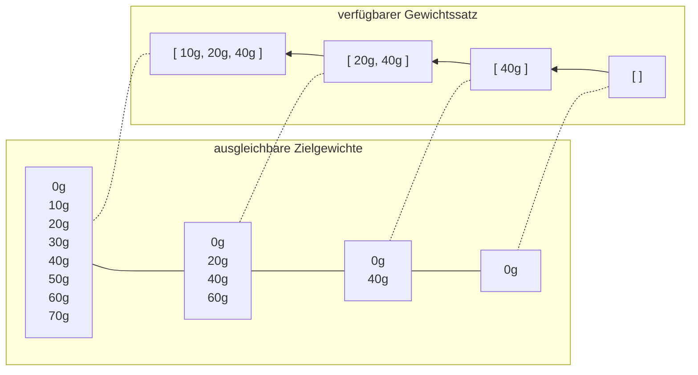

# Marktwaage

## Lösungsidee

Um diese Aufgabe zu lösen, werde ich für jedes Zielgewicht in einem sinnvollen Bereich ($Zielgewicht_{max} + Gewicht_{max}$) bestimmen, ob es ausgleichbar ist oder nicht. Dazu wird zunächst nur ein Teil des Gewichtssatzes herangezogen, der schrittweise vergrößert wird, bis zum Schluss alle Gewichte verfügbar sind. Zuerst wird ein leerer Gewichtssatz herangezogen, dann wird das letzte Gewicht im Gewichtssatz hinzugenommen, dann das vorletzte usw. Diese Vorgehensweise hat zwei Vorteile:

- Weil die Menge aller möglichen Lösungen mit $k$ verfügbaren Gewichten eine Untermenge der möglichen Lösungen mit $k + 1$ verfügbaren Gewichten ist, kann auf der vorherigen Menge aufgebaut werden um die nächste zu bestimmen.
- Da nur abgespeichert wird, *ob* ein Zielgewicht erreichbar ist, und nicht genau *wie*, bleibt der Arbeitsspeicherbedarf im Rahmen.

Beispiel (Zielgewicht: 30g, Gewichte 10g, 20g, 40g):



**oberer Abschnitt**: Der verfügbare Gewichtssatz wird schrittweise von hinten anfangend erweitert. 

**unterer Abschnitt**: Alle mit dem entsprechenden Untergewichtssatz erreichbaren Zielgewichte 

Die Tabelle kann von hinten nach vorne durchgegangen werden, bis eine Lösung für das gewünschte Zielgewicht erscheint. Das gerade neu verfügbar gewordene Gewicht muss in jedem Fall relevant für die Lösung sein, weil sie davor noch nicht vorhanden war. Mit diesem Wissen können die für die Lösung benötigten Gewichte bestimmt werden, indem der Ablauf rekursiv für $Zielgewicht - hinzugenommenes \space Gewicht$ wiederholt wird, bis man bei $0$ landet.

## Umsetzung

&rarr; Eine 1 an der Stelle $tabelle[i][j][k]$ bedeutet, dass das Gewicht `j` mit `k` gebrauchten Gewichten aus der Menge  $gewicht_i, \space gewicht_{i+1}, \space ..., \space gewicht_n$  ausgleichbar ist, wobei $n$ die Länge des Gewichtssatzes ist.

Diese Informationen speichere ich in einer dreidimensionalen Tabelle:

1. Die erste Dimension ist genauso lang wie der Gewichtssatz, weil für jedes Gewicht abgespeichert werden soll, welche Zielgewichte mit ihm und allen Gewichten hinter ihm erreichbar sind. Das Auffüllen der Tabelle beginnt folglich von hinten, weil zuerst nur ein Gewicht, am Ende aber alle verfügbar sein sollen.
2. Die zweite Dimension hat die Länge des größten Zielgewichts + des größten Gewichts im Gewichtssatz, weil das die Spanne aller sinnvollen Zielgewichte ist. Man muss leider über das größte Zielgewicht hinausgehen, da es Lösungen geben kann, bei denen von einem größeren Gewicht wieder etwas abgezogen wurde (&rarr; zwei Seiten der Waage).
3. In der dritten Dimension wird repräsentiert, wie viele Gewichte für die Lösung gebraucht wurden, sie ist also so lang wie der Gewichtssatz. Bei den Indizes werden 0 oder 1 eingetragen, eine 1 bedeutet, dass das Zielgewicht mit dem Index entsprechend vielen Gewichten ausgleichbar ist.

Dieses Konzept setze ich in [Typescript](https://www.typescriptlang.org/) mit der Laufzeit [Deno](https://deno.land/) um. Ich schreibe wegen einer besseren Lesbarkeit auf Englisch, da Typescript selbst englischbasiert ist.

Das Einlesen und die Umwandlung der Textdateien sowie die Vorbereitung für die Ausgabe im Terminal übernehmen die zwei Funktionen `convertInput()` und `convertOutput()`, allerdings enthalten sie keine Logik zur Bestimmung passender Gewichte.

In `main.ts` werden alle nötigen Funktionen für Zielgewicht (10, 20, ..., 10 000) aufgerufen,  die aber in `calculations.ts` stehen. Folgende Berechnungen gescehen in [`nearestCombination()`](###nearestCombination).

### Basisfälle

Zuerst wird der oben angesprochene Fall eines Zielgewichts von 0 überprüft (Z. 7 - 11), bei dem sofort eine genau passende Gewichtskombination (`diff = target = 0`) zurückgegeben werden kann. Wenn keine Gewichte zum Ausgleichen vorhanden sind, sind keine weiteren Berechnungen möglich, folglich ist der Abstand zum anfänglichen Zielgewicht das verbleibende Zielgewicht.

### Rekursion

Jedes zum Ausgleichen vorhandene Gewicht wird zum aktuellen Zielgewicht addiert und subtrahiert, mit diesen neu entstandenen Zielgewichten wird die gesamte Funktion erneut aufgerufen (Z. 21 - 54).

Dazu wird zunächst eine aktualisierte Version der Liste von benutzbaren Gewichten (`shortenedWeights`) erstellt (Z. 22 - 24), da das eben addierte (&rarr; linke Seite der Waage) oder subtrahierte (&rarr; rechte Seite) Gewicht nicht mehr zum Ausgleichen vorhanden ist. Auch wird die Liste der benutzten Gewichte um das gerade eben benutzte erweitert und an die nächste Funktion weitergegeben.

Die Variablen `added` und `subtracted` speichern die bestmögliche Gewichtskombination zum Erreichen des Zielgewichts nach Addition bzw. Subtraktion. Diese werden mit der aktuellen `bestCombination` hinsichtlich ihrer Differenz zum Zielgewicht als auch der Anzahl an benutzten Gewichten durch [`determineBest()`](###determineBest()) verglichen (Z. 45 - 54). Die Differenz hat Priorität, bei beiden Kriterien wird ein möglichst kleiner Wert bevorzugt. `bestCombination` ist gewichtsübergreifend, (&rarr; nicht im Rahmen des for-loops) und wird laufend mit der passendsten und kürzesten Gewichtskombination aktualisiert.

### Rückgabe

Falls durch Austesten aller Gewichte keine passende Lösung gefunden worden ist, wird die nähste zurückgegeben (Z. 63). Die Funktion gibt eine genau passende Lösung aber schon während des Testens zurück, um unnötige Berechnungen zu vermeiden (Z. 56 - 60). Eine Lösung ( &rarr; [Typ Gewichtskombination](###type%20weightCombination)) besteht aus dem Unterschied zum Zielgewichts und den zuvor aggregierten Gewichten, die zum Erreichen der Lösung beitragen.

`convertOutput()` wandelt diese in ein gut lesbares Format um, damit sie im Terminal ausgegeben werden kann.

### Laufzeitverbesserungen

Ich habe einige Abschnitte bis jetzt nicht behandelt  (z.B. Z. 13-14, 30), weil die Funktion ohne sie richtig arbeiten würde, allerdings sehr ineffizient (exponentielle Zeitkomplexität). Daher habe ich (neben frühzeitiger Rückgabe) drei Maßnahmen zum Umgehen irrelevanter Berechnungen eingebaut.

1. Memoisation (Zwischenspeicherung) von Teillösungen
2. keine gleichzeitige Addition und Subtraktion der gleichen Gewichtsgröße
3. keine Kalkulation, wenn $0 > target_{neu} > 10000 + weight_{max}$

#### Memoisation

Die Memoisation realisiere ich durch `memo`, ein JavaScript Objekt mit dem [Typ `weightMemo`](###type%20weightMemo), das an alle Unteraufrufe weitergegeben wird. Damit ergibt sich ein dritter Basisfall, der eintritt, wenn die Kombination aus gesuchtem Gewicht und vorhandenen Gewichten bereits berechnet worden ist.

## Beispiele

### gewichtsstuecke0

```txt
6
10 3
50 2
100 3
500 3
1000 3
5000 1
```

*10g bis 500g*

```txt
10g: Ausgleich möglich!	
	Links: 
	Rechts: 10
	
20g: Ausgleich möglich!	
	Links: 
	Rechts: 10, 10
	
30g: Ausgleich möglich!	
	Links: 
	Rechts: 10, 10, 10
	
40g: Ausgleich möglich!	
	Links: 10
	Rechts: 50
	
50g: Ausgleich möglich!	
	Links: 
	Rechts: 50
	
60g: Ausgleich möglich!	
	Links: 
	Rechts: 50, 10
	
70g: Ausgleich möglich!	
	Links: 
	Rechts: 50, 10, 10
	
80g: Ausgleich möglich!	
	Links: 
	Rechts: 50, 10, 10, 10
	
90g: Ausgleich möglich!	
	Links: 10
	Rechts: 100
	
100g: Ausgleich möglich!	
	Links: 
	Rechts: 100
	
110g: Ausgleich möglich!	
	Links: 
	Rechts: 100, 10
	
120g: Ausgleich möglich!	
	Links: 
	Rechts: 100, 10, 10
	
130g: Ausgleich möglich!	
	Links: 
	Rechts: 100, 10, 10, 10
	
140g: Ausgleich möglich!	
	Links: 10
	Rechts: 100, 50
	
150g: Ausgleich möglich!	
	Links: 
	Rechts: 100, 50
	
160g: Ausgleich möglich!	
	Links: 
	Rechts: 100, 50, 10
	
170g: Ausgleich möglich!	
	Links: 
	Rechts: 100, 50, 10, 10
	
180g: Ausgleich möglich!	
	Links: 
	Rechts: 100, 50, 10, 10, 10
	
190g: Ausgleich möglich!	
	Links: 10
	Rechts: 100, 100
	
200g: Ausgleich möglich!	
	Links: 
	Rechts: 100, 100
	
210g: Ausgleich möglich!	
	Links: 
	Rechts: 100, 100, 10
	
220g: Ausgleich möglich!	
	Links: 
	Rechts: 100, 100, 10, 10
	
230g: Ausgleich möglich!	
	Links: 
	Rechts: 100, 100, 10, 10, 10
	
240g: Ausgleich möglich!	
	Links: 10
	Rechts: 100, 100, 50
	
250g: Ausgleich möglich!	
	Links: 
	Rechts: 100, 100, 50
	
260g: Ausgleich möglich!	
	Links: 
	Rechts: 100, 100, 50, 10
	
270g: Ausgleich möglich!	
	Links: 
	Rechts: 100, 100, 50, 10, 10
	
280g: Ausgleich möglich!	
	Links: 
	Rechts: 100, 100, 50, 10, 10, 10
	
290g: Ausgleich möglich!	
	Links: 10
	Rechts: 100, 100, 100
	
300g: Ausgleich möglich!	
	Links: 
	Rechts: 100, 100, 100
	
310g: Ausgleich möglich!	
	Links: 
	Rechts: 100, 100, 100, 10
	
320g: Ausgleich möglich!	
	Links: 
	Rechts: 100, 100, 100, 10, 10
	
330g: Ausgleich möglich!	
	Links: 
	Rechts: 100, 100, 100, 10, 10, 10
	
340g: Ausgleich möglich!	
	Links: 10
	Rechts: 100, 100, 100, 50
	
350g: Ausgleich möglich!	
	Links: 
	Rechts: 100, 100, 100, 50
	
360g: Ausgleich möglich!	
	Links: 
	Rechts: 100, 100, 100, 50, 10
	
370g: Ausgleich möglich!	
	Links: 
	Rechts: 100, 100, 100, 50, 10, 10
	
380g: Ausgleich möglich!	
	Links: 
	Rechts: 100, 100, 100, 50, 10, 10, 10
	
390g: Ausgleich möglich!	
	Links: 10
	Rechts: 100, 100, 100, 50, 50
	
400g: Ausgleich möglich!	
	Links: 
	Rechts: 100, 100, 100, 50, 50
	
410g: Ausgleich möglich!	
	Links: 
	Rechts: 100, 100, 100, 50, 50, 10
	
420g: Ausgleich möglich!	
	Links: 
	Rechts: 100, 100, 100, 50, 50, 10, 10
	
430g: Ausgleich möglich!	
	Links: 
	Rechts: 100, 100, 100, 50, 50, 10, 10, 10
	
440g: Ausgleich möglich!	
	Links: 100, 10
	Rechts: 500, 50
	
450g: Ausgleich möglich!	
	Links: 100
	Rechts: 500, 50
	
460g: Ausgleich möglich!	
	Links: 100
	Rechts: 500, 50, 10
	
470g: Ausgleich möglich!	
	Links: 100
	Rechts: 500, 50, 10, 10
	
480g: Ausgleich möglich!	
	Links: 100
	Rechts: 500, 50, 10, 10, 10
	
490g: Ausgleich möglich!	
	Links: 10
	Rechts: 500
	
500g: Ausgleich möglich!	
	Links: 
	Rechts: 500

```

*9500g bis 10000g*

```txt
9500g: Ausgleich möglich!	
	Links: 
	Rechts: 5000, 1000, 1000, 1000, 500, 500, 500
	
9510g: Ausgleich möglich!	
	Links: 
	Rechts: 5000, 1000, 1000, 1000, 500, 500, 500, 10
	
9520g: Ausgleich möglich!	
	Links: 
	Rechts: 5000, 1000, 1000, 1000, 500, 500, 500, 10, 10
	
9530g: Ausgleich möglich!	
	Links: 
	Rechts: 5000, 1000, 1000, 1000, 500, 500, 500, 10, 10, 10
	
9540g: Ausgleich möglich!	
	Links: 10
	Rechts: 5000, 1000, 1000, 1000, 500, 500, 500, 50
	
9550g: Ausgleich möglich!	
	Links: 
	Rechts: 5000, 1000, 1000, 1000, 500, 500, 500, 50
	
9560g: Ausgleich möglich!	
	Links: 
	Rechts: 5000, 1000, 1000, 1000, 500, 500, 500, 50, 10
	
9570g: Ausgleich möglich!	
	Links: 
	Rechts: 5000, 1000, 1000, 1000, 500, 500, 500, 50, 10, 10
	
9580g: Ausgleich möglich!	
	Links: 
	Rechts: 5000, 1000, 1000, 1000, 500, 500, 500, 50, 10, 10, 10
	
9590g: Ausgleich möglich!	
	Links: 10
	Rechts: 5000, 1000, 1000, 1000, 500, 500, 500, 100
	
9600g: Ausgleich möglich!	
	Links: 
	Rechts: 5000, 1000, 1000, 1000, 500, 500, 500, 100
	
9610g: Ausgleich möglich!	
	Links: 
	Rechts: 5000, 1000, 1000, 1000, 500, 500, 500, 100, 10
	
9620g: Ausgleich möglich!	
	Links: 
	Rechts: 5000, 1000, 1000, 1000, 500, 500, 500, 100, 10, 10
	
9630g: Ausgleich möglich!	
	Links: 
	Rechts: 5000, 1000, 1000, 1000, 500, 500, 500, 100, 10, 10, 10
	
9640g: Ausgleich möglich!	
	Links: 10
	Rechts: 5000, 1000, 1000, 1000, 500, 500, 500, 100, 50
	
9650g: Ausgleich möglich!	
	Links: 
	Rechts: 5000, 1000, 1000, 1000, 500, 500, 500, 100, 50
	
9660g: Ausgleich möglich!	
	Links: 
	Rechts: 5000, 1000, 1000, 1000, 500, 500, 500, 100, 50, 10
	
9670g: Ausgleich möglich!	
	Links: 
	Rechts: 5000, 1000, 1000, 1000, 500, 500, 500, 100, 50, 10, 10
	
9680g: Ausgleich möglich!	
	Links: 
	Rechts: 5000, 1000, 1000, 1000, 500, 500, 500, 100, 50, 10, 10, 10
	
9690g: Ausgleich möglich!	
	Links: 10
	Rechts: 5000, 1000, 1000, 1000, 500, 500, 500, 100, 100
	
9700g: Ausgleich möglich!	
	Links: 
	Rechts: 5000, 1000, 1000, 1000, 500, 500, 500, 100, 100
	
9710g: Ausgleich möglich!	
	Links: 
	Rechts: 5000, 1000, 1000, 1000, 500, 500, 500, 100, 100, 10
	
9720g: Ausgleich möglich!	
	Links: 
	Rechts: 5000, 1000, 1000, 1000, 500, 500, 500, 100, 100, 10, 10
	
9730g: Ausgleich möglich!	
	Links: 
	Rechts: 5000, 1000, 1000, 1000, 500, 500, 500, 100, 100, 10, 10, 10
	
9740g: Ausgleich möglich!	
	Links: 10
	Rechts: 5000, 1000, 1000, 1000, 500, 500, 500, 100, 100, 50
	
9750g: Ausgleich möglich!	
	Links: 
	Rechts: 5000, 1000, 1000, 1000, 500, 500, 500, 100, 100, 50
	
9760g: Ausgleich möglich!	
	Links: 
	Rechts: 5000, 1000, 1000, 1000, 500, 500, 500, 100, 100, 50, 10
	
9770g: Ausgleich möglich!	
	Links: 
	Rechts: 5000, 1000, 1000, 1000, 500, 500, 500, 100, 100, 50, 10, 10
	
9780g: Ausgleich möglich!	
	Links: 
	Rechts: 5000, 1000, 1000, 1000, 500, 500, 500, 100, 100, 50, 10, 10, 10
	
9790g: Ausgleich möglich!	
	Links: 10
	Rechts: 5000, 1000, 1000, 1000, 500, 500, 500, 100, 100, 100
	
9800g: Ausgleich möglich!	
	Links: 
	Rechts: 5000, 1000, 1000, 1000, 500, 500, 500, 100, 100, 100
	
9810g: Ausgleich möglich!	
	Links: 
	Rechts: 5000, 1000, 1000, 1000, 500, 500, 500, 100, 100, 100, 10
	
9820g: Ausgleich möglich!	
	Links: 
	Rechts: 5000, 1000, 1000, 1000, 500, 500, 500, 100, 100, 100, 10, 10
	
9830g: Ausgleich möglich!	
	Links: 
	Rechts: 5000, 1000, 1000, 1000, 500, 500, 500, 100, 100, 100, 10, 10, 10
	
9840g: Ausgleich möglich!	
	Links: 10
	Rechts: 5000, 1000, 1000, 1000, 500, 500, 500, 100, 100, 100, 50
	
9850g: Ausgleich möglich!	
	Links: 
	Rechts: 5000, 1000, 1000, 1000, 500, 500, 500, 100, 100, 100, 50
	
9860g: Ausgleich möglich!	
	Links: 
	Rechts: 5000, 1000, 1000, 1000, 500, 500, 500, 100, 100, 100, 50, 10
	
9870g: Ausgleich möglich!	
	Links: 
	Rechts: 5000, 1000, 1000, 1000, 500, 500, 500, 100, 100, 100, 50, 10, 10
	
9880g: Ausgleich möglich!	
	Links: 
	Rechts: 5000, 1000, 1000, 1000, 500, 500, 500, 100, 100, 100, 50, 10, 10, 
	10
	
9890g: Ausgleich möglich!	
	Links: 10
	Rechts: 5000, 1000, 1000, 1000, 500, 500, 500, 100, 100, 100, 50, 50
	
9900g: Ausgleich möglich!	
	Links: 
	Rechts: 5000, 1000, 1000, 1000, 500, 500, 500, 100, 100, 100, 50, 50
	
9910g: Ausgleich möglich!	
	Links: 
	Rechts: 5000, 1000, 1000, 1000, 500, 500, 500, 100, 100, 100, 50, 50, 10
	
9920g: Ausgleich möglich!	
	Links: 
	Rechts: 5000, 1000, 1000, 1000, 500, 500, 500, 100, 100, 100, 50, 50, 10, 
	10
	
9930g: Ausgleich möglich!	
	Links: 
	Rechts: 5000, 1000, 1000, 1000, 500, 500, 500, 100, 100, 100, 50, 50, 10, 
	10, 10
	
9940g: Ausgleich nicht möglich.
	Differenz: 10
	Links: 
	Rechts: 5000, 1000, 1000, 1000, 500, 500, 500, 100, 100, 100, 50, 50, 10, 
	10, 10
	
9950g: Ausgleich nicht möglich.
	Differenz: 20
	Links: 
	Rechts: 5000, 1000, 1000, 1000, 500, 500, 500, 100, 100, 100, 50, 50, 10, 
	10, 10
	
9960g: Ausgleich nicht möglich.
	Differenz: 30
	Links: 
	Rechts: 5000, 1000, 1000, 1000, 500, 500, 500, 100, 100, 100, 50, 50, 10, 
	10, 10
	
9970g: Ausgleich nicht möglich.
	Differenz: 40
	Links: 
	Rechts: 5000, 1000, 1000, 1000, 500, 500, 500, 100, 100, 100, 50, 50, 10, 
	10, 10
	
9980g: Ausgleich nicht möglich.
	Differenz: 50
	Links: 
	Rechts: 5000, 1000, 1000, 1000, 500, 500, 500, 100, 100, 100, 50, 50, 10, 
	10, 10
	
9990g: Ausgleich nicht möglich.
	Differenz: 60
	Links: 
	Rechts: 5000, 1000, 1000, 1000, 500, 500, 500, 100, 100, 100, 50, 50, 10, 
	10, 10
	
10000g: Ausgleich nicht möglich.
	Differenz: 70
	Links: 
	Rechts: 5000, 1000, 1000, 1000, 500, 500, 500, 100, 100, 100, 50, 50, 10, 
	10, 10
```

### gewichtsstuecke1

```txt
4
42 3
127 3
371 6
2000 5
```

*10g bis 500g*

```txt
10g: Ausgleich möglich!	
	Links: 371
	Rechts: 127, 127, 127
	
20g: Ausgleich nicht möglich.
	Differenz: 1
	Links: 371, 371, 371, 371, 371, 42, 42, 42
	Rechts: 2000
	
30g: Ausgleich nicht möglich.
	Differenz: 1
	Links: 371, 371, 371, 371, 371, 371, 42, 42, 42
	Rechts: 2000, 127, 127, 127
	
40g: Ausgleich nicht möglich.
	Differenz: 2
	Links: 
	Rechts: 42
	
50g: Ausgleich nicht möglich.
	Differenz: 1
	Links: 371, 371, 371, 371, 127, 127, 127, 42, 42
	Rechts: 2000
	
60g: Ausgleich möglich!	
	Links: 371, 371, 371, 371, 371, 127
	Rechts: 2000, 42
	
70g: Ausgleich möglich!	
	Links: 371, 371, 371, 371, 371, 371
	Rechts: 2000, 127, 127, 42
	
80g: Ausgleich nicht möglich.
	Differenz: 4
	Links: 
	Rechts: 42, 42
	
90g: Ausgleich nicht möglich.
	Differenz: 3
	Links: 371, 371, 371, 371, 127, 127, 127, 42
	Rechts: 2000
	
100g: Ausgleich möglich!	
	Links: 2000, 42, 42, 42
	Rechts: 371, 371, 371, 371, 371, 371
	
110g: Ausgleich möglich!	
	Links: 2000, 42, 42, 42
	Rechts: 371, 371, 371, 371, 371, 127, 127, 127
	
120g: Ausgleich nicht möglich.
	Differenz: 2
	Links: 127, 42, 42, 42
	Rechts: 371
	
130g: Ausgleich nicht möglich.
	Differenz: 2
	Links: 42, 42, 42
	Rechts: 127, 127
	
140g: Ausgleich nicht möglich.
	Differenz: 1
	Links: 2000, 127
	Rechts: 371, 371, 371, 371, 371, 371, 42
	
150g: Ausgleich nicht möglich.
	Differenz: 1
	Links: 2000
	Rechts: 371, 371, 371, 371, 371, 127, 127, 42
	
160g: Ausgleich möglich!	
	Links: 127, 42, 42
	Rechts: 371
	
170g: Ausgleich möglich!	
	Links: 42, 42
	Rechts: 127, 127
	
180g: Ausgleich nicht möglich.
	Differenz: 2
	Links: 371, 371, 371, 371, 127, 127, 42, 42
	Rechts: 2000
	
190g: Ausgleich nicht möglich.
	Differenz: 2
	Links: 371, 371, 371, 371, 371, 42, 42
	Rechts: 2000, 127
	
200g: Ausgleich nicht möglich.
	Differenz: 1
	Links: 127, 127
	Rechts: 371, 42, 42
	
210g: Ausgleich nicht möglich.
	Differenz: 1
	Links: 
	Rechts: 127, 42, 42
	
220g: Ausgleich möglich!	
	Links: 371, 371, 371, 371, 127, 127, 42
	Rechts: 2000
	
230g: Ausgleich möglich!	
	Links: 371, 371, 371, 371, 371, 42
	Rechts: 2000, 127
	
240g: Ausgleich nicht möglich.
	Differenz: 1
	Links: 371, 371, 371, 371, 371, 371
	Rechts: 2000, 127, 127, 127, 42, 42
	
250g: Ausgleich nicht möglich.
	Differenz: 3
	Links: 
	Rechts: 127, 42, 42, 42
	
260g: Ausgleich nicht möglich.
	Differenz: 1
	Links: 371, 371, 371, 371, 127, 127, 127
	Rechts: 2000, 42, 42, 42
	
270g: Ausgleich nicht möglich.
	Differenz: 1
	Links: 371, 371, 371, 371, 371
	Rechts: 2000, 42, 42, 42
	
280g: Ausgleich nicht möglich.
	Differenz: 1
	Links: 371, 371, 371, 371, 371, 371
	Rechts: 2000, 127, 127, 127, 42, 42, 42
	
290g: Ausgleich nicht möglich.
	Differenz: 3
	Links: 42, 42
	Rechts: 371
	
300g: Ausgleich nicht möglich.
	Differenz: 3
	Links: 42, 42
	Rechts: 127, 127, 127
	
310g: Ausgleich möglich!	
	Links: 2000
	Rechts: 371, 371, 371, 371, 371, 371, 42, 42
	
320g: Ausgleich möglich!	
	Links: 2000
	Rechts: 371, 371, 371, 371, 371, 127, 127, 127, 42, 42
	
330g: Ausgleich nicht möglich.
	Differenz: 1
	Links: 42
	Rechts: 371
	
340g: Ausgleich nicht möglich.
	Differenz: 1
	Links: 42
	Rechts: 127, 127, 127
	
350g: Ausgleich nicht möglich.
	Differenz: 2
	Links: 2000
	Rechts: 371, 371, 371, 371, 371, 371, 42, 42, 42
	
360g: Ausgleich nicht möglich.
	Differenz: 1
	Links: 127, 127, 127
	Rechts: 371, 371
	
370g: Ausgleich möglich!	
	Links: 127
	Rechts: 371, 42, 42, 42
	
380g: Ausgleich möglich!	
	Links: 
	Rechts: 127, 127, 42, 42, 42
	
390g: Ausgleich möglich!	
	Links: 371, 371, 371, 371, 42, 42, 42
	Rechts: 2000
	
400g: Ausgleich möglich!	
	Links: 371, 371, 371, 371, 371, 42, 42, 42
	Rechts: 2000, 127, 127, 127
	
410g: Ausgleich nicht möglich.
	Differenz: 3
	Links: 
	Rechts: 371, 42
	
420g: Ausgleich nicht möglich.
	Differenz: 2
	Links: 371, 371, 371, 127, 127, 127, 42, 42
	Rechts: 2000
	
430g: Ausgleich nicht möglich.
	Differenz: 1
	Links: 371, 371, 371, 371, 127
	Rechts: 2000, 42
	
440g: Ausgleich nicht möglich.
	Differenz: 1
	Links: 371, 371, 371, 371, 371
	Rechts: 2000, 127, 127, 42
	
450g: Ausgleich nicht möglich.
	Differenz: 4
	Links: 127, 127, 42
	Rechts: 371, 371
	
460g: Ausgleich nicht möglich.
	Differenz: 4
	Links: 371, 371, 371, 127, 127, 127, 42
	Rechts: 2000
	
470g: Ausgleich nicht möglich.
	Differenz: 3
	Links: 371, 371, 371, 371, 127
	Rechts: 2000, 42, 42
	
480g: Ausgleich möglich!	
	Links: 2000
	Rechts: 371, 371, 371, 371, 371, 371, 127, 127
	
490g: Ausgleich nicht möglich.
	Differenz: 1
	Links: 127, 42, 42, 42
	Rechts: 371, 371
	
500g: Ausgleich nicht möglich.
	Differenz: 1
	Links: 42, 42, 42
	Rechts: 371, 127, 127
```

*9500g bis 10000g*

```txt
9500g: Ausgleich nicht möglich.
	Differenz: 1
	Links: 371, 127, 127
	Rechts: 2000, 2000, 2000, 2000, 2000, 42, 42, 42
	
9510g: Ausgleich nicht möglich.
	Differenz: 1
	Links: 371, 371
	Rechts: 2000, 2000, 2000, 2000, 2000, 127, 42, 42, 42
	
9520g: Ausgleich nicht möglich.
	Differenz: 3
	Links: 127, 127, 42, 42
	Rechts: 2000, 2000, 2000, 2000, 371, 371, 371, 371, 371
	
9530g: Ausgleich nicht möglich.
	Differenz: 3
	Links: 42, 42
	Rechts: 2000, 2000, 2000, 2000, 371, 371, 371, 371, 127
	
9540g: Ausgleich nicht möglich.
	Differenz: 4
	Links: 371, 127
	Rechts: 2000, 2000, 2000, 2000, 2000, 42
	
9550g: Ausgleich nicht möglich.
	Differenz: 4
	Links: 371, 371
	Rechts: 2000, 2000, 2000, 2000, 2000, 127, 127, 42
	
9560g: Ausgleich nicht möglich.
	Differenz: 1
	Links: 127, 127, 42
	Rechts: 2000, 2000, 2000, 2000, 371, 371, 371, 371, 371
	
9570g: Ausgleich nicht möglich.
	Differenz: 1
	Links: 42
	Rechts: 2000, 2000, 2000, 2000, 371, 371, 371, 371, 127
	
9580g: Ausgleich nicht möglich.
	Differenz: 2
	Links: 
	Rechts: 2000, 2000, 2000, 2000, 371, 371, 371, 127, 127, 127, 42, 42
	
9590g: Ausgleich nicht möglich.
	Differenz: 3
	Links: 371, 42
	Rechts: 2000, 2000, 2000, 2000, 2000
	
9600g: Ausgleich möglich!	
	Links: 127, 127, 127
	Rechts: 2000, 2000, 2000, 2000, 371, 371, 371, 371, 371, 42, 42, 42
	
9610g: Ausgleich möglich!	
	Links: 
	Rechts: 2000, 2000, 2000, 2000, 371, 371, 371, 371, 42, 42, 42
	
9620g: Ausgleich möglich!	
	Links: 
	Rechts: 2000, 2000, 2000, 2000, 371, 371, 371, 127, 127, 127, 42, 42, 42
	
9630g: Ausgleich möglich!	
	Links: 371, 42, 42, 42
	Rechts: 2000, 2000, 2000, 2000, 2000, 127
	
9640g: Ausgleich nicht möglich.
	Differenz: 1
	Links: 371, 371
	Rechts: 2000, 2000, 2000, 2000, 2000, 127, 127, 127
	
9650g: Ausgleich nicht möglich.
	Differenz: 3
	Links: 
	Rechts: 2000, 2000, 2000, 2000, 371, 371, 371, 371, 127, 42
	
9660g: Ausgleich nicht möglich.
	Differenz: 1
	Links: 127, 127, 127
	Rechts: 2000, 2000, 2000, 2000, 2000, 42
	
9670g: Ausgleich nicht möglich.
	Differenz: 1
	Links: 371
	Rechts: 2000, 2000, 2000, 2000, 2000, 42
	
9680g: Ausgleich nicht möglich.
	Differenz: 1
	Links: 371, 371
	Rechts: 2000, 2000, 2000, 2000, 2000, 127, 127, 127, 42
	
9690g: Ausgleich nicht möglich.
	Differenz: 4
	Links: 127, 42
	Rechts: 2000, 2000, 2000, 2000, 371, 371, 371, 371, 371
	
9700g: Ausgleich nicht möglich.
	Differenz: 3
	Links: 127, 127, 127
	Rechts: 2000, 2000, 2000, 2000, 2000, 42, 42
	
9710g: Ausgleich nicht möglich.
	Differenz: 3
	Links: 371
	Rechts: 2000, 2000, 2000, 2000, 2000, 42, 42
	
9720g: Ausgleich nicht möglich.
	Differenz: 1
	Links: 127, 127, 127, 42, 42, 42
	Rechts: 2000, 2000, 2000, 2000, 371, 371, 371, 371, 371, 371
	
9730g: Ausgleich nicht möglich.
	Differenz: 1
	Links: 42, 42, 42
	Rechts: 2000, 2000, 2000, 2000, 371, 371, 371, 371, 371
	
9740g: Ausgleich nicht möglich.
	Differenz: 1
	Links: 42, 42, 42
	Rechts: 2000, 2000, 2000, 2000, 371, 371, 371, 371, 127, 127, 127
	
9750g: Ausgleich nicht möglich.
	Differenz: 3
	Links: 127, 42, 42, 42
	Rechts: 2000, 2000, 2000, 2000, 2000
	
9760g: Ausgleich nicht möglich.
	Differenz: 1
	Links: 127, 127, 127, 42, 42
	Rechts: 2000, 2000, 2000, 2000, 371, 371, 371, 371, 371, 371
	
9770g: Ausgleich möglich!	
	Links: 127
	Rechts: 2000, 2000, 2000, 2000, 371, 371, 371, 371, 371, 42
	
9780g: Ausgleich möglich!	
	Links: 
	Rechts: 2000, 2000, 2000, 2000, 371, 371, 371, 371, 127, 127, 42
	
9790g: Ausgleich nicht möglich.
	Differenz: 1
	Links: 127, 42, 42
	Rechts: 2000, 2000, 2000, 2000, 2000
	
9800g: Ausgleich nicht möglich.
	Differenz: 1
	Links: 371, 42, 42
	Rechts: 2000, 2000, 2000, 2000, 2000, 127, 127
	
9810g: Ausgleich nicht möglich.
	Differenz: 2
	Links: 127
	Rechts: 2000, 2000, 2000, 2000, 371, 371, 371, 371, 371, 42, 42
	
9820g: Ausgleich nicht möglich.
	Differenz: 2
	Links: 
	Rechts: 2000, 2000, 2000, 2000, 371, 371, 371, 371, 127, 127, 42, 42
	
9830g: Ausgleich möglich!	
	Links: 127, 127
	Rechts: 2000, 2000, 2000, 2000, 2000, 42, 42
	
9840g: Ausgleich möglich!	
	Links: 371
	Rechts: 2000, 2000, 2000, 2000, 2000, 127, 42, 42
	
9850g: Ausgleich nicht möglich.
	Differenz: 4
	Links: 127
	Rechts: 2000, 2000, 2000, 2000, 371, 371, 371, 371, 371, 42, 42, 42
	
9860g: Ausgleich nicht möglich.
	Differenz: 4
	Links: 
	Rechts: 2000, 2000, 2000, 2000, 371, 371, 371, 371, 127, 127, 42, 42, 42
	
9870g: Ausgleich nicht möglich.
	Differenz: 2
	Links: 127, 127
	Rechts: 2000, 2000, 2000, 2000, 2000, 42, 42, 42
	
9880g: Ausgleich nicht möglich.
	Differenz: 2
	Links: 371
	Rechts: 2000, 2000, 2000, 2000, 2000, 127, 42, 42, 42
	
9890g: Ausgleich nicht möglich.
	Differenz: 2
	Links: 127, 127, 42, 42
	Rechts: 2000, 2000, 2000, 2000, 371, 371, 371, 371, 371, 371
	
9900g: Ausgleich nicht möglich.
	Differenz: 2
	Links: 42, 42
	Rechts: 2000, 2000, 2000, 2000, 371, 371, 371, 371, 371, 127
	
9910g: Ausgleich nicht möglich.
	Differenz: 3
	Links: 
	Rechts: 2000, 2000, 2000, 2000, 371, 371, 371, 371, 127, 127, 127, 42
	
9920g: Ausgleich nicht möglich.
	Differenz: 4
	Links: 42, 42
	Rechts: 2000, 2000, 2000, 2000, 2000
	
9930g: Ausgleich möglich!	
	Links: 127, 127, 42
	Rechts: 2000, 2000, 2000, 2000, 371, 371, 371, 371, 371, 371
	
9940g: Ausgleich möglich!	
	Links: 42
	Rechts: 2000, 2000, 2000, 2000, 371, 371, 371, 371, 371, 127
	
9950g: Ausgleich nicht möglich.
	Differenz: 1
	Links: 
	Rechts: 2000, 2000, 2000, 2000, 371, 371, 371, 371, 127, 127, 127, 42, 42
	
9960g: Ausgleich nicht möglich.
	Differenz: 2
	Links: 42
	Rechts: 2000, 2000, 2000, 2000, 2000
	
9970g: Ausgleich nicht möglich.
	Differenz: 1
	Links: 127, 127, 127
	Rechts: 2000, 2000, 2000, 2000, 371, 371, 371, 371, 371, 371, 42, 42, 42
	
9980g: Ausgleich nicht möglich.
	Differenz: 1
	Links: 
	Rechts: 2000, 2000, 2000, 2000, 371, 371, 371, 371, 371, 42, 42, 42
	
9990g: Ausgleich möglich!	
	Links: 127, 127, 127
	Rechts: 2000, 2000, 2000, 2000, 2000, 371
	
10000g: Ausgleich möglich!	
	Links: 
	Rechts: 2000, 2000, 2000, 2000, 2000
```

### gewichtsstuecke2

```txt
10
10 1
20 1
40 1
80 1
160 1
320 1
640 1
1280 1
2560 1
5120 1
```

*10g bis 500g*

```txt
10g: Ausgleich möglich!	
	Links: 
	Rechts: 10
	
20g: Ausgleich möglich!	
	Links: 
	Rechts: 20
	
30g: Ausgleich möglich!	
	Links: 
	Rechts: 20, 10
	
40g: Ausgleich möglich!	
	Links: 
	Rechts: 40
	
50g: Ausgleich möglich!	
	Links: 
	Rechts: 40, 10
	
60g: Ausgleich möglich!	
	Links: 
	Rechts: 40, 20
	
70g: Ausgleich möglich!	
	Links: 
	Rechts: 40, 20, 10
	
80g: Ausgleich möglich!	
	Links: 
	Rechts: 80
	
90g: Ausgleich möglich!	
	Links: 
	Rechts: 80, 10
	
100g: Ausgleich möglich!	
	Links: 
	Rechts: 80, 20
	
110g: Ausgleich möglich!	
	Links: 
	Rechts: 80, 20, 10
	
120g: Ausgleich möglich!	
	Links: 
	Rechts: 80, 40
	
130g: Ausgleich möglich!	
	Links: 
	Rechts: 80, 40, 10
	
140g: Ausgleich möglich!	
	Links: 
	Rechts: 80, 40, 20
	
150g: Ausgleich möglich!	
	Links: 
	Rechts: 80, 40, 20, 10
	
160g: Ausgleich möglich!	
	Links: 
	Rechts: 160
	
170g: Ausgleich möglich!	
	Links: 
	Rechts: 160, 10
	
180g: Ausgleich möglich!	
	Links: 
	Rechts: 160, 20
	
190g: Ausgleich möglich!	
	Links: 
	Rechts: 160, 20, 10
	
200g: Ausgleich möglich!	
	Links: 
	Rechts: 160, 40
	
210g: Ausgleich möglich!	
	Links: 
	Rechts: 160, 40, 10
	
220g: Ausgleich möglich!	
	Links: 
	Rechts: 160, 40, 20
	
230g: Ausgleich möglich!	
	Links: 
	Rechts: 160, 40, 20, 10
	
240g: Ausgleich möglich!	
	Links: 
	Rechts: 160, 80
	
250g: Ausgleich möglich!	
	Links: 
	Rechts: 160, 80, 10
	
260g: Ausgleich möglich!	
	Links: 
	Rechts: 160, 80, 20
	
270g: Ausgleich möglich!	
	Links: 
	Rechts: 160, 80, 20, 10
	
280g: Ausgleich möglich!	
	Links: 
	Rechts: 160, 80, 40
	
290g: Ausgleich möglich!	
	Links: 
	Rechts: 160, 80, 40, 10
	
300g: Ausgleich möglich!	
	Links: 
	Rechts: 160, 80, 40, 20
	
310g: Ausgleich möglich!	
	Links: 
	Rechts: 160, 80, 40, 20, 10
	
320g: Ausgleich möglich!	
	Links: 
	Rechts: 320
	
330g: Ausgleich möglich!	
	Links: 
	Rechts: 320, 10
	
340g: Ausgleich möglich!	
	Links: 
	Rechts: 320, 20
	
350g: Ausgleich möglich!	
	Links: 
	Rechts: 320, 20, 10
	
360g: Ausgleich möglich!	
	Links: 
	Rechts: 320, 40
	
370g: Ausgleich möglich!	
	Links: 
	Rechts: 320, 40, 10
	
380g: Ausgleich möglich!	
	Links: 
	Rechts: 320, 40, 20
	
390g: Ausgleich möglich!	
	Links: 
	Rechts: 320, 40, 20, 10
	
400g: Ausgleich möglich!	
	Links: 
	Rechts: 320, 80
	
410g: Ausgleich möglich!	
	Links: 
	Rechts: 320, 80, 10
	
420g: Ausgleich möglich!	
	Links: 
	Rechts: 320, 80, 20
	
430g: Ausgleich möglich!	
	Links: 
	Rechts: 320, 80, 20, 10
	
440g: Ausgleich möglich!	
	Links: 
	Rechts: 320, 80, 40
	
450g: Ausgleich möglich!	
	Links: 
	Rechts: 320, 80, 40, 10
	
460g: Ausgleich möglich!	
	Links: 
	Rechts: 320, 80, 40, 20
	
470g: Ausgleich möglich!	
	Links: 
	Rechts: 320, 80, 40, 20, 10
	
480g: Ausgleich möglich!	
	Links: 
	Rechts: 320, 160
	
490g: Ausgleich möglich!	
	Links: 
	Rechts: 320, 160, 10
	
500g: Ausgleich möglich!	
	Links: 
	Rechts: 320, 160, 20
```

*9500g bis 10000g*

```txt
9500g: Ausgleich möglich!	
	Links: 
	Rechts: 5120, 2560, 1280, 320, 160, 40, 20
	
9510g: Ausgleich möglich!	
	Links: 
	Rechts: 5120, 2560, 1280, 320, 160, 40, 20, 10
	
9520g: Ausgleich möglich!	
	Links: 
	Rechts: 5120, 2560, 1280, 320, 160, 80
	
9530g: Ausgleich möglich!	
	Links: 
	Rechts: 5120, 2560, 1280, 320, 160, 80, 10
	
9540g: Ausgleich möglich!	
	Links: 
	Rechts: 5120, 2560, 1280, 320, 160, 80, 20
	
9550g: Ausgleich möglich!	
	Links: 
	Rechts: 5120, 2560, 1280, 320, 160, 80, 20, 10
	
9560g: Ausgleich möglich!	
	Links: 
	Rechts: 5120, 2560, 1280, 320, 160, 80, 40
	
9570g: Ausgleich möglich!	
	Links: 
	Rechts: 5120, 2560, 1280, 320, 160, 80, 40, 10
	
9580g: Ausgleich möglich!	
	Links: 
	Rechts: 5120, 2560, 1280, 320, 160, 80, 40, 20
	
9590g: Ausgleich möglich!	
	Links: 
	Rechts: 5120, 2560, 1280, 320, 160, 80, 40, 20, 10
	
9600g: Ausgleich möglich!	
	Links: 
	Rechts: 5120, 2560, 1280, 640
	
9610g: Ausgleich möglich!	
	Links: 
	Rechts: 5120, 2560, 1280, 640, 10
	
9620g: Ausgleich möglich!	
	Links: 
	Rechts: 5120, 2560, 1280, 640, 20
	
9630g: Ausgleich möglich!	
	Links: 
	Rechts: 5120, 2560, 1280, 640, 20, 10
	
9640g: Ausgleich möglich!	
	Links: 
	Rechts: 5120, 2560, 1280, 640, 40
	
9650g: Ausgleich möglich!	
	Links: 
	Rechts: 5120, 2560, 1280, 640, 40, 10
	
9660g: Ausgleich möglich!	
	Links: 
	Rechts: 5120, 2560, 1280, 640, 40, 20
	
9670g: Ausgleich möglich!	
	Links: 
	Rechts: 5120, 2560, 1280, 640, 40, 20, 10
	
9680g: Ausgleich möglich!	
	Links: 
	Rechts: 5120, 2560, 1280, 640, 80
	
9690g: Ausgleich möglich!	
	Links: 
	Rechts: 5120, 2560, 1280, 640, 80, 10
	
9700g: Ausgleich möglich!	
	Links: 
	Rechts: 5120, 2560, 1280, 640, 80, 20
	
9710g: Ausgleich möglich!	
	Links: 
	Rechts: 5120, 2560, 1280, 640, 80, 20, 10
	
9720g: Ausgleich möglich!	
	Links: 
	Rechts: 5120, 2560, 1280, 640, 80, 40
	
9730g: Ausgleich möglich!	
	Links: 
	Rechts: 5120, 2560, 1280, 640, 80, 40, 10
	
9740g: Ausgleich möglich!	
	Links: 
	Rechts: 5120, 2560, 1280, 640, 80, 40, 20
	
9750g: Ausgleich möglich!	
	Links: 
	Rechts: 5120, 2560, 1280, 640, 80, 40, 20, 10
	
9760g: Ausgleich möglich!	
	Links: 
	Rechts: 5120, 2560, 1280, 640, 160
	
9770g: Ausgleich möglich!	
	Links: 
	Rechts: 5120, 2560, 1280, 640, 160, 10
	
9780g: Ausgleich möglich!	
	Links: 
	Rechts: 5120, 2560, 1280, 640, 160, 20
	
9790g: Ausgleich möglich!	
	Links: 
	Rechts: 5120, 2560, 1280, 640, 160, 20, 10
	
9800g: Ausgleich möglich!	
	Links: 
	Rechts: 5120, 2560, 1280, 640, 160, 40
	
9810g: Ausgleich möglich!	
	Links: 
	Rechts: 5120, 2560, 1280, 640, 160, 40, 10
	
9820g: Ausgleich möglich!	
	Links: 
	Rechts: 5120, 2560, 1280, 640, 160, 40, 20
	
9830g: Ausgleich möglich!	
	Links: 
	Rechts: 5120, 2560, 1280, 640, 160, 40, 20, 10
	
9840g: Ausgleich möglich!	
	Links: 
	Rechts: 5120, 2560, 1280, 640, 160, 80
	
9850g: Ausgleich möglich!	
	Links: 
	Rechts: 5120, 2560, 1280, 640, 160, 80, 10
	
9860g: Ausgleich möglich!	
	Links: 
	Rechts: 5120, 2560, 1280, 640, 160, 80, 20
	
9870g: Ausgleich möglich!	
	Links: 
	Rechts: 5120, 2560, 1280, 640, 160, 80, 20, 10
	
9880g: Ausgleich möglich!	
	Links: 
	Rechts: 5120, 2560, 1280, 640, 160, 80, 40
	
9890g: Ausgleich möglich!	
	Links: 
	Rechts: 5120, 2560, 1280, 640, 160, 80, 40, 10
	
9900g: Ausgleich möglich!	
	Links: 
	Rechts: 5120, 2560, 1280, 640, 160, 80, 40, 20
	
9910g: Ausgleich möglich!	
	Links: 
	Rechts: 5120, 2560, 1280, 640, 160, 80, 40, 20, 10
	
9920g: Ausgleich möglich!	
	Links: 
	Rechts: 5120, 2560, 1280, 640, 320
	
9930g: Ausgleich möglich!	
	Links: 
	Rechts: 5120, 2560, 1280, 640, 320, 10
	
9940g: Ausgleich möglich!	
	Links: 
	Rechts: 5120, 2560, 1280, 640, 320, 20
	
9950g: Ausgleich möglich!	
	Links: 
	Rechts: 5120, 2560, 1280, 640, 320, 20, 10
	
9960g: Ausgleich möglich!	
	Links: 
	Rechts: 5120, 2560, 1280, 640, 320, 40
	
9970g: Ausgleich möglich!	
	Links: 
	Rechts: 5120, 2560, 1280, 640, 320, 40, 10
	
9980g: Ausgleich möglich!	
	Links: 
	Rechts: 5120, 2560, 1280, 640, 320, 40, 20
	
9990g: Ausgleich möglich!	
	Links: 
	Rechts: 5120, 2560, 1280, 640, 320, 40, 20, 10
	
10000g: Ausgleich möglich!	
	Links: 
	Rechts: 5120, 2560, 1280, 640, 320, 80
```

### gewichtsstuecke3

```txt
7
10 1
30 1
90 1
270 1
810 1
2430 1
7290 1
```

*10g bis 500g*

```txt
10g: Ausgleich möglich!	
	Links: 
	Rechts: 10
	
20g: Ausgleich möglich!	
	Links: 10
	Rechts: 30
	
30g: Ausgleich möglich!	
	Links: 
	Rechts: 30
	
40g: Ausgleich möglich!	
	Links: 
	Rechts: 30, 10
	
50g: Ausgleich möglich!	
	Links: 30, 10
	Rechts: 90
	
60g: Ausgleich möglich!	
	Links: 30
	Rechts: 90
	
70g: Ausgleich möglich!	
	Links: 30
	Rechts: 90, 10
	
80g: Ausgleich möglich!	
	Links: 10
	Rechts: 90
	
90g: Ausgleich möglich!	
	Links: 
	Rechts: 90
	
100g: Ausgleich möglich!	
	Links: 
	Rechts: 90, 10
	
110g: Ausgleich möglich!	
	Links: 10
	Rechts: 90, 30
	
120g: Ausgleich möglich!	
	Links: 
	Rechts: 90, 30
	
130g: Ausgleich möglich!	
	Links: 
	Rechts: 90, 30, 10
	
140g: Ausgleich möglich!	
	Links: 90, 30, 10
	Rechts: 270
	
150g: Ausgleich möglich!	
	Links: 90, 30
	Rechts: 270
	
160g: Ausgleich möglich!	
	Links: 90, 30
	Rechts: 270, 10
	
170g: Ausgleich möglich!	
	Links: 90, 10
	Rechts: 270
	
180g: Ausgleich möglich!	
	Links: 90
	Rechts: 270
	
190g: Ausgleich möglich!	
	Links: 90
	Rechts: 270, 10
	
200g: Ausgleich möglich!	
	Links: 90, 10
	Rechts: 270, 30
	
210g: Ausgleich möglich!	
	Links: 90
	Rechts: 270, 30
	
220g: Ausgleich möglich!	
	Links: 90
	Rechts: 270, 30, 10
	
230g: Ausgleich möglich!	
	Links: 30, 10
	Rechts: 270
	
240g: Ausgleich möglich!	
	Links: 30
	Rechts: 270
	
250g: Ausgleich möglich!	
	Links: 30
	Rechts: 270, 10
	
260g: Ausgleich möglich!	
	Links: 10
	Rechts: 270
	
270g: Ausgleich möglich!	
	Links: 
	Rechts: 270
	
280g: Ausgleich möglich!	
	Links: 
	Rechts: 270, 10
	
290g: Ausgleich möglich!	
	Links: 10
	Rechts: 270, 30
	
300g: Ausgleich möglich!	
	Links: 
	Rechts: 270, 30
	
310g: Ausgleich möglich!	
	Links: 
	Rechts: 270, 30, 10
	
320g: Ausgleich möglich!	
	Links: 30, 10
	Rechts: 270, 90
	
330g: Ausgleich möglich!	
	Links: 30
	Rechts: 270, 90
	
340g: Ausgleich möglich!	
	Links: 30
	Rechts: 270, 90, 10
	
350g: Ausgleich möglich!	
	Links: 10
	Rechts: 270, 90
	
360g: Ausgleich möglich!	
	Links: 
	Rechts: 270, 90
	
370g: Ausgleich möglich!	
	Links: 
	Rechts: 270, 90, 10
	
380g: Ausgleich möglich!	
	Links: 10
	Rechts: 270, 90, 30
	
390g: Ausgleich möglich!	
	Links: 
	Rechts: 270, 90, 30
	
400g: Ausgleich möglich!	
	Links: 
	Rechts: 270, 90, 30, 10
	
410g: Ausgleich möglich!	
	Links: 270, 90, 30, 10
	Rechts: 810
	
420g: Ausgleich möglich!	
	Links: 270, 90, 30
	Rechts: 810
	
430g: Ausgleich möglich!	
	Links: 270, 90, 30
	Rechts: 810, 10
	
440g: Ausgleich möglich!	
	Links: 270, 90, 10
	Rechts: 810
	
450g: Ausgleich möglich!	
	Links: 270, 90
	Rechts: 810
	
460g: Ausgleich möglich!	
	Links: 270, 90
	Rechts: 810, 10
	
470g: Ausgleich möglich!	
	Links: 270, 90, 10
	Rechts: 810, 30
	
480g: Ausgleich möglich!	
	Links: 270, 90
	Rechts: 810, 30
	
490g: Ausgleich möglich!	
	Links: 270, 90
	Rechts: 810, 30, 10
	
500g: Ausgleich möglich!	
	Links: 270, 30, 10
	Rechts: 810
```

*9500g bis 10000g*

```txt
9500g: Ausgleich möglich!	
	Links: 270, 30, 10
	Rechts: 7290, 2430, 90
	
9510g: Ausgleich möglich!	
	Links: 270, 30
	Rechts: 7290, 2430, 90
	
9520g: Ausgleich möglich!	
	Links: 270, 30
	Rechts: 7290, 2430, 90, 10
	
9530g: Ausgleich möglich!	
	Links: 270, 10
	Rechts: 7290, 2430, 90
	
9540g: Ausgleich möglich!	
	Links: 270
	Rechts: 7290, 2430, 90
	
9550g: Ausgleich möglich!	
	Links: 270
	Rechts: 7290, 2430, 90, 10
	
9560g: Ausgleich möglich!	
	Links: 270, 10
	Rechts: 7290, 2430, 90, 30
	
9570g: Ausgleich möglich!	
	Links: 270
	Rechts: 7290, 2430, 90, 30
	
9580g: Ausgleich möglich!	
	Links: 270
	Rechts: 7290, 2430, 90, 30, 10
	
9590g: Ausgleich möglich!	
	Links: 90, 30, 10
	Rechts: 7290, 2430
	
9600g: Ausgleich möglich!	
	Links: 90, 30
	Rechts: 7290, 2430
	
9610g: Ausgleich möglich!	
	Links: 90, 30
	Rechts: 7290, 2430, 10
	
9620g: Ausgleich möglich!	
	Links: 90, 10
	Rechts: 7290, 2430
	
9630g: Ausgleich möglich!	
	Links: 90
	Rechts: 7290, 2430
	
9640g: Ausgleich möglich!	
	Links: 90
	Rechts: 7290, 2430, 10
	
9650g: Ausgleich möglich!	
	Links: 90, 10
	Rechts: 7290, 2430, 30
	
9660g: Ausgleich möglich!	
	Links: 90
	Rechts: 7290, 2430, 30
	
9670g: Ausgleich möglich!	
	Links: 90
	Rechts: 7290, 2430, 30, 10
	
9680g: Ausgleich möglich!	
	Links: 30, 10
	Rechts: 7290, 2430
	
9690g: Ausgleich möglich!	
	Links: 30
	Rechts: 7290, 2430
	
9700g: Ausgleich möglich!	
	Links: 30
	Rechts: 7290, 2430, 10
	
9710g: Ausgleich möglich!	
	Links: 10
	Rechts: 7290, 2430
	
9720g: Ausgleich möglich!	
	Links: 
	Rechts: 7290, 2430
	
9730g: Ausgleich möglich!	
	Links: 
	Rechts: 7290, 2430, 10
	
9740g: Ausgleich möglich!	
	Links: 10
	Rechts: 7290, 2430, 30
	
9750g: Ausgleich möglich!	
	Links: 
	Rechts: 7290, 2430, 30
	
9760g: Ausgleich möglich!	
	Links: 
	Rechts: 7290, 2430, 30, 10
	
9770g: Ausgleich möglich!	
	Links: 30, 10
	Rechts: 7290, 2430, 90
	
9780g: Ausgleich möglich!	
	Links: 30
	Rechts: 7290, 2430, 90
	
9790g: Ausgleich möglich!	
	Links: 30
	Rechts: 7290, 2430, 90, 10
	
9800g: Ausgleich möglich!	
	Links: 10
	Rechts: 7290, 2430, 90
	
9810g: Ausgleich möglich!	
	Links: 
	Rechts: 7290, 2430, 90
	
9820g: Ausgleich möglich!	
	Links: 
	Rechts: 7290, 2430, 90, 10
	
9830g: Ausgleich möglich!	
	Links: 10
	Rechts: 7290, 2430, 90, 30
	
9840g: Ausgleich möglich!	
	Links: 
	Rechts: 7290, 2430, 90, 30
	
9850g: Ausgleich möglich!	
	Links: 
	Rechts: 7290, 2430, 90, 30, 10
	
9860g: Ausgleich möglich!	
	Links: 90, 30, 10
	Rechts: 7290, 2430, 270
	
9870g: Ausgleich möglich!	
	Links: 90, 30
	Rechts: 7290, 2430, 270
	
9880g: Ausgleich möglich!	
	Links: 90, 30
	Rechts: 7290, 2430, 270, 10
	
9890g: Ausgleich möglich!	
	Links: 90, 10
	Rechts: 7290, 2430, 270
	
9900g: Ausgleich möglich!	
	Links: 90
	Rechts: 7290, 2430, 270
	
9910g: Ausgleich möglich!	
	Links: 90
	Rechts: 7290, 2430, 270, 10
	
9920g: Ausgleich möglich!	
	Links: 90, 10
	Rechts: 7290, 2430, 270, 30
	
9930g: Ausgleich möglich!	
	Links: 90
	Rechts: 7290, 2430, 270, 30
	
9940g: Ausgleich möglich!	
	Links: 90
	Rechts: 7290, 2430, 270, 30, 10
	
9950g: Ausgleich möglich!	
	Links: 30, 10
	Rechts: 7290, 2430, 270
	
9960g: Ausgleich möglich!	
	Links: 30
	Rechts: 7290, 2430, 270
	
9970g: Ausgleich möglich!	
	Links: 30
	Rechts: 7290, 2430, 270, 10
	
9980g: Ausgleich möglich!	
	Links: 10
	Rechts: 7290, 2430, 270
	
9990g: Ausgleich möglich!	
	Links: 
	Rechts: 7290, 2430, 270
	
10000g: Ausgleich möglich!	
	Links: 
	Rechts: 7290, 2430, 270, 10
```

### gewichtsstuecke4

```txt
7
5 1
21 3
29 3
259 1
287 1
399 1
2993 3
```

*10g bis 500g*

```txt
10g: Ausgleich möglich!	
	Links: 399
	Rechts: 259, 29, 29, 29, 21, 21, 21
	
20g: Ausgleich möglich!	
	Links: 259, 29
	Rechts: 287, 21
	
30g: Ausgleich möglich!	
	Links: 287
	Rechts: 259, 29, 29
	
40g: Ausgleich möglich!	
	Links: 287
	Rechts: 259, 21, 21, 21, 5
	
50g: Ausgleich möglich!	
	Links: 
	Rechts: 29, 21
	
60g: Ausgleich möglich!	
	Links: 399, 29, 29, 29
	Rechts: 287, 259
	
70g: Ausgleich möglich!	
	Links: 259
	Rechts: 287, 21, 21
	
80g: Ausgleich möglich!	
	Links: 287
	Rechts: 259, 29, 29, 29, 21
	
90g: Ausgleich möglich!	
	Links: 259, 29, 21
	Rechts: 399
	
100g: Ausgleich möglich!	
	Links: 
	Rechts: 29, 29, 21, 21
	
110g: Ausgleich möglich!	
	Links: 399, 29, 29
	Rechts: 287, 259, 21
	
120g: Ausgleich möglich!	
	Links: 259
	Rechts: 287, 29, 21, 21, 21
	
130g: Ausgleich möglich!	
	Links: 287, 29
	Rechts: 399, 21, 21, 5
	
140g: Ausgleich möglich!	
	Links: 259
	Rechts: 399
	
150g: Ausgleich möglich!	
	Links: 
	Rechts: 29, 29, 29, 21, 21, 21
	
160g: Ausgleich möglich!	
	Links: 399, 29
	Rechts: 287, 259, 21, 21
	
170g: Ausgleich möglich!	
	Links: 287
	Rechts: 399, 29, 29
	
180g: Ausgleich möglich!	
	Links: 287
	Rechts: 399, 21, 21, 21, 5
	
190g: Ausgleich möglich!	
	Links: 259
	Rechts: 399, 29, 21
	
200g: Ausgleich möglich!	
	Links: 29, 29, 29
	Rechts: 287
	
210g: Ausgleich möglich!	
	Links: 399
	Rechts: 287, 259, 21, 21, 21
	
220g: Ausgleich möglich!	
	Links: 287
	Rechts: 399, 29, 29, 29, 21
	
230g: Ausgleich möglich!	
	Links: 29
	Rechts: 259
	
240g: Ausgleich möglich!	
	Links: 259
	Rechts: 399, 29, 29, 21, 21
	
250g: Ausgleich möglich!	
	Links: 29, 29
	Rechts: 287, 21
	
260g: Ausgleich möglich!	
	Links: 399
	Rechts: 287, 259, 29, 29, 29, 21, 5
	
270g: Ausgleich möglich!	
	Links: 29, 29, 29, 21, 21
	Rechts: 399
	
280g: Ausgleich möglich!	
	Links: 
	Rechts: 259, 21
	
290g: Ausgleich möglich!	
	Links: 259
	Rechts: 399, 29, 29, 29, 21, 21, 21
	
300g: Ausgleich möglich!	
	Links: 29
	Rechts: 287, 21, 21
	
310g: Ausgleich möglich!	
	Links: 287, 29, 29, 29
	Rechts: 399, 259, 21, 5
	
320g: Ausgleich möglich!	
	Links: 29, 29, 21
	Rechts: 399
	
330g: Ausgleich möglich!	
	Links: 
	Rechts: 259, 29, 21, 21
	
340g: Ausgleich möglich!	
	Links: 259, 29, 29, 29
	Rechts: 399, 287
	
350g: Ausgleich möglich!	
	Links: 
	Rechts: 287, 21, 21, 21
	
360g: Ausgleich möglich!	
	Links: 287, 29, 29
	Rechts: 399, 259, 21, 21, 5
	
370g: Ausgleich möglich!	
	Links: 29
	Rechts: 399
	
380g: Ausgleich möglich!	
	Links: 
	Rechts: 259, 29, 29, 21, 21, 21
	
390g: Ausgleich möglich!	
	Links: 259, 29, 29
	Rechts: 399, 287, 21
	
400g: Ausgleich möglich!	
	Links: 
	Rechts: 287, 29, 29, 29, 21, 5
	
410g: Ausgleich möglich!	
	Links: 287, 29
	Rechts: 399, 259, 21, 21, 21, 5
	
420g: Ausgleich möglich!	
	Links: 
	Rechts: 399, 21
	
430g: Ausgleich möglich!	
	Links: 29, 29, 21, 21, 21
	Rechts: 287, 259, 5
	
440g: Ausgleich möglich!	
	Links: 259, 29
	Rechts: 399, 287, 21, 21
	
450g: Ausgleich möglich!	
	Links: 287
	Rechts: 399, 259, 29, 29, 21
	
460g: Ausgleich möglich!	
	Links: 21, 5
	Rechts: 399, 29, 29, 29
	
470g: Ausgleich möglich!	
	Links: 
	Rechts: 399, 29, 21, 21
	
480g: Ausgleich möglich!	
	Links: 29, 29, 29
	Rechts: 287, 259, 21
	
490g: Ausgleich möglich!	
	Links: 259
	Rechts: 399, 287, 21, 21, 21
	
500g: Ausgleich möglich!	
	Links: 287
	Rechts: 399, 259, 29, 29, 29, 21, 21
```

*9500g bis 10000g*

```txt
9500g: Ausgleich möglich!	
	Links: 287
	Rechts: 2993, 2993, 2993, 399, 259, 29, 29, 29, 21, 21, 21
	
9510g: Ausgleich möglich!	
	Links: 29, 29, 29, 21, 21, 21, 5
	Rechts: 2993, 2993, 2993, 399, 287
	
9520g: Ausgleich möglich!	
	Links: 21, 21, 21
	Rechts: 2993, 2993, 2993, 287, 259, 29, 29
	
9530g: Ausgleich möglich!	
	Links: 
	Rechts: 2993, 2993, 2993, 287, 259, 5
	
9540g: Ausgleich möglich!	
	Links: 259
	Rechts: 2993, 2993, 2993, 399, 287, 29, 29, 29, 21, 21, 5
	
9550g: Ausgleich möglich!	
	Links: 29, 29, 29
	Rechts: 2993, 2993, 2993, 399, 259
	
9560g: Ausgleich möglich!	
	Links: 29, 29, 21, 21, 5
	Rechts: 2993, 2993, 2993, 399, 287
	
9570g: Ausgleich möglich!	
	Links: 21, 21
	Rechts: 2993, 2993, 2993, 287, 259, 29, 29, 29
	
9580g: Ausgleich möglich!	
	Links: 
	Rechts: 2993, 2993, 2993, 287, 259, 29, 21, 5
	
9590g: Ausgleich möglich!	
	Links: 21, 21, 5
	Rechts: 2993, 2993, 2993, 399, 259
	
9600g: Ausgleich möglich!	
	Links: 29, 29
	Rechts: 2993, 2993, 2993, 399, 259, 21
	
9610g: Ausgleich möglich!	
	Links: 29, 21, 5
	Rechts: 2993, 2993, 2993, 399, 287
	
9620g: Ausgleich möglich!	
	Links: 29, 29, 29
	Rechts: 2993, 2993, 2993, 399, 287, 21, 21
	
9630g: Ausgleich möglich!	
	Links: 
	Rechts: 2993, 2993, 2993, 287, 259, 29, 29, 21, 21, 5
	
9640g: Ausgleich möglich!	
	Links: 21, 5
	Rechts: 2993, 2993, 2993, 399, 259, 29
	
9650g: Ausgleich möglich!	
	Links: 29
	Rechts: 2993, 2993, 2993, 399, 259, 21, 21
	
9660g: Ausgleich möglich!	
	Links: 21, 21, 21
	Rechts: 2993, 2993, 2993, 399, 287, 29, 29
	
9670g: Ausgleich möglich!	
	Links: 
	Rechts: 2993, 2993, 2993, 399, 287, 5
	
9680g: Ausgleich möglich!	
	Links: 
	Rechts: 2993, 2993, 2993, 287, 259, 29, 29, 29, 21, 21, 21, 5
	
9690g: Ausgleich möglich!	
	Links: 5
	Rechts: 2993, 2993, 2993, 399, 259, 29, 29
	
9700g: Ausgleich möglich!	
	Links: 
	Rechts: 2993, 2993, 2993, 399, 259, 21, 21, 21
	
9710g: Ausgleich möglich!	
	Links: 21, 21
	Rechts: 2993, 2993, 2993, 399, 287, 29, 29, 29
	
9720g: Ausgleich möglich!	
	Links: 
	Rechts: 2993, 2993, 2993, 399, 287, 29, 21, 5
	
9730g: Ausgleich nicht möglich.
	Differenz: 1
	Links: 21
	Rechts: 2993, 2993, 2993, 399, 287, 29, 29, 29
	
9740g: Ausgleich möglich!	
	Links: 5
	Rechts: 2993, 2993, 2993, 399, 259, 29, 29, 29, 21
	
9750g: Ausgleich möglich!	
	Links: 
	Rechts: 2993, 2993, 2993, 399, 259, 29, 29, 29, 21, 5
	
9760g: Ausgleich möglich!	
	Links: 5
	Rechts: 2993, 2993, 2993, 399, 287, 29, 29, 21, 21
	
9770g: Ausgleich möglich!	
	Links: 
	Rechts: 2993, 2993, 2993, 399, 287, 29, 29, 21, 21, 5
	
9780g: Ausgleich nicht möglich.
	Differenz: 1
	Links: 5
	Rechts: 2993, 2993, 2993, 399, 287, 29, 29, 21, 21, 21
	
9790g: Ausgleich möglich!	
	Links: 29, 29, 29, 21, 21, 5
	Rechts: 2993, 2993, 2993, 399, 287, 259
	
9800g: Ausgleich möglich!	
	Links: 29, 29, 29, 21, 21
	Rechts: 2993, 2993, 2993, 399, 287, 259, 5
	
9810g: Ausgleich möglich!	
	Links: 5
	Rechts: 2993, 2993, 2993, 399, 287, 29, 29, 29, 21, 21, 21
	
9820g: Ausgleich möglich!	
	Links: 
	Rechts: 2993, 2993, 2993, 399, 287, 29, 29, 29, 21, 21, 21, 5
	
9830g: Ausgleich nicht möglich.
	Differenz: 1
	Links: 29, 29, 21, 21
	Rechts: 2993, 2993, 2993, 399, 287, 259, 5
	
9840g: Ausgleich möglich!	
	Links: 29, 29, 21, 5
	Rechts: 2993, 2993, 2993, 399, 287, 259
	
9850g: Ausgleich möglich!	
	Links: 29, 29, 21
	Rechts: 2993, 2993, 2993, 399, 287, 259, 5
	
9860g: Ausgleich nicht möglich.
	Differenz: 1
	Links: 21, 21, 21
	Rechts: 2993, 2993, 2993, 399, 287, 259
	
9870g: Ausgleich nicht möglich.
	Differenz: 1
	Links: 29, 29
	Rechts: 2993, 2993, 2993, 399, 287, 259, 5
	
9880g: Ausgleich nicht möglich.
	Differenz: 1
	Links: 29, 29, 29
	Rechts: 2993, 2993, 2993, 399, 287, 259, 21, 21
	
9890g: Ausgleich möglich!	
	Links: 21, 21, 21
	Rechts: 2993, 2993, 2993, 399, 287, 259, 29
	
9900g: Ausgleich möglich!	
	Links: 29
	Rechts: 2993, 2993, 2993, 399, 287, 259, 5
	
9910g: Ausgleich nicht möglich.
	Differenz: 1
	Links: 21, 21
	Rechts: 2993, 2993, 2993, 399, 287, 259, 29
	
9920g: Ausgleich nicht möglich.
	Differenz: 1
	Links: 29
	Rechts: 2993, 2993, 2993, 399, 287, 259, 21, 5
	
9930g: Ausgleich nicht möglich.
	Differenz: 1
	Links: 
	Rechts: 2993, 2993, 2993, 399, 287, 259, 5
	
9940g: Ausgleich möglich!	
	Links: 21, 21
	Rechts: 2993, 2993, 2993, 399, 287, 259, 29, 29
	
9950g: Ausgleich möglich!	
	Links: 
	Rechts: 2993, 2993, 2993, 399, 287, 259, 21, 5
	
9960g: Ausgleich nicht möglich.
	Differenz: 1
	Links: 21
	Rechts: 2993, 2993, 2993, 399, 287, 259, 29, 29
	
9970g: Ausgleich nicht möglich.
	Differenz: 1
	Links: 
	Rechts: 2993, 2993, 2993, 399, 287, 259, 21, 21, 5
	
9980g: Ausgleich nicht möglich.
	Differenz: 1
	Links: 
	Rechts: 2993, 2993, 2993, 399, 287, 259, 29, 21, 5
	
9990g: Ausgleich möglich!	
	Links: 21
	Rechts: 2993, 2993, 2993, 399, 287, 259, 29, 29, 29
	
10000g: Ausgleich möglich!	
	Links: 
	Rechts: 2993, 2993, 2993, 399, 287, 259, 29, 21, 21, 5
```

### gewichtsstuecke5

Da dieser Gewichtssatz sehr lang und groß ist, kann es beim Ausführen des Programms einige Zeit dauern, bis Lösungen ausgegeben werden (bei meinem Laptop ca. 24s). Das liegt einerseits an der großen Spanne an relevanten Zielgewichten (0 bis 10000 + 1984505261), andererseits an der relativ großen Länge des Gewichtssatzes (23 Gewichte). Durch diese Faktoren wird die Liste an Sets von ausgleichbaren Zielgewichten sowie jedes einzelne Set sehr lang.

```txt
13
11 1
99480 1
99511 1
299836 2
599761 1
4497786 3
1499171 1
10499654 4
41999427 1
94499810 3
283501867 1
661499326 3
1984505261 1
```

*10g bis 500g*

```txt
10g: Ausgleich nicht möglich.
	Differenz: 1
	Links: 
	Rechts: 11
	
20g: Ausgleich möglich!	
	Links: 99480, 11
	Rechts: 99511
	
30g: Ausgleich nicht möglich.
	Differenz: 1
	Links: 99480
	Rechts: 99511
	
40g: Ausgleich nicht möglich.
	Differenz: 2
	Links: 99480
	Rechts: 99511, 11
	
50g: Ausgleich nicht möglich.
	Differenz: 3
	Links: 299836, 299836, 99511, 11
	Rechts: 599761, 99480
	
60g: Ausgleich nicht möglich.
	Differenz: 2
	Links: 299836, 299836, 99511
	Rechts: 599761, 99480
	
70g: Ausgleich nicht möglich.
	Differenz: 1
	Links: 299836, 299836, 99511
	Rechts: 599761, 99480, 11
	
80g: Ausgleich nicht möglich.
	Differenz: 2
	Links: 299836, 299836, 11
	Rechts: 599761
	
90g: Ausgleich nicht möglich.
	Differenz: 1
	Links: 299836, 299836
	Rechts: 599761
	
100g: Ausgleich möglich!	
	Links: 299836, 299836
	Rechts: 599761, 11
	
110g: Ausgleich nicht möglich.
	Differenz: 1
	Links: 299836, 299836, 99480, 11
	Rechts: 599761, 99511
	
120g: Ausgleich möglich!	
	Links: 299836, 299836, 99480
	Rechts: 599761, 99511
	
130g: Ausgleich nicht möglich.
	Differenz: 1
	Links: 299836, 299836, 99480
	Rechts: 599761, 99511, 11
	
140g: Ausgleich nicht möglich.
	Differenz: 9
	Links: 299836, 299836, 99480
	Rechts: 599761, 99511, 11
	
150g: Ausgleich nicht möglich.
	Differenz: 19
	Links: 299836, 299836, 99480
	Rechts: 599761, 99511, 11
	
160g: Ausgleich nicht möglich.
	Differenz: 29
	Links: 299836, 299836, 99480
	Rechts: 599761, 99511, 11
	
170g: Ausgleich nicht möglich.
	Differenz: 39
	Links: 299836, 299836, 99480
	Rechts: 599761, 99511, 11
	
180g: Ausgleich nicht möglich.
	Differenz: 49
	Links: 299836, 299836, 99480
	Rechts: 599761, 99511, 11
	
190g: Ausgleich nicht möglich.
	Differenz: 59
	Links: 299836, 299836, 99480
	Rechts: 599761, 99511, 11
	
200g: Ausgleich nicht möglich.
	Differenz: 69
	Links: 299836, 299836, 99480
	Rechts: 599761, 99511, 11
	
210g: Ausgleich nicht möglich.
	Differenz: 79
	Links: 299836, 299836, 99480
	Rechts: 599761, 99511, 11
	
220g: Ausgleich nicht möglich.
	Differenz: 89
	Links: 299836, 299836, 99480
	Rechts: 599761, 99511, 11
	
230g: Ausgleich nicht möglich.
	Differenz: 99
	Links: 299836, 299836, 99480
	Rechts: 599761, 99511, 11
	
240g: Ausgleich nicht möglich.
	Differenz: 109
	Links: 299836, 299836, 99480
	Rechts: 599761, 99511, 11
	
250g: Ausgleich nicht möglich.
	Differenz: 119
	Links: 299836, 299836, 99480
	Rechts: 599761, 99511, 11
	
260g: Ausgleich nicht möglich.
	Differenz: 129
	Links: 299836, 299836, 99480
	Rechts: 599761, 99511, 11
	
270g: Ausgleich nicht möglich.
	Differenz: 139
	Links: 299836, 299836, 99480
	Rechts: 599761, 99511, 11
	
280g: Ausgleich nicht möglich.
	Differenz: 149
	Links: 299836, 299836, 99480
	Rechts: 599761, 99511, 11
	
290g: Ausgleich nicht möglich.
	Differenz: 159
	Links: 299836, 299836, 99480
	Rechts: 599761, 99511, 11
	
300g: Ausgleich nicht möglich.
	Differenz: 169
	Links: 299836, 299836, 99480
	Rechts: 599761, 99511, 11
	
310g: Ausgleich nicht möglich.
	Differenz: 179
	Links: 299836, 299836, 99480
	Rechts: 599761, 99511, 11
	
320g: Ausgleich nicht möglich.
	Differenz: 189
	Links: 299836, 299836, 99480
	Rechts: 599761, 99511, 11
	
330g: Ausgleich nicht möglich.
	Differenz: 199
	Links: 299836, 299836, 99480
	Rechts: 599761, 99511, 11
	
340g: Ausgleich nicht möglich.
	Differenz: 209
	Links: 299836, 299836, 99480
	Rechts: 599761, 99511, 11
	
350g: Ausgleich nicht möglich.
	Differenz: 219
	Links: 299836, 299836, 99480
	Rechts: 599761, 99511, 11
	
360g: Ausgleich nicht möglich.
	Differenz: 229
	Links: 299836, 299836, 99480
	Rechts: 599761, 99511, 11
	
370g: Ausgleich nicht möglich.
	Differenz: 239
	Links: 299836, 299836, 99480
	Rechts: 599761, 99511, 11
	
380g: Ausgleich nicht möglich.
	Differenz: 249
	Links: 299836, 299836, 99480
	Rechts: 599761, 99511, 11
	
390g: Ausgleich nicht möglich.
	Differenz: 259
	Links: 299836, 299836, 99480
	Rechts: 599761, 99511, 11
	
400g: Ausgleich nicht möglich.
	Differenz: 269
	Links: 299836, 299836, 99480
	Rechts: 599761, 99511, 11
	
410g: Ausgleich nicht möglich.
	Differenz: 270
	Links: 10499654, 10499654, 10499654, 10499654, 599761, 99511, 11
	Rechts: 41999427, 299836, 299836, 99480
	
420g: Ausgleich nicht möglich.
	Differenz: 260
	Links: 10499654, 10499654, 10499654, 10499654, 599761, 99511, 11
	Rechts: 41999427, 299836, 299836, 99480
	
430g: Ausgleich nicht möglich.
	Differenz: 250
	Links: 10499654, 10499654, 10499654, 10499654, 599761, 99511, 11
	Rechts: 41999427, 299836, 299836, 99480
	
440g: Ausgleich nicht möglich.
	Differenz: 240
	Links: 10499654, 10499654, 10499654, 10499654, 599761, 99511, 11
	Rechts: 41999427, 299836, 299836, 99480
	
450g: Ausgleich nicht möglich.
	Differenz: 230
	Links: 10499654, 10499654, 10499654, 10499654, 599761, 99511, 11
	Rechts: 41999427, 299836, 299836, 99480
	
460g: Ausgleich nicht möglich.
	Differenz: 220
	Links: 10499654, 10499654, 10499654, 10499654, 599761, 99511, 11
	Rechts: 41999427, 299836, 299836, 99480
	
470g: Ausgleich nicht möglich.
	Differenz: 210
	Links: 10499654, 10499654, 10499654, 10499654, 599761, 99511, 11
	Rechts: 41999427, 299836, 299836, 99480
	
480g: Ausgleich nicht möglich.
	Differenz: 200
	Links: 10499654, 10499654, 10499654, 10499654, 599761, 99511, 11
	Rechts: 41999427, 299836, 299836, 99480
	
490g: Ausgleich nicht möglich.
	Differenz: 190
	Links: 10499654, 10499654, 10499654, 10499654, 599761, 99511, 11
	Rechts: 41999427, 299836, 299836, 99480
	
500g: Ausgleich nicht möglich.
	Differenz: 180
	Links: 10499654, 10499654, 10499654, 10499654, 599761, 99511, 11
	Rechts: 41999427, 299836, 299836, 99480

```

*9500g bis 10000g*

```txt
9500g: Ausgleich nicht möglich.
	Differenz: 3
	Links: 94499810, 94499810, 41999427, 10499654, 10499654, 10499654, 10499654, 1499171, 4497786, 
	4497786, 99480
	Rechts: 283501867, 99511, 11
	
9510g: Ausgleich nicht möglich.
	Differenz: 2
	Links: 94499810, 94499810, 41999427, 10499654, 10499654, 10499654, 10499654, 1499171, 4497786, 
	4497786, 299836, 299836, 99511, 11
	Rechts: 283501867, 599761, 99480
	
9520g: Ausgleich nicht möglich.
	Differenz: 1
	Links: 94499810, 94499810, 41999427, 10499654, 10499654, 10499654, 10499654, 1499171, 4497786, 
	4497786, 299836, 299836, 99511
	Rechts: 283501867, 599761, 99480
	
9530g: Ausgleich möglich!	
	Links: 94499810, 94499810, 41999427, 10499654, 10499654, 10499654, 10499654, 1499171, 4497786, 
	4497786, 299836, 299836, 99511
	Rechts: 283501867, 599761, 99480, 11
	
9540g: Ausgleich nicht möglich.
	Differenz: 1
	Links: 94499810, 94499810, 41999427, 10499654, 10499654, 10499654, 10499654, 1499171, 4497786, 
	4497786, 299836, 299836, 11
	Rechts: 283501867, 599761
	
9550g: Ausgleich möglich!	
	Links: 94499810, 94499810, 41999427, 10499654, 10499654, 10499654, 10499654, 1499171, 4497786, 
	4497786, 299836, 299836
	Rechts: 283501867, 599761
	
9560g: Ausgleich nicht möglich.
	Differenz: 1
	Links: 94499810, 94499810, 41999427, 10499654, 10499654, 10499654, 10499654, 1499171, 4497786, 
	4497786, 299836, 299836
	Rechts: 283501867, 599761, 11
	
9570g: Ausgleich möglich!	
	Links: 94499810, 94499810, 41999427, 10499654, 10499654, 10499654, 10499654, 1499171, 4497786, 
	4497786, 299836, 299836, 99480, 11
	Rechts: 283501867, 599761, 99511
	
9580g: Ausgleich nicht möglich.
	Differenz: 1
	Links: 94499810, 94499810, 41999427, 10499654, 10499654, 10499654, 10499654, 1499171, 4497786, 
	4497786, 299836, 299836, 99480
	Rechts: 283501867, 599761, 99511
	
9590g: Ausgleich nicht möglich.
	Differenz: 2
	Links: 94499810, 94499810, 41999427, 10499654, 10499654, 10499654, 10499654, 1499171, 4497786, 
	4497786, 299836, 299836, 99480
	Rechts: 283501867, 599761, 99511, 11
	
9600g: Ausgleich nicht möglich.
	Differenz: 8
	Links: 94499810, 94499810, 41999427, 10499654, 10499654, 10499654, 10499654, 1499171, 4497786, 
	4497786, 299836, 299836, 99480
	Rechts: 283501867, 599761, 99511, 11
	
9610g: Ausgleich nicht möglich.
	Differenz: 18
	Links: 94499810, 94499810, 41999427, 10499654, 10499654, 10499654, 10499654, 1499171, 4497786, 
	4497786, 299836, 299836, 99480
	Rechts: 283501867, 599761, 99511, 11
	
9620g: Ausgleich nicht möglich.
	Differenz: 28
	Links: 94499810, 94499810, 41999427, 10499654, 10499654, 10499654, 10499654, 1499171, 4497786, 
	4497786, 299836, 299836, 99480
	Rechts: 283501867, 599761, 99511, 11
	
9630g: Ausgleich nicht möglich.
	Differenz: 38
	Links: 94499810, 94499810, 41999427, 10499654, 10499654, 10499654, 10499654, 1499171, 4497786, 
	4497786, 299836, 299836, 99480
	Rechts: 283501867, 599761, 99511, 11
	
9640g: Ausgleich nicht möglich.
	Differenz: 48
	Links: 94499810, 94499810, 41999427, 10499654, 10499654, 10499654, 10499654, 1499171, 4497786, 
	4497786, 299836, 299836, 99480
	Rechts: 283501867, 599761, 99511, 11
	
9650g: Ausgleich nicht möglich.
	Differenz: 58
	Links: 94499810, 94499810, 41999427, 10499654, 10499654, 10499654, 10499654, 1499171, 4497786, 
	4497786, 299836, 299836, 99480
	Rechts: 283501867, 599761, 99511, 11
	
9660g: Ausgleich nicht möglich.
	Differenz: 68
	Links: 94499810, 94499810, 41999427, 10499654, 10499654, 10499654, 10499654, 1499171, 4497786, 
	4497786, 299836, 299836, 99480
	Rechts: 283501867, 599761, 99511, 11
	
9670g: Ausgleich nicht möglich.
	Differenz: 78
	Links: 94499810, 94499810, 41999427, 10499654, 10499654, 10499654, 10499654, 1499171, 4497786, 
	4497786, 299836, 299836, 99480
	Rechts: 283501867, 599761, 99511, 11
	
9680g: Ausgleich nicht möglich.
	Differenz: 88
	Links: 94499810, 94499810, 41999427, 10499654, 10499654, 10499654, 10499654, 1499171, 4497786, 
	4497786, 299836, 299836, 99480
	Rechts: 283501867, 599761, 99511, 11
	
9690g: Ausgleich nicht möglich.
	Differenz: 98
	Links: 94499810, 94499810, 41999427, 10499654, 10499654, 10499654, 10499654, 1499171, 4497786, 
	4497786, 299836, 299836, 99480
	Rechts: 283501867, 599761, 99511, 11
	
9700g: Ausgleich nicht möglich.
	Differenz: 108
	Links: 94499810, 94499810, 41999427, 10499654, 10499654, 10499654, 10499654, 1499171, 4497786, 
	4497786, 299836, 299836, 99480
	Rechts: 283501867, 599761, 99511, 11
	
9710g: Ausgleich nicht möglich.
	Differenz: 118
	Links: 94499810, 94499810, 41999427, 10499654, 10499654, 10499654, 10499654, 1499171, 4497786, 
	4497786, 299836, 299836, 99480
	Rechts: 283501867, 599761, 99511, 11
	
9720g: Ausgleich nicht möglich.
	Differenz: 128
	Links: 94499810, 94499810, 41999427, 10499654, 10499654, 10499654, 10499654, 1499171, 4497786, 
	4497786, 299836, 299836, 99480
	Rechts: 283501867, 599761, 99511, 11
	
9730g: Ausgleich nicht möglich.
	Differenz: 138
	Links: 94499810, 94499810, 41999427, 10499654, 10499654, 10499654, 10499654, 1499171, 4497786, 
	4497786, 299836, 299836, 99480
	Rechts: 283501867, 599761, 99511, 11
	
9740g: Ausgleich nicht möglich.
	Differenz: 148
	Links: 94499810, 94499810, 41999427, 10499654, 10499654, 10499654, 10499654, 1499171, 4497786, 
	4497786, 299836, 299836, 99480
	Rechts: 283501867, 599761, 99511, 11
	
9750g: Ausgleich nicht möglich.
	Differenz: 158
	Links: 94499810, 94499810, 41999427, 10499654, 10499654, 10499654, 10499654, 1499171, 4497786, 
	4497786, 299836, 299836, 99480
	Rechts: 283501867, 599761, 99511, 11
	
9760g: Ausgleich nicht möglich.
	Differenz: 168
	Links: 94499810, 94499810, 41999427, 10499654, 10499654, 10499654, 10499654, 1499171, 4497786, 
	4497786, 299836, 299836, 99480
	Rechts: 283501867, 599761, 99511, 11
	
9770g: Ausgleich nicht möglich.
	Differenz: 178
	Links: 94499810, 94499810, 41999427, 10499654, 10499654, 10499654, 10499654, 1499171, 4497786, 
	4497786, 299836, 299836, 99480
	Rechts: 283501867, 599761, 99511, 11
	
9780g: Ausgleich nicht möglich.
	Differenz: 188
	Links: 94499810, 94499810, 41999427, 10499654, 10499654, 10499654, 10499654, 1499171, 4497786, 
	4497786, 299836, 299836, 99480
	Rechts: 283501867, 599761, 99511, 11
	
9790g: Ausgleich nicht möglich.
	Differenz: 198
	Links: 94499810, 94499810, 41999427, 10499654, 10499654, 10499654, 10499654, 1499171, 4497786, 
	4497786, 299836, 299836, 99480
	Rechts: 283501867, 599761, 99511, 11
	
9800g: Ausgleich nicht möglich.
	Differenz: 208
	Links: 94499810, 94499810, 41999427, 10499654, 10499654, 10499654, 10499654, 1499171, 4497786, 
	4497786, 299836, 299836, 99480
	Rechts: 283501867, 599761, 99511, 11
	
9810g: Ausgleich nicht möglich.
	Differenz: 218
	Links: 94499810, 94499810, 41999427, 10499654, 10499654, 10499654, 10499654, 1499171, 4497786, 
	4497786, 299836, 299836, 99480
	Rechts: 283501867, 599761, 99511, 11
	
9820g: Ausgleich nicht möglich.
	Differenz: 228
	Links: 94499810, 94499810, 41999427, 10499654, 10499654, 10499654, 10499654, 1499171, 4497786, 
	4497786, 299836, 299836, 99480
	Rechts: 283501867, 599761, 99511, 11
	
9830g: Ausgleich nicht möglich.
	Differenz: 238
	Links: 94499810, 94499810, 41999427, 10499654, 10499654, 10499654, 10499654, 1499171, 4497786, 
	4497786, 299836, 299836, 99480
	Rechts: 283501867, 599761, 99511, 11
	
9840g: Ausgleich nicht möglich.
	Differenz: 248
	Links: 94499810, 94499810, 41999427, 10499654, 10499654, 10499654, 10499654, 1499171, 4497786, 
	4497786, 299836, 299836, 99480
	Rechts: 283501867, 599761, 99511, 11
	
9850g: Ausgleich nicht möglich.
	Differenz: 258
	Links: 94499810, 94499810, 41999427, 10499654, 10499654, 10499654, 10499654, 1499171, 4497786, 
	4497786, 299836, 299836, 99480
	Rechts: 283501867, 599761, 99511, 11
	
9860g: Ausgleich nicht möglich.
	Differenz: 268
	Links: 94499810, 94499810, 41999427, 10499654, 10499654, 10499654, 10499654, 1499171, 4497786, 
	4497786, 299836, 299836, 99480
	Rechts: 283501867, 599761, 99511, 11
	
9870g: Ausgleich nicht möglich.
	Differenz: 278
	Links: 94499810, 94499810, 41999427, 10499654, 10499654, 10499654, 10499654, 1499171, 4497786, 
	4497786, 299836, 299836, 99480
	Rechts: 283501867, 599761, 99511, 11
	
9880g: Ausgleich nicht möglich.
	Differenz: 288
	Links: 94499810, 94499810, 41999427, 10499654, 10499654, 10499654, 10499654, 1499171, 4497786, 
	4497786, 299836, 299836, 99480
	Rechts: 283501867, 599761, 99511, 11
	
9890g: Ausgleich nicht möglich.
	Differenz: 298
	Links: 94499810, 94499810, 41999427, 10499654, 10499654, 10499654, 10499654, 1499171, 4497786, 
	4497786, 299836, 299836, 99480
	Rechts: 283501867, 599761, 99511, 11
	
9900g: Ausgleich nicht möglich.
	Differenz: 308
	Links: 94499810, 94499810, 41999427, 10499654, 10499654, 10499654, 10499654, 1499171, 4497786, 
	4497786, 299836, 299836, 99480
	Rechts: 283501867, 599761, 99511, 11
	
9910g: Ausgleich nicht möglich.
	Differenz: 318
	Links: 94499810, 94499810, 41999427, 10499654, 10499654, 10499654, 10499654, 1499171, 4497786, 
	4497786, 299836, 299836, 99480
	Rechts: 283501867, 599761, 99511, 11
	
9920g: Ausgleich nicht möglich.
	Differenz: 328
	Links: 94499810, 94499810, 41999427, 10499654, 10499654, 10499654, 10499654, 1499171, 4497786, 
	4497786, 299836, 299836, 99480
	Rechts: 283501867, 599761, 99511, 11
	
9930g: Ausgleich nicht möglich.
	Differenz: 338
	Links: 94499810, 94499810, 41999427, 10499654, 10499654, 10499654, 10499654, 1499171, 4497786, 
	4497786, 299836, 299836, 99480
	Rechts: 283501867, 599761, 99511, 11
	
9940g: Ausgleich nicht möglich.
	Differenz: 348
	Links: 94499810, 94499810, 41999427, 10499654, 10499654, 10499654, 10499654, 1499171, 4497786, 
	4497786, 299836, 299836, 99480
	Rechts: 283501867, 599761, 99511, 11
	
9950g: Ausgleich nicht möglich.
	Differenz: 358
	Links: 94499810, 94499810, 41999427, 10499654, 10499654, 10499654, 10499654, 1499171, 4497786, 
	4497786, 299836, 299836, 99480
	Rechts: 283501867, 599761, 99511, 11
	
9960g: Ausgleich nicht möglich.
	Differenz: 368
	Links: 94499810, 94499810, 41999427, 10499654, 10499654, 10499654, 10499654, 1499171, 4497786, 
	4497786, 299836, 299836, 99480
	Rechts: 283501867, 599761, 99511, 11
	
9970g: Ausgleich nicht möglich.
	Differenz: 378
	Links: 94499810, 94499810, 41999427, 10499654, 10499654, 10499654, 10499654, 1499171, 4497786, 
	4497786, 299836, 299836, 99480
	Rechts: 283501867, 599761, 99511, 11
	
9980g: Ausgleich nicht möglich.
	Differenz: 388
	Links: 94499810, 94499810, 41999427, 10499654, 10499654, 10499654, 10499654, 1499171, 4497786, 
	4497786, 299836, 299836, 99480
	Rechts: 283501867, 599761, 99511, 11
	
9990g: Ausgleich nicht möglich.
	Differenz: 398
	Links: 94499810, 94499810, 41999427, 10499654, 10499654, 10499654, 10499654, 1499171, 4497786, 
	4497786, 299836, 299836, 99480
	Rechts: 283501867, 599761, 99511, 11
	
10000g: Ausgleich nicht möglich.
	Differenz: 408
	Links: 94499810, 94499810, 41999427, 10499654, 10499654, 10499654, 10499654, 1499171, 4497786, 
	4497786, 299836, 299836, 99480
	Rechts: 283501867, 599761, 99511, 11
```

### gewichtsstuecke6

Ich habe diesen Gewichtssatz ausgewählt, um zu testen, wie mein Programm mit sehr vielen kleinen Gewichten zurechtkommt. Insgesamt sind 2074 Gewichte enthalten. Es gibt korrekte Ergebnisse aus und stürzt nicht ab, allerdings benötigt es nicht nur bei der Erstellung der Tabelle einige Sekunden, sondern ist auch merklich langsamer bei der Durchsuchung. Das ist aber okay, weil der Gewichtssatz ein Extremfall ist.

Weil die Ausgabe bei großen Zielgewichten sehr lang ist, habe ich mich auf 10g bis 500g und 9950g bis 10000g beschränkt.

```txt
5
1 62
2 380
3 792
6 510
12 330
```

*10g bis 500g*

```txt
10g: Ausgleich möglich!	
	Links: 
	Rechts: 6, 2, 2
	
20g: Ausgleich möglich!	
	Links: 
	Rechts: 12, 6, 2
	
30g: Ausgleich möglich!	
	Links: 
	Rechts: 12, 12, 6
	
40g: Ausgleich möglich!	
	Links: 
	Rechts: 12, 12, 12, 2, 2
	
50g: Ausgleich möglich!	
	Links: 
	Rechts: 12, 12, 12, 12, 2
	
60g: Ausgleich möglich!	
	Links: 
	Rechts: 12, 12, 12, 12, 12
	
70g: Ausgleich möglich!	
	Links: 
	Rechts: 12, 12, 12, 12, 12, 6, 2, 2
	
80g: Ausgleich möglich!	
	Links: 
	Rechts: 12, 12, 12, 12, 12, 12, 6, 2
	
90g: Ausgleich möglich!	
	Links: 
	Rechts: 12, 12, 12, 12, 12, 12, 12, 6
	
100g: Ausgleich möglich!	
	Links: 
	Rechts: 12, 12, 12, 12, 12, 12, 12, 12, 2, 2
	
110g: Ausgleich möglich!	
	Links: 
	Rechts: 12, 12, 12, 12, 12, 12, 12, 12, 12, 2
	
120g: Ausgleich möglich!	
	Links: 
	Rechts: 12, 12, 12, 12, 12, 12, 12, 12, 12, 12
	
130g: Ausgleich möglich!	
	Links: 
	Rechts: 12, 12, 12, 12, 12, 12, 12, 12, 12, 12, 6, 2, 2
	
140g: Ausgleich möglich!	
	Links: 
	Rechts: 12, 12, 12, 12, 12, 12, 12, 12, 12, 12, 12, 6, 2
	
150g: Ausgleich möglich!	
	Links: 
	Rechts: 12, 12, 12, 12, 12, 12, 12, 12, 12, 12, 12, 12, 6
	
160g: Ausgleich möglich!	
	Links: 
	Rechts: 12, 12, 12, 12, 12, 12, 12, 12, 12, 12, 12, 12, 12, 2, 2
	
170g: Ausgleich möglich!	
	Links: 
	Rechts: 12, 12, 12, 12, 12, 12, 12, 12, 12, 12, 12, 12, 12, 12, 2
	
180g: Ausgleich möglich!	
	Links: 
	Rechts: 12, 12, 12, 12, 12, 12, 12, 12, 12, 12, 12, 12, 12, 12, 12
	
190g: Ausgleich möglich!	
	Links: 
	Rechts: 12, 12, 12, 12, 12, 12, 12, 12, 12, 12, 12, 12, 12, 12, 12, 6, 2, 2
	
200g: Ausgleich möglich!	
	Links: 
	Rechts: 12, 12, 12, 12, 12, 12, 12, 12, 12, 12, 12, 12, 12, 12, 12, 12, 6, 2
	
210g: Ausgleich möglich!	
	Links: 
	Rechts: 12, 12, 12, 12, 12, 12, 12, 12, 12, 12, 12, 12, 12, 12, 12, 12, 12, 6
	
220g: Ausgleich möglich!	
	Links: 
	Rechts: 12, 12, 12, 12, 12, 12, 12, 12, 12, 12, 12, 12, 12, 12, 12, 12, 12, 12, 2, 2
	
230g: Ausgleich möglich!	
	Links: 
	Rechts: 12, 12, 12, 12, 12, 12, 12, 12, 12, 12, 12, 12, 12, 12, 12, 12, 12, 12, 12, 2
	
240g: Ausgleich möglich!	
	Links: 
	Rechts: 12, 12, 12, 12, 12, 12, 12, 12, 12, 12, 12, 12, 12, 12, 12, 12, 12, 12, 12, 12
	
250g: Ausgleich möglich!	
	Links: 
	Rechts: 12, 12, 12, 12, 12, 12, 12, 12, 12, 12, 12, 12, 12, 12, 12, 12, 12, 12, 12, 12, 6, 2, 2
	
260g: Ausgleich möglich!	
	Links: 
	Rechts: 12, 12, 12, 12, 12, 12, 12, 12, 12, 12, 12, 12, 12, 12, 12, 12, 12, 12, 12, 12, 12, 6, 
	2
	
270g: Ausgleich möglich!	
	Links: 
	Rechts: 12, 12, 12, 12, 12, 12, 12, 12, 12, 12, 12, 12, 12, 12, 12, 12, 12, 12, 12, 12, 12, 12, 
	6
	
280g: Ausgleich möglich!	
	Links: 
	Rechts: 12, 12, 12, 12, 12, 12, 12, 12, 12, 12, 12, 12, 12, 12, 12, 12, 12, 12, 12, 12, 12, 12, 
	12, 2, 2
	
290g: Ausgleich möglich!	
	Links: 
	Rechts: 12, 12, 12, 12, 12, 12, 12, 12, 12, 12, 12, 12, 12, 12, 12, 12, 12, 12, 12, 12, 12, 12, 
	12, 12, 2
	
300g: Ausgleich möglich!	
	Links: 
	Rechts: 12, 12, 12, 12, 12, 12, 12, 12, 12, 12, 12, 12, 12, 12, 12, 12, 12, 12, 12, 12, 12, 12, 
	12, 12, 12
	
310g: Ausgleich möglich!	
	Links: 
	Rechts: 12, 12, 12, 12, 12, 12, 12, 12, 12, 12, 12, 12, 12, 12, 12, 12, 12, 12, 12, 12, 12, 12, 
	12, 12, 12, 6, 2, 2
	
320g: Ausgleich möglich!	
	Links: 
	Rechts: 12, 12, 12, 12, 12, 12, 12, 12, 12, 12, 12, 12, 12, 12, 12, 12, 12, 12, 12, 12, 12, 12, 12, 
	12, 12, 12, 6, 2
	
330g: Ausgleich möglich!	
	Links: 
	Rechts: 12, 12, 12, 12, 12, 12, 12, 12, 12, 12, 12, 12, 12, 12, 12, 12, 12, 12, 12, 12, 12, 12, 
	12, 12, 12, 12, 12, 6
	
340g: Ausgleich möglich!	
	Links: 
	Rechts: 12, 12, 12, 12, 12, 12, 12, 12, 12, 12, 12, 12, 12, 12, 12, 12, 12, 12, 12, 12, 12, 12, 
	12, 12, 12, 12, 12, 12, 2, 2
	
350g: Ausgleich möglich!	
	Links: 
	Rechts: 12, 12, 12, 12, 12, 12, 12, 12, 12, 12, 12, 12, 12, 12, 12, 12, 12, 12, 12, 12, 12, 12, 
	12, 12, 12, 12, 12, 12, 12, 2
	
360g: Ausgleich möglich!	
	Links: 
	Rechts: 12, 12, 12, 12, 12, 12, 12, 12, 12, 12, 12, 12, 12, 12, 12, 12, 12, 12, 12, 12, 12, 12, 
	12, 12, 12, 12, 12, 12, 12, 12
	
370g: Ausgleich möglich!	
	Links: 
	Rechts: 12, 12, 12, 12, 12, 12, 12, 12, 12, 12, 12, 12, 12, 12, 12, 12, 12, 12, 12, 12, 12, 12, 
	12, 12, 12, 12, 12, 12, 12, 12, 6, 2, 2
	
380g: Ausgleich möglich!	
	Links: 
	Rechts: 12, 12, 12, 12, 12, 12, 12, 12, 12, 12, 12, 12, 12, 12, 12, 12, 12, 12, 12, 12, 12, 12, 
	12, 12, 12, 12, 12, 12, 12, 12, 12, 6, 2
	
390g: Ausgleich möglich!	
	Links: 
	Rechts: 12, 12, 12, 12, 12, 12, 12, 12, 12, 12, 12, 12, 12, 12, 12, 12, 12, 12, 12, 12, 12, 12, 
	12, 12, 12, 12, 12, 12, 12, 12, 12, 12, 6
	
400g: Ausgleich möglich!	
	Links: 
	Rechts: 12, 12, 12, 12, 12, 12, 12, 12, 12, 12, 12, 12, 12, 12, 12, 12, 12, 12, 12, 12, 12, 12, 
	12, 12, 12, 12, 12, 12, 12, 12, 12, 12, 12, 2, 2
	
410g: Ausgleich möglich!	
	Links: 
	Rechts: 12, 12, 12, 12, 12, 12, 12, 12, 12, 12, 12, 12, 12, 12, 12, 12, 12, 12, 12, 12, 12, 12, 
	12, 12, 12, 12, 12, 12, 12, 12, 12, 12, 12, 12, 2
	
420g: Ausgleich möglich!	
	Links: 
	Rechts: 12, 12, 12, 12, 12, 12, 12, 12, 12, 12, 12, 12, 12, 12, 12, 12, 12, 12, 12, 12, 12, 12, 
	12, 12, 12, 12, 12, 12, 12, 12, 12, 12, 12, 12, 12
	
430g: Ausgleich möglich!	
	Links: 
	Rechts: 12, 12, 12, 12, 12, 12, 12, 12, 12, 12, 12, 12, 12, 12, 12, 12, 12, 12, 12, 12, 12, 12, 
	12, 12, 12, 12, 12, 12, 12, 12, 12, 12, 12, 12, 12, 6, 2, 2
	
440g: Ausgleich möglich!	
	Links: 
	Rechts: 12, 12, 12, 12, 12, 12, 12, 12, 12, 12, 12, 12, 12, 12, 12, 12, 12, 12, 12, 12, 12, 12, 
	12, 12, 12, 12, 12, 12, 12, 12, 12, 12, 12, 12, 12, 12, 6, 2
	
450g: Ausgleich möglich!	
	Links: 
	Rechts: 12, 12, 12, 12, 12, 12, 12, 12, 12, 12, 12, 12, 12, 12, 12, 12, 12, 12, 12, 12, 12, 12, 
	12, 12, 12, 12, 12, 12, 12, 12, 12, 12, 12, 12, 12, 12, 12, 6
	
460g: Ausgleich möglich!	
	Links: 
	Rechts: 12, 12, 12, 12, 12, 12, 12, 12, 12, 12, 12, 12, 12, 12, 12, 12, 12, 12, 12, 12, 12, 12, 
	12, 12, 12, 12, 12, 12, 12, 12, 12, 12, 12, 12, 12, 12, 12, 12, 2, 2
	
470g: Ausgleich möglich!	
	Links: 
	Rechts: 12, 12, 12, 12, 12, 12, 12, 12, 12, 12, 12, 12, 12, 12, 12, 12, 12, 12, 12, 12, 12, 12, 
	12, 12, 12, 12, 12, 12, 12, 12, 12, 12, 12, 12, 12, 12, 12, 12, 12, 2
	
480g: Ausgleich möglich!	
	Links: 
	Rechts: 12, 12, 12, 12, 12, 12, 12, 12, 12, 12, 12, 12, 12, 12, 12, 12, 12, 12, 12, 12, 12, 12, 
	12, 12, 12, 12, 12, 12, 12, 12, 12, 12, 12, 12, 12, 12, 12, 12, 12, 12
	
490g: Ausgleich möglich!	
	Links: 
	Rechts: 12, 12, 12, 12, 12, 12, 12, 12, 12, 12, 12, 12, 12, 12, 12, 12, 12, 12, 12, 12, 12, 12, 
	12, 12, 12, 12, 12, 12, 12, 12, 12, 12, 12, 12, 12, 12, 12, 12, 12, 12, 6, 2, 2
	
500g: Ausgleich möglich!	
	Links: 
	Rechts: 12, 12, 12, 12, 12, 12, 12, 12, 12, 12, 12, 12, 12, 12, 12, 12, 12, 12, 12, 12, 12, 12, 
	12, 12, 12, 12, 12, 12, 12, 12, 12, 12, 12, 12, 12, 12, 12, 12, 12, 12, 12, 6, 2
```

*9950g bis 10000g*

```txt
9950g: Ausgleich möglich!	
	Links: 
	Rechts: 12, 12, 12, 12, 12, 12, 12, 12, 12, 12, 12, 12, 12, 12, 12, 12, 12, 12, 12, 12, 12, 12, 
	12, 12, 12, 12, 12, 12, 12, 12, 12, 12, 12, 12, 12, 12, 12, 12, 12, 12, 12, 12, 12, 12, 12, 12, 
	12, 12, 12, 12, 12, 12, 12, 12, 12, 12, 12, 12, 12, 12, 12, 12, 12, 12, 12, 12, 12, 12, 12, 12, 
	12, 12, 12, 12, 12, 12, 12, 12, 12, 12, 12, 12, 12, 12, 12, 12, 12, 12, 12, 12, 12, 12, 12, 12, 
	12, 12, 12, 12, 12, 12, 12, 12, 12, 12, 12, 12, 12, 12, 12, 12, 12, 12, 12, 12, 12, 12, 12, 12, 
	12, 12, 12, 12, 12, 12, 12, 12, 12, 12, 12, 12, 12, 12, 12, 12, 12, 12, 12, 12, 12, 12, 12, 12, 
	12, 12, 12, 12, 12, 12, 12, 12, 12, 12, 12, 12, 12, 12, 12, 12, 12, 12, 12, 12, 12, 12, 12, 12, 
	12, 12, 12, 12, 12, 12, 12, 12, 12, 12, 12, 12, 12, 12, 12, 12, 12, 12, 12, 12, 12, 12, 12, 12, 
	12, 12, 12, 12, 12, 12, 12, 12, 12, 12, 12, 12, 12, 12, 12, 12, 12, 12, 12, 12, 12, 12, 12, 12, 
	12, 12, 12, 12, 12, 12, 12, 12, 12, 12, 12, 12, 12, 12, 12, 12, 12, 12, 12, 12, 12, 12, 12, 12, 
	12, 12, 12, 12, 12, 12, 12, 12, 12, 12, 12, 12, 12, 12, 12, 12, 12, 12, 12, 12, 12, 12, 12, 12, 
	12, 12, 12, 12, 12, 12, 12, 12, 12, 12, 12, 12, 12, 12, 12, 12, 12, 12, 12, 12, 12, 12, 12, 12, 
	12, 12, 12, 12, 12, 12, 12, 12, 12, 12, 12, 12, 12, 12, 12, 12, 12, 12, 12, 12, 12, 12, 12, 12, 
	12, 12, 12, 12, 12, 12, 12, 12, 12, 12, 12, 12, 12, 12, 12, 12, 12, 12, 12, 12, 6, 6, 6, 6, 6, 
	6, 6, 6, 6, 6, 6, 6, 6, 6, 6, 6, 6, 6, 6, 6, 6, 6, 6, 6, 6, 6, 6, 6, 6, 6, 6, 6, 6, 6, 6, 6, 6, 
	6, 6, 6, 6, 6, 6, 6, 6, 6, 6, 6, 6, 6, 6, 6, 6, 6, 6, 6, 6, 6, 6, 6, 6, 6, 6, 6, 6, 6, 6, 6, 6, 
	6, 6, 6, 6, 6, 6, 6, 6, 6, 6, 6, 6, 6, 6, 6, 6, 6, 6, 6, 6, 6, 6, 6, 6, 6, 6, 6, 6, 6, 6, 6, 6, 
	6, 6, 6, 6, 6, 6, 6, 6, 6, 6, 6, 6, 6, 6, 6, 6, 6, 6, 6, 6, 6, 6, 6, 6, 6, 6, 6, 6, 6, 6, 6, 6, 
	6, 6, 6, 6, 6, 6, 6, 6, 6, 6, 6, 6, 6, 6, 6, 6, 6, 6, 6, 6, 6, 6, 6, 6, 6, 6, 6, 6, 6, 6, 6, 6, 
	6, 6, 6, 6, 6, 6, 6, 6, 6, 6, 6, 6, 6, 6, 6, 6, 6, 6, 6, 6, 6, 6, 6, 6, 6, 6, 6, 6, 6, 6, 6, 6, 
	6, 6, 6, 6, 6, 6, 6, 6, 6, 6, 6, 6, 6, 6, 6, 6, 6, 6, 6, 6, 6, 6, 6, 6, 6, 6, 6, 6, 6, 6, 6, 6, 
	6, 6, 6, 6, 6, 6, 6, 6, 6, 6, 6, 6, 6, 6, 6, 6, 6, 6, 6, 6, 6, 6, 6, 6, 6, 6, 6, 6, 6, 6, 6, 6, 
	6, 6, 6, 6, 6, 6, 6, 6, 6, 6, 6, 6, 6, 6, 6, 6, 6, 6, 6, 6, 6, 6, 6, 6, 6, 6, 6, 6, 6, 6, 6, 6, 
	6, 6, 6, 6, 6, 6, 6, 6, 6, 6, 6, 6, 6, 6, 6, 6, 6, 6, 6, 6, 6, 6, 6, 6, 6, 6, 6, 6, 6, 6, 6, 6, 
	6, 6, 6, 6, 6, 6, 6, 6, 6, 6, 6, 6, 6, 6, 6, 6, 6, 6, 6, 6, 6, 6, 6, 6, 6, 6, 6, 6, 6, 6, 6, 6, 
	6, 6, 6, 6, 6, 6, 6, 6, 6, 6, 6, 6, 6, 6, 6, 6, 6, 6, 6, 6, 6, 6, 6, 6, 6, 6, 6, 6, 6, 6, 6, 6, 
	6, 6, 6, 6, 6, 6, 6, 6, 6, 6, 6, 6, 6, 6, 6, 6, 6, 6, 6, 6, 6, 6, 6, 6, 6, 6, 6, 6, 6, 6, 6, 6, 
	6, 6, 6, 6, 6, 6, 6, 6, 6, 6, 6, 6, 6, 6, 6, 6, 6, 6, 6, 6, 6, 6, 6, 6, 6, 6, 6, 6, 6, 6, 6, 6, 
	6, 6, 6, 6, 6, 6, 6, 6, 6, 6, 6, 6, 6, 6, 6, 6, 6, 6, 6, 6, 6, 6, 6, 6, 6, 6, 6, 6, 6, 6, 6, 6, 
	6, 6, 6, 6, 6, 6, 6, 6, 6, 6, 6, 6, 6, 6, 6, 6, 6, 6, 6, 6, 6, 6, 6, 6, 6, 3, 3, 3, 3, 3, 3, 3, 
	3, 3, 3, 3, 3, 3, 3, 3, 3, 3, 3, 3, 3, 3, 3, 3, 3, 3, 3, 3, 3, 3, 3, 3, 3, 3, 3, 3, 3, 3, 3, 3, 
	3, 3, 3, 3, 3, 3, 3, 3, 3, 3, 3, 3, 3, 3, 3, 3, 3, 3, 3, 3, 3, 3, 3, 3, 3, 3, 3, 3, 3, 3, 3, 3, 
	3, 3, 3, 3, 3, 3, 3, 3, 3, 3, 3, 3, 3, 3, 3, 3, 3, 3, 3, 3, 3, 3, 3, 3, 3, 3, 3, 3, 3, 3, 3, 3, 
	3, 3, 3, 3, 3, 3, 3, 3, 3, 3, 3, 3, 3, 3, 3, 3, 3, 3, 3, 3, 3, 3, 3, 3, 3, 3, 3, 3, 3, 3, 3, 3, 
	3, 3, 3, 3, 3, 3, 3, 3, 3, 3, 3, 3, 3, 3, 3, 3, 3, 3, 3, 3, 3, 3, 3, 3, 3, 3, 3, 3, 3, 3, 3, 3, 
	3, 3, 3, 3, 3, 3, 3, 3, 3, 3, 3, 3, 3, 3, 3, 3, 3, 3, 3, 3, 3, 3, 3, 3, 3, 3, 3, 3, 3, 3, 3, 3, 
	3, 3, 3, 3, 3, 3, 3, 3, 3, 3, 3, 3, 3, 3, 3, 3, 3, 3, 3, 3, 3, 3, 3, 3, 3, 3, 3, 3, 3, 3, 3, 3, 
	3, 3, 3, 3, 3, 3, 3, 3, 3, 3, 3, 3, 3, 3, 3, 3, 3, 3, 3, 3, 3, 3, 3, 3, 3, 3, 3, 3, 3, 3, 3, 3, 
	3, 3, 3, 3, 3, 3, 3, 3, 3, 3, 3, 3, 3, 3, 3, 3, 3, 3, 3, 3, 3, 3, 3, 3, 3, 3, 3, 3, 3, 3, 3, 3, 
	3, 3, 3, 3, 3, 3, 3, 3, 3, 3, 3, 3, 3, 3, 3, 3, 3, 3, 3, 3, 3, 3, 3, 3, 3, 3, 3, 3, 3, 3, 3, 3, 
	3, 3, 3, 3, 3, 3, 3, 3, 3, 3, 3, 3, 3, 3, 3, 3, 3, 3, 3, 3, 3, 3, 3, 3, 3, 3, 3, 3, 3, 3, 3, 3, 
	3, 3, 3, 3, 3, 3, 3, 3, 3, 3, 3, 3, 3, 3, 3, 3, 3, 3, 3, 3, 3, 3, 3, 3, 3, 3, 3, 3, 3, 3, 3, 3, 
	3, 3, 3, 3, 3, 3, 3, 3, 3, 3, 3, 3, 3, 3, 3, 3, 3, 3, 3, 3, 3, 3, 3, 3, 3, 3, 3, 3, 3, 3, 3, 3, 
	3, 3, 3, 3, 3, 3, 3, 3, 3, 3, 3, 3, 3, 3, 3, 3, 3, 3, 3, 3, 3, 3, 3, 3, 3, 3, 3, 3, 3, 3, 3, 3, 
	3, 3, 3, 3, 3, 3, 3, 3, 3, 3, 3, 3, 3, 3, 3, 3, 3, 3, 3, 3, 3, 3, 3, 3, 3, 3, 3, 3, 3, 3, 3, 3, 
	3, 3, 3, 3, 3, 3, 3, 3, 3, 3, 3, 3, 3, 3, 3, 3, 3, 3, 3, 3, 3, 3, 3, 3, 3, 3, 3, 3, 3, 3, 3, 3, 
	3, 3, 3, 3, 3, 3, 3, 3, 3, 3, 3, 3, 3, 3, 3, 3, 3, 3, 3, 3, 3, 3, 3, 3, 3, 3, 3, 3, 3, 3, 3, 3, 
	3, 3, 3, 3, 3, 3, 3, 3, 3, 3, 3, 3, 3, 3, 3, 3, 3, 3, 3, 3, 3, 3, 3, 3, 3, 3, 3, 3, 3, 3, 3, 3, 
	3, 3, 3, 3, 3, 3, 3, 3, 3, 3, 3, 3, 3, 3, 3, 3, 3, 3, 3, 3, 3, 3, 3, 3, 3, 3, 3, 3, 3, 3, 3, 3, 
	3, 3, 3, 3, 3, 3, 3, 3, 3, 3, 3, 3, 3, 3, 3, 3, 3, 3, 3, 3, 3, 3, 3, 3, 3, 3, 3, 3, 3, 3, 3, 3, 
	3, 3, 3, 3, 3, 3, 3, 3, 3, 3, 3, 3, 3, 3, 3, 3, 3, 3, 3, 3, 3, 3, 3, 3, 3, 3, 3, 3, 3, 3, 3, 3, 
	3, 3, 3, 3, 3, 3, 3, 3, 3, 3, 3, 3, 3, 3, 3, 3, 3, 3, 3, 3, 3, 3, 3, 3, 3, 3, 3, 3, 3, 3, 3, 3, 
	3, 3, 3, 3, 3, 3, 3, 3, 3, 3, 3, 3, 3, 3, 3, 3, 3, 3, 3, 3, 3, 3, 3, 3, 3, 3, 3, 3, 3, 3, 3, 3, 
	3, 3, 3, 3, 3, 3, 3, 3, 3, 3, 3, 3, 3, 3, 3, 3, 3, 3, 3, 3, 3, 3, 3, 3, 3, 3, 3, 3, 3, 3, 3, 3, 
	3, 3, 3, 3, 3, 3, 3, 3, 3, 3, 3, 3, 3, 3, 3, 3, 3, 2, 2, 2, 2, 2, 2, 2, 2, 2, 2, 2, 2, 2, 2, 2, 
	2, 2, 2, 2, 2, 2, 2, 2, 2, 2, 2, 2, 2, 2, 2, 2, 2, 2, 2, 2, 2, 2, 2, 2, 2, 2, 2, 2, 2, 2, 2, 2, 
	2, 2, 2, 2, 2, 2, 2, 2, 2, 2, 2, 2, 2, 2, 2, 2, 2, 2, 2, 2, 2, 2, 2, 2, 2, 2, 2, 2, 2, 2, 2, 2, 
	2, 2, 2, 2, 2, 2, 2, 2, 2, 2, 2, 2, 2, 2, 2, 2, 2, 2, 2, 2, 2, 2, 2, 2, 2, 2, 2, 2, 2, 2, 2, 2, 
	2, 2, 2, 2, 2, 2, 2, 2, 2, 2, 2, 2, 2, 2, 2, 2, 2, 2, 2, 2, 2, 2, 2, 2, 2, 2, 2, 2, 2, 2, 2, 2, 
	2, 2, 2, 2, 2, 2, 2, 2, 2, 2, 2, 2, 2, 2, 2, 2, 2, 2, 2, 2, 2, 2, 2, 2, 2, 2, 2, 2, 2, 2, 2, 2, 
	2, 2, 2, 2, 2, 2, 2, 2, 2, 2, 2, 2, 2, 2, 2, 2, 2, 2, 2, 2, 2, 2, 2, 2, 2, 2, 2, 2, 2, 2, 2, 2, 
	2, 2, 2, 2, 2, 2, 2, 2, 2, 2, 2, 2, 2, 2, 2, 2, 2, 2, 2, 2, 2, 2, 2, 2, 2, 2, 2, 2, 2, 2, 2, 2, 
	2, 2, 2, 2, 2, 2, 2, 2, 2, 2, 2, 2, 2, 2, 2, 2, 2, 2, 2, 2, 2, 2, 2, 2, 2, 2, 2, 2, 2, 2, 2, 2, 
	2, 2, 2, 2, 2, 2
	
9960g: Ausgleich möglich!	
	Links: 
	Rechts: 12, 12, 12, 12, 12, 12, 12, 12, 12, 12, 12, 12, 12, 12, 12, 12, 12, 12, 12, 12, 12, 12, 
	12, 12, 12, 12, 12, 12, 12, 12, 12, 12, 12, 12, 12, 12, 12, 12, 12, 12, 12, 12, 12, 12, 12, 12, 
	12, 12, 12, 12, 12, 12, 12, 12, 12, 12, 12, 12, 12, 12, 12, 12, 12, 12, 12, 12, 12, 12, 12, 12, 
	12, 12, 12, 12, 12, 12, 12, 12, 12, 12, 12, 12, 12, 12, 12, 12, 12, 12, 12, 12, 12, 12, 12, 12, 
	12, 12, 12, 12, 12, 12, 12, 12, 12, 12, 12, 12, 12, 12, 12, 12, 12, 12, 12, 12, 12, 12, 12, 12, 
	12, 12, 12, 12, 12, 12, 12, 12, 12, 12, 12, 12, 12, 12, 12, 12, 12, 12, 12, 12, 12, 12, 12, 12, 
	12, 12, 12, 12, 12, 12, 12, 12, 12, 12, 12, 12, 12, 12, 12, 12, 12, 12, 12, 12, 12, 12, 12, 12, 
	12, 12, 12, 12, 12, 12, 12, 12, 12, 12, 12, 12, 12, 12, 12, 12, 12, 12, 12, 12, 12, 12, 12, 12, 
	12, 12, 12, 12, 12, 12, 12, 12, 12, 12, 12, 12, 12, 12, 12, 12, 12, 12, 12, 12, 12, 12, 12, 12, 
	12, 12, 12, 12, 12, 12, 12, 12, 12, 12, 12, 12, 12, 12, 12, 12, 12, 12, 12, 12, 12, 12, 12, 12, 
	12, 12, 12, 12, 12, 12, 12, 12, 12, 12, 12, 12, 12, 12, 12, 12, 12, 12, 12, 12, 12, 12, 12, 12, 
	12, 12, 12, 12, 12, 12, 12, 12, 12, 12, 12, 12, 12, 12, 12, 12, 12, 12, 12, 12, 12, 12, 12, 12, 
	12, 12, 12, 12, 12, 12, 12, 12, 12, 12, 12, 12, 12, 12, 12, 12, 12, 12, 12, 12, 12, 12, 12, 12, 
	12, 12, 12, 12, 12, 12, 12, 12, 12, 12, 12, 12, 12, 12, 12, 12, 12, 12, 12, 12, 6, 6, 6, 6, 6, 
	6, 6, 6, 6, 6, 6, 6, 6, 6, 6, 6, 6, 6, 6, 6, 6, 6, 6, 6, 6, 6, 6, 6, 6, 6, 6, 6, 6, 6, 6, 6, 6, 
	6, 6, 6, 6, 6, 6, 6, 6, 6, 6, 6, 6, 6, 6, 6, 6, 6, 6, 6, 6, 6, 6, 6, 6, 6, 6, 6, 6, 6, 6, 6, 6, 
	6, 6, 6, 6, 6, 6, 6, 6, 6, 6, 6, 6, 6, 6, 6, 6, 6, 6, 6, 6, 6, 6, 6, 6, 6, 6, 6, 6, 6, 6, 6, 6, 
	6, 6, 6, 6, 6, 6, 6, 6, 6, 6, 6, 6, 6, 6, 6, 6, 6, 6, 6, 6, 6, 6, 6, 6, 6, 6, 6, 6, 6, 6, 6, 6, 
	6, 6, 6, 6, 6, 6, 6, 6, 6, 6, 6, 6, 6, 6, 6, 6, 6, 6, 6, 6, 6, 6, 6, 6, 6, 6, 6, 6, 6, 6, 6, 6, 
	6, 6, 6, 6, 6, 6, 6, 6, 6, 6, 6, 6, 6, 6, 6, 6, 6, 6, 6, 6, 6, 6, 6, 6, 6, 6, 6, 6, 6, 6, 6, 6, 
	6, 6, 6, 6, 6, 6, 6, 6, 6, 6, 6, 6, 6, 6, 6, 6, 6, 6, 6, 6, 6, 6, 6, 6, 6, 6, 6, 6, 6, 6, 6, 6, 
	6, 6, 6, 6, 6, 6, 6, 6, 6, 6, 6, 6, 6, 6, 6, 6, 6, 6, 6, 6, 6, 6, 6, 6, 6, 6, 6, 6, 6, 6, 6, 6, 
	6, 6, 6, 6, 6, 6, 6, 6, 6, 6, 6, 6, 6, 6, 6, 6, 6, 6, 6, 6, 6, 6, 6, 6, 6, 6, 6, 6, 6, 6, 6, 6, 
	6, 6, 6, 6, 6, 6, 6, 6, 6, 6, 6, 6, 6, 6, 6, 6, 6, 6, 6, 6, 6, 6, 6, 6, 6, 6, 6, 6, 6, 6, 6, 6, 
	6, 6, 6, 6, 6, 6, 6, 6, 6, 6, 6, 6, 6, 6, 6, 6, 6, 6, 6, 6, 6, 6, 6, 6, 6, 6, 6, 6, 6, 6, 6, 6, 
	6, 6, 6, 6, 6, 6, 6, 6, 6, 6, 6, 6, 6, 6, 6, 6, 6, 6, 6, 6, 6, 6, 6, 6, 6, 6, 6, 6, 6, 6, 6, 6, 
	6, 6, 6, 6, 6, 6, 6, 6, 6, 6, 6, 6, 6, 6, 6, 6, 6, 6, 6, 6, 6, 6, 6, 6, 6, 6, 6, 6, 6, 6, 6, 6, 
	6, 6, 6, 6, 6, 6, 6, 6, 6, 6, 6, 6, 6, 6, 6, 6, 6, 6, 6, 6, 6, 6, 6, 6, 6, 6, 6, 6, 6, 6, 6, 6, 
	6, 6, 6, 6, 6, 6, 6, 6, 6, 6, 6, 6, 6, 6, 6, 6, 6, 6, 6, 6, 6, 6, 6, 6, 6, 6, 6, 6, 6, 6, 6, 6, 
	6, 6, 6, 6, 6, 6, 6, 6, 6, 6, 6, 6, 6, 6, 6, 6, 6, 6, 6, 6, 6, 6, 6, 6, 6, 3, 3, 3, 3, 3, 3, 3, 
	3, 3, 3, 3, 3, 3, 3, 3, 3, 3, 3, 3, 3, 3, 3, 3, 3, 3, 3, 3, 3, 3, 3, 3, 3, 3, 3, 3, 3, 3, 3, 3, 
	3, 3, 3, 3, 3, 3, 3, 3, 3, 3, 3, 3, 3, 3, 3, 3, 3, 3, 3, 3, 3, 3, 3, 3, 3, 3, 3, 3, 3, 3, 3, 3, 
	3, 3, 3, 3, 3, 3, 3, 3, 3, 3, 3, 3, 3, 3, 3, 3, 3, 3, 3, 3, 3, 3, 3, 3, 3, 3, 3, 3, 3, 3, 3, 3, 
	3, 3, 3, 3, 3, 3, 3, 3, 3, 3, 3, 3, 3, 3, 3, 3, 3, 3, 3, 3, 3, 3, 3, 3, 3, 3, 3, 3, 3, 3, 3, 3, 
	3, 3, 3, 3, 3, 3, 3, 3, 3, 3, 3, 3, 3, 3, 3, 3, 3, 3, 3, 3, 3, 3, 3, 3, 3, 3, 3, 3, 3, 3, 3, 3, 
	3, 3, 3, 3, 3, 3, 3, 3, 3, 3, 3, 3, 3, 3, 3, 3, 3, 3, 3, 3, 3, 3, 3, 3, 3, 3, 3, 3, 3, 3, 3, 3, 
	3, 3, 3, 3, 3, 3, 3, 3, 3, 3, 3, 3, 3, 3, 3, 3, 3, 3, 3, 3, 3, 3, 3, 3, 3, 3, 3, 3, 3, 3, 3, 3, 
	3, 3, 3, 3, 3, 3, 3, 3, 3, 3, 3, 3, 3, 3, 3, 3, 3, 3, 3, 3, 3, 3, 3, 3, 3, 3, 3, 3, 3, 3, 3, 3, 
	3, 3, 3, 3, 3, 3, 3, 3, 3, 3, 3, 3, 3, 3, 3, 3, 3, 3, 3, 3, 3, 3, 3, 3, 3, 3, 3, 3, 3, 3, 3, 3, 
	3, 3, 3, 3, 3, 3, 3, 3, 3, 3, 3, 3, 3, 3, 3, 3, 3, 3, 3, 3, 3, 3, 3, 3, 3, 3, 3, 3, 3, 3, 3, 3, 
	3, 3, 3, 3, 3, 3, 3, 3, 3, 3, 3, 3, 3, 3, 3, 3, 3, 3, 3, 3, 3, 3, 3, 3, 3, 3, 3, 3, 3, 3, 3, 3, 
	3, 3, 3, 3, 3, 3, 3, 3, 3, 3, 3, 3, 3, 3, 3, 3, 3, 3, 3, 3, 3, 3, 3, 3, 3, 3, 3, 3, 3, 3, 3, 3, 
	3, 3, 3, 3, 3, 3, 3, 3, 3, 3, 3, 3, 3, 3, 3, 3, 3, 3, 3, 3, 3, 3, 3, 3, 3, 3, 3, 3, 3, 3, 3, 3, 
	3, 3, 3, 3, 3, 3, 3, 3, 3, 3, 3, 3, 3, 3, 3, 3, 3, 3, 3, 3, 3, 3, 3, 3, 3, 3, 3, 3, 3, 3, 3, 3, 
	3, 3, 3, 3, 3, 3, 3, 3, 3, 3, 3, 3, 3, 3, 3, 3, 3, 3, 3, 3, 3, 3, 3, 3, 3, 3, 3, 3, 3, 3, 3, 3, 
	3, 3, 3, 3, 3, 3, 3, 3, 3, 3, 3, 3, 3, 3, 3, 3, 3, 3, 3, 3, 3, 3, 3, 3, 3, 3, 3, 3, 3, 3, 3, 3, 
	3, 3, 3, 3, 3, 3, 3, 3, 3, 3, 3, 3, 3, 3, 3, 3, 3, 3, 3, 3, 3, 3, 3, 3, 3, 3, 3, 3, 3, 3, 3, 3, 
	3, 3, 3, 3, 3, 3, 3, 3, 3, 3, 3, 3, 3, 3, 3, 3, 3, 3, 3, 3, 3, 3, 3, 3, 3, 3, 3, 3, 3, 3, 3, 3, 
	3, 3, 3, 3, 3, 3, 3, 3, 3, 3, 3, 3, 3, 3, 3, 3, 3, 3, 3, 3, 3, 3, 3, 3, 3, 3, 3, 3, 3, 3, 3, 3, 
	3, 3, 3, 3, 3, 3, 3, 3, 3, 3, 3, 3, 3, 3, 3, 3, 3, 3, 3, 3, 3, 3, 3, 3, 3, 3, 3, 3, 3, 3, 3, 3, 
	3, 3, 3, 3, 3, 3, 3, 3, 3, 3, 3, 3, 3, 3, 3, 3, 3, 3, 3, 3, 3, 3, 3, 3, 3, 3, 3, 3, 3, 3, 3, 3, 
	3, 3, 3, 3, 3, 3, 3, 3, 3, 3, 3, 3, 3, 3, 3, 3, 3, 3, 3, 3, 3, 3, 3, 3, 3, 3, 3, 3, 3, 3, 3, 3, 
	3, 3, 3, 3, 3, 3, 3, 3, 3, 3, 3, 3, 3, 3, 3, 3, 3, 3, 3, 3, 3, 3, 3, 3, 3, 3, 3, 3, 3, 3, 3, 3, 
	3, 3, 3, 3, 3, 3, 3, 3, 3, 3, 3, 3, 3, 3, 3, 3, 3, 3, 3, 3, 3, 3, 3, 3, 3, 3, 3, 3, 3, 3, 3, 3, 
	3, 3, 3, 3, 3, 3, 3, 3, 3, 3, 3, 3, 3, 3, 3, 3, 3, 2, 2, 2, 2, 2, 2, 2, 2, 2, 2, 2, 2, 2, 2, 2, 
	2, 2, 2, 2, 2, 2, 2, 2, 2, 2, 2, 2, 2, 2, 2, 2, 2, 2, 2, 2, 2, 2, 2, 2, 2, 2, 2, 2, 2, 2, 2, 2, 
	2, 2, 2, 2, 2, 2, 2, 2, 2, 2, 2, 2, 2, 2, 2, 2, 2, 2, 2, 2, 2, 2, 2, 2, 2, 2, 2, 2, 2, 2, 2, 2, 
	2, 2, 2, 2, 2, 2, 2, 2, 2, 2, 2, 2, 2, 2, 2, 2, 2, 2, 2, 2, 2, 2, 2, 2, 2, 2, 2, 2, 2, 2, 2, 2, 
	2, 2, 2, 2, 2, 2, 2, 2, 2, 2, 2, 2, 2, 2, 2, 2, 2, 2, 2, 2, 2, 2, 2, 2, 2, 2, 2, 2, 2, 2, 2, 2, 
	2, 2, 2, 2, 2, 2, 2, 2, 2, 2, 2, 2, 2, 2, 2, 2, 2, 2, 2, 2, 2, 2, 2, 2, 2, 2, 2, 2, 2, 2, 2, 2, 
	2, 2, 2, 2, 2, 2, 2, 2, 2, 2, 2, 2, 2, 2, 2, 2, 2, 2, 2, 2, 2, 2, 2, 2, 2, 2, 2, 2, 2, 2, 2, 2, 
	2, 2, 2, 2, 2, 2, 2, 2, 2, 2, 2, 2, 2, 2, 2, 2, 2, 2, 2, 2, 2, 2, 2, 2, 2, 2, 2, 2, 2, 2, 2, 2, 
	2, 2, 2, 2, 2, 2, 2, 2, 2, 2, 2, 2, 2, 2, 2, 2, 2, 2, 2, 2, 2, 2, 2, 2, 2, 2, 2, 2, 2, 2, 2, 2, 
	2, 2, 2, 2, 2, 2, 2, 2, 2, 2, 2
	
9970g: Ausgleich möglich!	
	Links: 
	Rechts: 12, 12, 12, 12, 12, 12, 12, 12, 12, 12, 12, 12, 12, 12, 12, 12, 12, 12, 12, 12, 12, 12, 
	12, 12, 12, 12, 12, 12, 12, 12, 12, 12, 12, 12, 12, 12, 12, 12, 12, 12, 12, 12, 12, 12, 12, 12, 
	12, 12, 12, 12, 12, 12, 12, 12, 12, 12, 12, 12, 12, 12, 12, 12, 12, 12, 12, 12, 12, 12, 12, 12, 
	12, 12, 12, 12, 12, 12, 12, 12, 12, 12, 12, 12, 12, 12, 12, 12, 12, 12, 12, 12, 12, 12, 12, 12, 
	12, 12, 12, 12, 12, 12, 12, 12, 12, 12, 12, 12, 12, 12, 12, 12, 12, 12, 12, 12, 12, 12, 12, 12, 
	12, 12, 12, 12, 12, 12, 12, 12, 12, 12, 12, 12, 12, 12, 12, 12, 12, 12, 12, 12, 12, 12, 12, 12, 
	12, 12, 12, 12, 12, 12, 12, 12, 12, 12, 12, 12, 12, 12, 12, 12, 12, 12, 12, 12, 12, 12, 12, 12, 
	12, 12, 12, 12, 12, 12, 12, 12, 12, 12, 12, 12, 12, 12, 12, 12, 12, 12, 12, 12, 12, 12, 12, 12, 
	12, 12, 12, 12, 12, 12, 12, 12, 12, 12, 12, 12, 12, 12, 12, 12, 12, 12, 12, 12, 12, 12, 12, 12, 
	12, 12, 12, 12, 12, 12, 12, 12, 12, 12, 12, 12, 12, 12, 12, 12, 12, 12, 12, 12, 12, 12, 12, 12, 
	12, 12, 12, 12, 12, 12, 12, 12, 12, 12, 12, 12, 12, 12, 12, 12, 12, 12, 12, 12, 12, 12, 12, 12, 
	12, 12, 12, 12, 12, 12, 12, 12, 12, 12, 12, 12, 12, 12, 12, 12, 12, 12, 12, 12, 12, 12, 12, 12, 
	12, 12, 12, 12, 12, 12, 12, 12, 12, 12, 12, 12, 12, 12, 12, 12, 12, 12, 12, 12, 12, 12, 12, 12, 
	12, 12, 12, 12, 12, 12, 12, 12, 12, 12, 12, 12, 12, 12, 12, 12, 12, 12, 12, 12, 6, 6, 6, 6, 6, 
	6, 6, 6, 6, 6, 6, 6, 6, 6, 6, 6, 6, 6, 6, 6, 6, 6, 6, 6, 6, 6, 6, 6, 6, 6, 6, 6, 6, 6, 6, 6, 6, 
	6, 6, 6, 6, 6, 6, 6, 6, 6, 6, 6, 6, 6, 6, 6, 6, 6, 6, 6, 6, 6, 6, 6, 6, 6, 6, 6, 6, 6, 6, 6, 6, 
	6, 6, 6, 6, 6, 6, 6, 6, 6, 6, 6, 6, 6, 6, 6, 6, 6, 6, 6, 6, 6, 6, 6, 6, 6, 6, 6, 6, 6, 6, 6, 6, 
	6, 6, 6, 6, 6, 6, 6, 6, 6, 6, 6, 6, 6, 6, 6, 6, 6, 6, 6, 6, 6, 6, 6, 6, 6, 6, 6, 6, 6, 6, 6, 6, 
	6, 6, 6, 6, 6, 6, 6, 6, 6, 6, 6, 6, 6, 6, 6, 6, 6, 6, 6, 6, 6, 6, 6, 6, 6, 6, 6, 6, 6, 6, 6, 6, 
	6, 6, 6, 6, 6, 6, 6, 6, 6, 6, 6, 6, 6, 6, 6, 6, 6, 6, 6, 6, 6, 6, 6, 6, 6, 6, 6, 6, 6, 6, 6, 6, 
	6, 6, 6, 6, 6, 6, 6, 6, 6, 6, 6, 6, 6, 6, 6, 6, 6, 6, 6, 6, 6, 6, 6, 6, 6, 6, 6, 6, 6, 6, 6, 6, 
	6, 6, 6, 6, 6, 6, 6, 6, 6, 6, 6, 6, 6, 6, 6, 6, 6, 6, 6, 6, 6, 6, 6, 6, 6, 6, 6, 6, 6, 6, 6, 6, 
	6, 6, 6, 6, 6, 6, 6, 6, 6, 6, 6, 6, 6, 6, 6, 6, 6, 6, 6, 6, 6, 6, 6, 6, 6, 6, 6, 6, 6, 6, 6, 6, 
	6, 6, 6, 6, 6, 6, 6, 6, 6, 6, 6, 6, 6, 6, 6, 6, 6, 6, 6, 6, 6, 6, 6, 6, 6, 6, 6, 6, 6, 6, 6, 6, 
	6, 6, 6, 6, 6, 6, 6, 6, 6, 6, 6, 6, 6, 6, 6, 6, 6, 6, 6, 6, 6, 6, 6, 6, 6, 6, 6, 6, 6, 6, 6, 6, 
	6, 6, 6, 6, 6, 6, 6, 6, 6, 6, 6, 6, 6, 6, 6, 6, 6, 6, 6, 6, 6, 6, 6, 6, 6, 6, 6, 6, 6, 6, 6, 6, 
	6, 6, 6, 6, 6, 6, 6, 6, 6, 6, 6, 6, 6, 6, 6, 6, 6, 6, 6, 6, 6, 6, 6, 6, 6, 6, 6, 6, 6, 6, 6, 6, 
	6, 6, 6, 6, 6, 6, 6, 6, 6, 6, 6, 6, 6, 6, 6, 6, 6, 6, 6, 6, 6, 6, 6, 6, 6, 6, 6, 6, 6, 6, 6, 6, 
	6, 6, 6, 6, 6, 6, 6, 6, 6, 6, 6, 6, 6, 6, 6, 6, 6, 6, 6, 6, 6, 6, 6, 6, 6, 6, 6, 6, 6, 6, 6, 6, 
	6, 6, 6, 6, 6, 6, 6, 6, 6, 6, 6, 6, 6, 6, 6, 6, 6, 6, 6, 6, 6, 6, 6, 6, 6, 3, 3, 3, 3, 3, 3, 3, 
	3, 3, 3, 3, 3, 3, 3, 3, 3, 3, 3, 3, 3, 3, 3, 3, 3, 3, 3, 3, 3, 3, 3, 3, 3, 3, 3, 3, 3, 3, 3, 3, 
	3, 3, 3, 3, 3, 3, 3, 3, 3, 3, 3, 3, 3, 3, 3, 3, 3, 3, 3, 3, 3, 3, 3, 3, 3, 3, 3, 3, 3, 3, 3, 3, 
	3, 3, 3, 3, 3, 3, 3, 3, 3, 3, 3, 3, 3, 3, 3, 3, 3, 3, 3, 3, 3, 3, 3, 3, 3, 3, 3, 3, 3, 3, 3, 3, 
	3, 3, 3, 3, 3, 3, 3, 3, 3, 3, 3, 3, 3, 3, 3, 3, 3, 3, 3, 3, 3, 3, 3, 3, 3, 3, 3, 3, 3, 3, 3, 3, 
	3, 3, 3, 3, 3, 3, 3, 3, 3, 3, 3, 3, 3, 3, 3, 3, 3, 3, 3, 3, 3, 3, 3, 3, 3, 3, 3, 3, 3, 3, 3, 3,
    3, 3, 3, 3, 3, 3, 3, 3, 3, 3, 3, 3, 3, 3, 3, 3, 3, 3, 3, 3, 3, 3, 3, 3, 3, 3, 3, 3, 3, 3, 3, 3, 
    3, 3, 3, 3, 3, 3, 3, 3, 3, 3, 3, 3, 3, 3, 3, 3, 3, 3, 3, 3, 3, 3, 3, 3, 3, 3, 3, 3, 3, 3, 3, 3, 
    3, 3, 3, 3, 3, 3, 3, 3, 3, 3, 3, 3, 3, 3, 3, 3, 3, 3, 3, 3, 3, 3, 3, 3, 3, 3, 3, 3, 3, 3, 3, 3, 
    3, 3, 3, 3, 3, 3, 3, 3, 3, 3, 3, 3, 3, 3, 3, 3, 3, 3, 3, 3, 3, 3, 3, 3, 3, 3, 3, 3, 3, 3, 3, 3, 
    3, 3, 3, 3, 3, 3, 3, 3, 3, 3, 3, 3, 3, 3, 3, 3, 3, 3, 3, 3, 3, 3, 3, 3, 3, 3, 3, 3, 3, 3, 3, 3, 
    3, 3, 3, 3, 3, 3, 3, 3, 3, 3, 3, 3, 3, 3, 3, 3, 3, 3, 3, 3, 3, 3, 3, 3, 3, 3, 3, 3, 3, 3, 3, 3, 
    3, 3, 3, 3, 3, 3, 3, 3, 3, 3, 3, 3, 3, 3, 3, 3, 3, 3, 3, 3, 3, 3, 3, 3, 3, 3, 3, 3, 3, 3, 3, 3, 
    3, 3, 3, 3, 3, 3, 3, 3, 3, 3, 3, 3, 3, 3, 3, 3, 3, 3, 3, 3, 3, 3, 3, 3, 3, 3, 3, 3, 3, 3, 3, 3, 
    3, 3, 3, 3, 3, 3, 3, 3, 3, 3, 3, 3, 3, 3, 3, 3, 3, 3, 3, 3, 3, 3, 3, 3, 3, 3, 3, 3, 3, 3, 3, 3, 
    3, 3, 3, 3, 3, 3, 3, 3, 3, 3, 3, 3, 3, 3, 3, 3, 3, 3, 3, 3, 3, 3, 3, 3, 3, 3, 3, 3, 3, 3, 3, 3, 
    3, 3, 3, 3, 3, 3, 3, 3, 3, 3, 3, 3, 3, 3, 3, 3, 3, 3, 3, 3, 3, 3, 3, 3, 3, 3, 3, 3, 3, 3, 3, 3, 
    3, 3, 3, 3, 3, 3, 3, 3, 3, 3, 3, 3, 3, 3, 3, 3, 3, 3, 3, 3, 3, 3, 3, 3, 3, 3, 3, 3, 3, 3, 3, 3, 
    3, 3, 3, 3, 3, 3, 3, 3, 3, 3, 3, 3, 3, 3, 3, 3, 3, 3, 3, 3, 3, 3, 3, 3, 3, 3, 3, 3, 3, 3, 3, 3, 
    3, 3, 3, 3, 3, 3, 3, 3, 3, 3, 3, 3, 3, 3, 3, 3, 3, 3, 3, 3, 3, 3, 3, 3, 3, 3, 3, 3, 3, 3, 3, 3, 
    3, 3, 3, 3, 3, 3, 3, 3, 3, 3, 3, 3, 3, 3, 3, 3, 3, 3, 3, 3, 3, 3, 3, 3, 3, 3, 3, 3, 3, 3, 3, 3, 
    3, 3, 3, 3, 3, 3, 3, 3, 3, 3, 3, 3, 3, 3, 3, 3, 3, 3, 3, 3, 3, 3, 3, 3, 3, 3, 3, 3, 3, 3, 3, 3, 
    3, 3, 3, 3, 3, 3, 3, 3, 3, 3, 3, 3, 3, 3, 3, 3, 3, 3, 3, 3, 3, 3, 3, 3, 3, 3, 3, 3, 3, 3, 3, 3, 
    3, 3, 3, 3, 3, 3, 3, 3, 3, 3, 3, 3, 3, 3, 3, 3, 3, 3, 3, 3, 3, 3, 3, 3, 3, 3, 3, 3, 3, 3, 3, 3, 
    3, 3, 3, 3, 3, 3, 3, 3, 3, 3, 3, 3, 3, 3, 3, 3, 3, 3, 3, 3, 3, 3, 3, 3, 3, 3, 3, 3, 3, 3, 3, 3, 
    3, 3, 3, 3, 3, 3, 3, 3, 3, 3, 3, 3, 3, 3, 3, 3, 3, 2, 2, 2, 2, 2, 2, 2, 2, 2, 2, 2, 2, 2, 2, 2, 
    2, 2, 2, 2, 2, 2, 2, 2, 2, 2, 2, 2, 2, 2, 2, 2, 2, 2, 2, 2, 2, 2, 2, 2, 2, 2, 2, 2, 2, 2, 2, 2, 
    2, 2, 2, 2, 2, 2, 2, 2, 2, 2, 2, 2, 2, 2, 2, 2, 2, 2, 2, 2, 2, 2, 2, 2, 2, 2, 2, 2, 2, 2, 2, 2, 
    2, 2, 2, 2, 2, 2, 2, 2, 2, 2, 2, 2, 2, 2, 2, 2, 2, 2, 2, 2, 2, 2, 2, 2, 2, 2, 2, 2, 2, 2, 2, 2, 
    2, 2, 2, 2, 2, 2, 2, 2, 2, 2, 2, 2, 2, 2, 2, 2, 2, 2, 2, 2, 2, 2, 2, 2, 2, 2, 2, 2, 2, 2, 2, 2, 
    2, 2, 2, 2, 2, 2, 2, 2, 2, 2, 2, 2, 2, 2, 2, 2, 2, 2, 2, 2, 2, 2, 2, 2, 2, 2, 2, 2, 2, 2, 2, 2, 
    2, 2, 2, 2, 2, 2, 2, 2, 2, 2, 2, 2, 2, 2, 2, 2, 2, 2, 2, 2, 2, 2, 2, 2, 2, 2, 2, 2, 2, 2, 2, 2, 
    2, 2, 2, 2, 2, 2, 2, 2, 2, 2, 2, 2, 2, 2, 2, 2, 2, 2, 2, 2, 2, 2, 2, 2, 2, 2, 2, 2, 2, 2, 2, 2, 
    2, 2, 2, 2, 2, 2, 2, 2, 2, 2, 2, 2, 2, 2, 2, 2, 2, 2, 2, 2, 2, 2, 2, 2, 2, 2, 2, 2, 2, 2, 2, 2, 
    2, 2, 2, 2, 2, 2, 2, 2, 2, 2, 2, 2, 2, 2, 2, 2
	
9980g: Ausgleich möglich!	
	Links: 
	Rechts: 12, 12, 12, 12, 12, 12, 12, 12, 12, 12, 12, 12, 12, 12, 12, 12, 12, 12, 12, 12, 12, 12, 
	12, 12, 12, 12, 12, 12, 12, 12, 12, 12, 12, 12, 12, 12, 12, 12, 12, 12, 12, 12, 12, 12, 12, 12, 
	12, 12, 12, 12, 12, 12, 12, 12, 12, 12, 12, 12, 12, 12, 12, 12, 12, 12, 12, 12, 12, 12, 12, 12, 
	12, 12, 12, 12, 12, 12, 12, 12, 12, 12, 12, 12, 12, 12, 12, 12, 12, 12, 12, 12, 12, 12, 12, 12, 
	12, 12, 12, 12, 12, 12, 12, 12, 12, 12, 12, 12, 12, 12, 12, 12, 12, 12, 12, 12, 12, 12, 12, 12, 
	12, 12, 12, 12, 12, 12, 12, 12, 12, 12, 12, 12, 12, 12, 12, 12, 12, 12, 12, 12, 12, 12, 12, 12, 
	12, 12, 12, 12, 12, 12, 12, 12, 12, 12, 12, 12, 12, 12, 12, 12, 12, 12, 12, 12, 12, 12, 12, 12, 
	12, 12, 12, 12, 12, 12, 12, 12, 12, 12, 12, 12, 12, 12, 12, 12, 12, 12, 12, 12, 12, 12, 12, 12, 
	12, 12, 12, 12, 12, 12, 12, 12, 12, 12, 12, 12, 12, 12, 12, 12, 12, 12, 12, 12, 12, 12, 12, 12, 
	12, 12, 12, 12, 12, 12, 12, 12, 12, 12, 12, 12, 12, 12, 12, 12, 12, 12, 12, 12, 12, 12, 12, 12, 
	12, 12, 12, 12, 12, 12, 12, 12, 12, 12, 12, 12, 12, 12, 12, 12, 12, 12, 12, 12, 12, 12, 12, 12, 
	12, 12, 12, 12, 12, 12, 12, 12, 12, 12, 12, 12, 12, 12, 12, 12, 12, 12, 12, 12, 12, 12, 12, 12, 
	12, 12, 12, 12, 12, 12, 12, 12, 12, 12, 12, 12, 12, 12, 12, 12, 12, 12, 12, 12, 12, 12, 12, 12, 
	12, 12, 12, 12, 12, 12, 12, 12, 12, 12, 12, 12, 12, 12, 12, 12, 12, 12, 12, 12, 6, 6, 6, 6, 6, 
	6, 6, 6, 6, 6, 6, 6, 6, 6, 6, 6, 6, 6, 6, 6, 6, 6, 6, 6, 6, 6, 6, 6, 6, 6, 6, 6, 6, 6, 6, 6, 6, 
	6, 6, 6, 6, 6, 6, 6, 6, 6, 6, 6, 6, 6, 6, 6, 6, 6, 6, 6, 6, 6, 6, 6, 6, 6, 6, 6, 6, 6, 6, 6, 6, 
	6, 6, 6, 6, 6, 6, 6, 6, 6, 6, 6, 6, 6, 6, 6, 6, 6, 6, 6, 6, 6, 6, 6, 6, 6, 6, 6, 6, 6, 6, 6, 6, 
	6, 6, 6, 6, 6, 6, 6, 6, 6, 6, 6, 6, 6, 6, 6, 6, 6, 6, 6, 6, 6, 6, 6, 6, 6, 6, 6, 6, 6, 6, 6, 6, 
	6, 6, 6, 6, 6, 6, 6, 6, 6, 6, 6, 6, 6, 6, 6, 6, 6, 6, 6, 6, 6, 6, 6, 6, 6, 6, 6, 6, 6, 6, 6, 6, 
	6, 6, 6, 6, 6, 6, 6, 6, 6, 6, 6, 6, 6, 6, 6, 6, 6, 6, 6, 6, 6, 6, 6, 6, 6, 6, 6, 6, 6, 6, 6, 6, 
	6, 6, 6, 6, 6, 6, 6, 6, 6, 6, 6, 6, 6, 6, 6, 6, 6, 6, 6, 6, 6, 6, 6, 6, 6, 6, 6, 6, 6, 6, 6, 6, 
	6, 6, 6, 6, 6, 6, 6, 6, 6, 6, 6, 6, 6, 6, 6, 6, 6, 6, 6, 6, 6, 6, 6, 6, 6, 6, 6, 6, 6, 6, 6, 6, 
	6, 6, 6, 6, 6, 6, 6, 6, 6, 6, 6, 6, 6, 6, 6, 6, 6, 6, 6, 6, 6, 6, 6, 6, 6, 6, 6, 6, 6, 6, 6, 6, 
	6, 6, 6, 6, 6, 6, 6, 6, 6, 6, 6, 6, 6, 6, 6, 6, 6, 6, 6, 6, 6, 6, 6, 6, 6, 6, 6, 6, 6, 6, 6, 6, 
	6, 6, 6, 6, 6, 6, 6, 6, 6, 6, 6, 6, 6, 6, 6, 6, 6, 6, 6, 6, 6, 6, 6, 6, 6, 6, 6, 6, 6, 6, 6, 6, 
	6, 6, 6, 6, 6, 6, 6, 6, 6, 6, 6, 6, 6, 6, 6, 6, 6, 6, 6, 6, 6, 6, 6, 6, 6, 6, 6, 6, 6, 6, 6, 6, 
	6, 6, 6, 6, 6, 6, 6, 6, 6, 6, 6, 6, 6, 6, 6, 6, 6, 6, 6, 6, 6, 6, 6, 6, 6, 6, 6, 6, 6, 6, 6, 6, 
	6, 6, 6, 6, 6, 6, 6, 6, 6, 6, 6, 6, 6, 6, 6, 6, 6, 6, 6, 6, 6, 6, 6, 6, 6, 6, 6, 6, 6, 6, 6, 6, 
	6, 6, 6, 6, 6, 6, 6, 6, 6, 6, 6, 6, 6, 6, 6, 6, 6, 6, 6, 6, 6, 6, 6, 6, 6, 6, 6, 6, 6, 6, 6, 6, 
	6, 6, 6, 6, 6, 6, 6, 6, 6, 6, 6, 6, 6, 6, 6, 6, 6, 6, 6, 6, 6, 6, 6, 6, 6, 3, 3, 3, 3, 3, 3, 3, 
	3, 3, 3, 3, 3, 3, 3, 3, 3, 3, 3, 3, 3, 3, 3, 3, 3, 3, 3, 3, 3, 3, 3, 3, 3, 3, 3, 3, 3, 3, 3, 3, 
	3, 3, 3, 3, 3, 3, 3, 3, 3, 3, 3, 3, 3, 3, 3, 3, 3, 3, 3, 3, 3, 3, 3, 3, 3, 3, 3, 3, 3, 3, 3, 3, 
	3, 3, 3, 3, 3, 3, 3, 3, 3, 3, 3, 3, 3, 3, 3, 3, 3, 3, 3, 3, 3, 3, 3, 3, 3, 3, 3, 3, 3, 3, 3, 3, 
	3, 3, 3, 3, 3, 3, 3, 3, 3, 3, 3, 3, 3, 3, 3, 3, 3, 3, 3, 3, 3, 3, 3, 3, 3, 3, 3, 3, 3, 3, 3, 3, 
	3, 3, 3, 3, 3, 3, 3, 3, 3, 3, 3, 3, 3, 3, 3, 3, 3, 3, 3, 3, 3, 3, 3, 3, 3, 3, 3, 3, 3, 3, 3, 3, 
	3, 3, 3, 3, 3, 3, 3, 3, 3, 3, 3, 3, 3, 3, 3, 3, 3, 3, 3, 3, 3, 3, 3, 3, 3, 3, 3, 3, 3, 3, 3, 3, 
	3, 3, 3, 3, 3, 3, 3, 3, 3, 3, 3, 3, 3, 3, 3, 3, 3, 3, 3, 3, 3, 3, 3, 3, 3, 3, 3, 3, 3, 3, 3, 3, 
	3, 3, 3, 3, 3, 3, 3, 3, 3, 3, 3, 3, 3, 3, 3, 3, 3, 3, 3, 3, 3, 3, 3, 3, 3, 3, 3, 3, 3, 3, 3, 3, 
	3, 3, 3, 3, 3, 3, 3, 3, 3, 3, 3, 3, 3, 3, 3, 3, 3, 3, 3, 3, 3, 3, 3, 3, 3, 3, 3, 3, 3, 3, 3, 3, 
	3, 3, 3, 3, 3, 3, 3, 3, 3, 3, 3, 3, 3, 3, 3, 3, 3, 3, 3, 3, 3, 3, 3, 3, 3, 3, 3, 3, 3, 3, 3, 3, 
	3, 3, 3, 3, 3, 3, 3, 3, 3, 3, 3, 3, 3, 3, 3, 3, 3, 3, 3, 3, 3, 3, 3, 3, 3, 3, 3, 3, 3, 3, 3, 3, 
	3, 3, 3, 3, 3, 3, 3, 3, 3, 3, 3, 3, 3, 3, 3, 3, 3, 3, 3, 3, 3, 3, 3, 3, 3, 3, 3, 3, 3, 3, 3, 3, 
	3, 3, 3, 3, 3, 3, 3, 3, 3, 3, 3, 3, 3, 3, 3, 3, 3, 3, 3, 3, 3, 3, 3, 3, 3, 3, 3, 3, 3, 3, 3, 3, 
	3, 3, 3, 3, 3, 3, 3, 3, 3, 3, 3, 3, 3, 3, 3, 3, 3, 3, 3, 3, 3, 3, 3, 3, 3, 3, 3, 3, 3, 3, 3, 3, 
	3, 3, 3, 3, 3, 3, 3, 3, 3, 3, 3, 3, 3, 3, 3, 3, 3, 3, 3, 3, 3, 3, 3, 3, 3, 3, 3, 3, 3, 3, 3, 3, 
	3, 3, 3, 3, 3, 3, 3, 3, 3, 3, 3, 3, 3, 3, 3, 3, 3, 3, 3, 3, 3, 3, 3, 3, 3, 3, 3, 3, 3, 3, 3, 3, 
	3, 3, 3, 3, 3, 3, 3, 3, 3, 3, 3, 3, 3, 3, 3, 3, 3, 3, 3, 3, 3, 3, 3, 3, 3, 3, 3, 3, 3, 3, 3, 3, 
	3, 3, 3, 3, 3, 3, 3, 3, 3, 3, 3, 3, 3, 3, 3, 3, 3, 3, 3, 3, 3, 3, 3, 3, 3, 3, 3, 3, 3, 3, 3, 3, 
	3, 3, 3, 3, 3, 3, 3, 3, 3, 3, 3, 3, 3, 3, 3, 3, 3, 3, 3, 3, 3, 3, 3, 3, 3, 3, 3, 3, 3, 3, 3, 3, 
	3, 3, 3, 3, 3, 3, 3, 3, 3, 3, 3, 3, 3, 3, 3, 3, 3, 3, 3, 3, 3, 3, 3, 3, 3, 3, 3, 3, 3, 3, 3, 3, 
	3, 3, 3, 3, 3, 3, 3, 3, 3, 3, 3, 3, 3, 3, 3, 3, 3, 3, 3, 3, 3, 3, 3, 3, 3, 3, 3, 3, 3, 3, 3, 3, 
	3, 3, 3, 3, 3, 3, 3, 3, 3, 3, 3, 3, 3, 3, 3, 3, 3, 3, 3, 3, 3, 3, 3, 3, 3, 3, 3, 3, 3, 3, 3, 3, 
	3, 3, 3, 3, 3, 3, 3, 3, 3, 3, 3, 3, 3, 3, 3, 3, 3, 3, 3, 3, 3, 3, 3, 3, 3, 3, 3, 3, 3, 3, 3, 3, 
	3, 3, 3, 3, 3, 3, 3, 3, 3, 3, 3, 3, 3, 3, 3, 3, 3, 3, 3, 3, 3, 3, 3, 3, 3, 3, 3, 3, 3, 3, 3, 3, 
	3, 3, 3, 3, 3, 3, 3, 3, 3, 3, 3, 3, 3, 3, 3, 3, 3, 2, 2, 2, 2, 2, 2, 2, 2, 2, 2, 2, 2, 2, 2, 2, 
	2, 2, 2, 2, 2, 2, 2, 2, 2, 2, 2, 2, 2, 2, 2, 2, 2, 2, 2, 2, 2, 2, 2, 2, 2, 2, 2, 2, 2, 2, 2, 2, 
	2, 2, 2, 2, 2, 2, 2, 2, 2, 2, 2, 2, 2, 2, 2, 2, 2, 2, 2, 2, 2, 2, 2, 2, 2, 2, 2, 2, 2, 2, 2, 2, 
	2, 2, 2, 2, 2, 2, 2, 2, 2, 2, 2, 2, 2, 2, 2, 2, 2, 2, 2, 2, 2, 2, 2, 2, 2, 2, 2, 2, 2, 2, 2, 2, 
	2, 2, 2, 2, 2, 2, 2, 2, 2, 2, 2, 2, 2, 2, 2, 2, 2, 2, 2, 2, 2, 2, 2, 2, 2, 2, 2, 2, 2, 2, 2, 2, 
	2, 2, 2, 2, 2, 2, 2, 2, 2, 2, 2, 2, 2, 2, 2, 2, 2, 2, 2, 2, 2, 2, 2, 2, 2, 2, 2, 2, 2, 2, 2, 2, 
	2, 2, 2, 2, 2, 2, 2, 2, 2, 2, 2, 2, 2, 2, 2, 2, 2, 2, 2, 2, 2, 2, 2, 2, 2, 2, 2, 2, 2, 2, 2, 2, 
	2, 2, 2, 2, 2, 2, 2, 2, 2, 2, 2, 2, 2, 2, 2, 2, 2, 2, 2, 2, 2, 2, 2, 2, 2, 2, 2, 2, 2, 2, 2, 2, 
	2, 2, 2, 2, 2, 2, 2, 2, 2, 2, 2, 2, 2, 2, 2, 2, 2, 2, 2, 2, 2, 2, 2, 2, 2, 2, 2, 2, 2, 2, 2, 2, 
	2, 2, 2, 2, 2, 2, 2, 2, 2, 2, 2, 2, 2, 2, 2, 2, 2, 2, 2, 2, 2
	
9990g: Ausgleich möglich!	
	Links: 
	Rechts: 12, 12, 12, 12, 12, 12, 12, 12, 12, 12, 12, 12, 12, 12, 12, 12, 12, 12, 12, 12, 12, 12, 
	12, 12, 12, 12, 12, 12, 12, 12, 12, 12, 12, 12, 12, 12, 12, 12, 12, 12, 12, 12, 12, 12, 12, 12, 
	12, 12, 12, 12, 12, 12, 12, 12, 12, 12, 12, 12, 12, 12, 12, 12, 12, 12, 12, 12, 12, 12, 12, 12, 
	12, 12, 12, 12, 12, 12, 12, 12, 12, 12, 12, 12, 12, 12, 12, 12, 12, 12, 12, 12, 12, 12, 12, 12, 
	12, 12, 12, 12, 12, 12, 12, 12, 12, 12, 12, 12, 12, 12, 12, 12, 12, 12, 12, 12, 12, 12, 12, 12, 
	12, 12, 12, 12, 12, 12, 12, 12, 12, 12, 12, 12, 12, 12, 12, 12, 12, 12, 12, 12, 12, 12, 12, 12, 
	12, 12, 12, 12, 12, 12, 12, 12, 12, 12, 12, 12, 12, 12, 12, 12, 12, 12, 12, 12, 12, 12, 12, 12, 
	12, 12, 12, 12, 12, 12, 12, 12, 12, 12, 12, 12, 12, 12, 12, 12, 12, 12, 12, 12, 12, 12, 12, 12, 
	12, 12, 12, 12, 12, 12, 12, 12, 12, 12, 12, 12, 12, 12, 12, 12, 12, 12, 12, 12, 12, 12, 12, 12, 
	12, 12, 12, 12, 12, 12, 12, 12, 12, 12, 12, 12, 12, 12, 12, 12, 12, 12, 12, 12, 12, 12, 12, 12, 
	12, 12, 12, 12, 12, 12, 12, 12, 12, 12, 12, 12, 12, 12, 12, 12, 12, 12, 12, 12, 12, 12, 12, 12, 
	12, 12, 12, 12, 12, 12, 12, 12, 12, 12, 12, 12, 12, 12, 12, 12, 12, 12, 12, 12, 12, 12, 12, 12, 
	12, 12, 12, 12, 12, 12, 12, 12, 12, 12, 12, 12, 12, 12, 12, 12, 12, 12, 12, 12, 12, 12, 12, 12, 
	12, 12, 12, 12, 12, 12, 12, 12, 12, 12, 12, 12, 12, 12, 12, 12, 12, 12, 12, 12, 6, 6, 6, 6, 6, 
	6, 6, 6, 6, 6, 6, 6, 6, 6, 6, 6, 6, 6, 6, 6, 6, 6, 6, 6, 6, 6, 6, 6, 6, 6, 6, 6, 6, 6, 6, 6, 6, 
	6, 6, 6, 6, 6, 6, 6, 6, 6, 6, 6, 6, 6, 6, 6, 6, 6, 6, 6, 6, 6, 6, 6, 6, 6, 6, 6, 6, 6, 6, 6, 6, 
	6, 6, 6, 6, 6, 6, 6, 6, 6, 6, 6, 6, 6, 6, 6, 6, 6, 6, 6, 6, 6, 6, 6, 6, 6, 6, 6, 6, 6, 6, 6, 6, 
	6, 6, 6, 6, 6, 6, 6, 6, 6, 6, 6, 6, 6, 6, 6, 6, 6, 6, 6, 6, 6, 6, 6, 6, 6, 6, 6, 6, 6, 6, 6, 6, 
	6, 6, 6, 6, 6, 6, 6, 6, 6, 6, 6, 6, 6, 6, 6, 6, 6, 6, 6, 6, 6, 6, 6, 6, 6, 6, 6, 6, 6, 6, 6, 6, 
	6, 6, 6, 6, 6, 6, 6, 6, 6, 6, 6, 6, 6, 6, 6, 6, 6, 6, 6, 6, 6, 6, 6, 6, 6, 6, 6, 6, 6, 6, 6, 6, 
	6, 6, 6, 6, 6, 6, 6, 6, 6, 6, 6, 6, 6, 6, 6, 6, 6, 6, 6, 6, 6, 6, 6, 6, 6, 6, 6, 6, 6, 6, 6, 6, 
	6, 6, 6, 6, 6, 6, 6, 6, 6, 6, 6, 6, 6, 6, 6, 6, 6, 6, 6, 6, 6, 6, 6, 6, 6, 6, 6, 6, 6, 6, 6, 6, 
	6, 6, 6, 6, 6, 6, 6, 6, 6, 6, 6, 6, 6, 6, 6, 6, 6, 6, 6, 6, 6, 6, 6, 6, 6, 6, 6, 6, 6, 6, 6, 6, 
	6, 6, 6, 6, 6, 6, 6, 6, 6, 6, 6, 6, 6, 6, 6, 6, 6, 6, 6, 6, 6, 6, 6, 6, 6, 6, 6, 6, 6, 6, 6, 6, 
	6, 6, 6, 6, 6, 6, 6, 6, 6, 6, 6, 6, 6, 6, 6, 6, 6, 6, 6, 6, 6, 6, 6, 6, 6, 6, 6, 6, 6, 6, 6, 6, 
	6, 6, 6, 6, 6, 6, 6, 6, 6, 6, 6, 6, 6, 6, 6, 6, 6, 6, 6, 6, 6, 6, 6, 6, 6, 6, 6, 6, 6, 6, 6, 6, 
	6, 6, 6, 6, 6, 6, 6, 6, 6, 6, 6, 6, 6, 6, 6, 6, 6, 6, 6, 6, 6, 6, 6, 6, 6, 6, 6, 6, 6, 6, 6, 6, 
	6, 6, 6, 6, 6, 6, 6, 6, 6, 6, 6, 6, 6, 6, 6, 6, 6, 6, 6, 6, 6, 6, 6, 6, 6, 6, 6, 6, 6, 6, 6, 6, 
	6, 6, 6, 6, 6, 6, 6, 6, 6, 6, 6, 6, 6, 6, 6, 6, 6, 6, 6, 6, 6, 6, 6, 6, 6, 6, 6, 6, 6, 6, 6, 6, 
	6, 6, 6, 6, 6, 6, 6, 6, 6, 6, 6, 6, 6, 6, 6, 6, 6, 6, 6, 6, 6, 6, 6, 6, 6, 3, 3, 3, 3, 3, 3, 3, 
	3, 3, 3, 3, 3, 3, 3, 3, 3, 3, 3, 3, 3, 3, 3, 3, 3, 3, 3, 3, 3, 3, 3, 3, 3, 3, 3, 3, 3, 3, 3, 3, 
	3, 3, 3, 3, 3, 3, 3, 3, 3, 3, 3, 3, 3, 3, 3, 3, 3, 3, 3, 3, 3, 3, 3, 3, 3, 3, 3, 3, 3, 3, 3, 3, 
	3, 3, 3, 3, 3, 3, 3, 3, 3, 3, 3, 3, 3, 3, 3, 3, 3, 3, 3, 3, 3, 3, 3, 3, 3, 3, 3, 3, 3, 3, 3, 3, 
	3, 3, 3, 3, 3, 3, 3, 3, 3, 3, 3, 3, 3, 3, 3, 3, 3, 3, 3, 3, 3, 3, 3, 3, 3, 3, 3, 3, 3, 3, 3, 3, 
	3, 3, 3, 3, 3, 3, 3, 3, 3, 3, 3, 3, 3, 3, 3, 3, 3, 3, 3, 3, 3, 3, 3, 3, 3, 3, 3, 3, 3, 3, 3, 3, 
	3, 3, 3, 3, 3, 3, 3, 3, 3, 3, 3, 3, 3, 3, 3, 3, 3, 3, 3, 3, 3, 3, 3, 3, 3, 3, 3, 3, 3, 3, 3, 3, 
	3, 3, 3, 3, 3, 3, 3, 3, 3, 3, 3, 3, 3, 3, 3, 3, 3, 3, 3, 3, 3, 3, 3, 3, 3, 3, 3, 3, 3, 3, 3, 3, 
	3, 3, 3, 3, 3, 3, 3, 3, 3, 3, 3, 3, 3, 3, 3, 3, 3, 3, 3, 3, 3, 3, 3, 3, 3, 3, 3, 3, 3, 3, 3, 3, 
	3, 3, 3, 3, 3, 3, 3, 3, 3, 3, 3, 3, 3, 3, 3, 3, 3, 3, 3, 3, 3, 3, 3, 3, 3, 3, 3, 3, 3, 3, 3, 3, 
	3, 3, 3, 3, 3, 3, 3, 3, 3, 3, 3, 3, 3, 3, 3, 3, 3, 3, 3, 3, 3, 3, 3, 3, 3, 3, 3, 3, 3, 3, 3, 3, 
	3, 3, 3, 3, 3, 3, 3, 3, 3, 3, 3, 3, 3, 3, 3, 3, 3, 3, 3, 3, 3, 3, 3, 3, 3, 3, 3, 3, 3, 3, 3, 3, 
	3, 3, 3, 3, 3, 3, 3, 3, 3, 3, 3, 3, 3, 3, 3, 3, 3, 3, 3, 3, 3, 3, 3, 3, 3, 3, 3, 3, 3, 3, 3, 3, 
	3, 3, 3, 3, 3, 3, 3, 3, 3, 3, 3, 3, 3, 3, 3, 3, 3, 3, 3, 3, 3, 3, 3, 3, 3, 3, 3, 3, 3, 3, 3, 3, 
	3, 3, 3, 3, 3, 3, 3, 3, 3, 3, 3, 3, 3, 3, 3, 3, 3, 3, 3, 3, 3, 3, 3, 3, 3, 3, 3, 3, 3, 3, 3, 3, 
	3, 3, 3, 3, 3, 3, 3, 3, 3, 3, 3, 3, 3, 3, 3, 3, 3, 3, 3, 3, 3, 3, 3, 3, 3, 3, 3, 3, 3, 3, 3, 3, 
	3, 3, 3, 3, 3, 3, 3, 3, 3, 3, 3, 3, 3, 3, 3, 3, 3, 3, 3, 3, 3, 3, 3, 3, 3, 3, 3, 3, 3, 3, 3, 3, 
	3, 3, 3, 3, 3, 3, 3, 3, 3, 3, 3, 3, 3, 3, 3, 3, 3, 3, 3, 3, 3, 3, 3, 3, 3, 3, 3, 3, 3, 3, 3, 3, 
	3, 3, 3, 3, 3, 3, 3, 3, 3, 3, 3, 3, 3, 3, 3, 3, 3, 3, 3, 3, 3, 3, 3, 3, 3, 3, 3, 3, 3, 3, 3, 3, 
	3, 3, 3, 3, 3, 3, 3, 3, 3, 3, 3, 3, 3, 3, 3, 3, 3, 3, 3, 3, 3, 3, 3, 3, 3, 3, 3, 3, 3, 3, 3, 3, 
	3, 3, 3, 3, 3, 3, 3, 3, 3, 3, 3, 3, 3, 3, 3, 3, 3, 3, 3, 3, 3, 3, 3, 3, 3, 3, 3, 3, 3, 3, 3, 3, 
	3, 3, 3, 3, 3, 3, 3, 3, 3, 3, 3, 3, 3, 3, 3, 3, 3, 3, 3, 3, 3, 3, 3, 3, 3, 3, 3, 3, 3, 3, 3, 3, 
	3, 3, 3, 3, 3, 3, 3, 3, 3, 3, 3, 3, 3, 3, 3, 3, 3, 3, 3, 3, 3, 3, 3, 3, 3, 3, 3, 3, 3, 3, 3, 3, 
	3, 3, 3, 3, 3, 3, 3, 3, 3, 3, 3, 3, 3, 3, 3, 3, 3, 3, 3, 3, 3, 3, 3, 3, 3, 3, 3, 3, 3, 3, 3, 3, 
	3, 3, 3, 3, 3, 3, 3, 3, 3, 3, 3, 3, 3, 3, 3, 3, 3, 3, 3, 3, 3, 3, 3, 3, 3, 3, 3, 3, 3, 3, 3, 3, 
	3, 3, 3, 3, 3, 3, 3, 3, 3, 3, 3, 3, 3, 3, 3, 3, 3, 2, 2, 2, 2, 2, 2, 2, 2, 2, 2, 2, 2, 2, 2, 2, 
	2, 2, 2, 2, 2, 2, 2, 2, 2, 2, 2, 2, 2, 2, 2, 2, 2, 2, 2, 2, 2, 2, 2, 2, 2, 2, 2, 2, 2, 2, 2, 2, 
	2, 2, 2, 2, 2, 2, 2, 2, 2, 2, 2, 2, 2, 2, 2, 2, 2, 2, 2, 2, 2, 2, 2, 2, 2, 2, 2, 2, 2, 2, 2, 2, 
	2, 2, 2, 2, 2, 2, 2, 2, 2, 2, 2, 2, 2, 2, 2, 2, 2, 2, 2, 2, 2, 2, 2, 2, 2, 2, 2, 2, 2, 2, 2, 2, 
	2, 2, 2, 2, 2, 2, 2, 2, 2, 2, 2, 2, 2, 2, 2, 2, 2, 2, 2, 2, 2, 2, 2, 2, 2, 2, 2, 2, 2, 2, 2, 2, 
	2, 2, 2, 2, 2, 2, 2, 2, 2, 2, 2, 2, 2, 2, 2, 2, 2, 2, 2, 2, 2, 2, 2, 2, 2, 2, 2, 2, 2, 2, 2, 2, 
	2, 2, 2, 2, 2, 2, 2, 2, 2, 2, 2, 2, 2, 2, 2, 2, 2, 2, 2, 2, 2, 2, 2, 2, 2, 2, 2, 2, 2, 2, 2, 2, 
	2, 2, 2, 2, 2, 2, 2, 2, 2, 2, 2, 2, 2, 2, 2, 2, 2, 2, 2, 2, 2, 2, 2, 2, 2, 2, 2, 2, 2, 2, 2, 2, 
	2, 2, 2, 2, 2, 2, 2, 2, 2, 2, 2, 2, 2, 2, 2, 2, 2, 2, 2, 2, 2, 2, 2, 2, 2, 2, 2, 2, 2, 2, 2, 2, 
	2, 2, 2, 2, 2, 2, 2, 2, 2, 2, 2, 2, 2, 2, 2, 2, 2, 2, 2, 2, 2, 2, 2, 2, 2, 2
	
10000g: Ausgleich möglich!	
	Links: 
	Rechts: 12, 12, 12, 12, 12, 12, 12, 12, 12, 12, 12, 12, 12, 12, 12, 12, 12, 12, 12, 12, 12, 12, 
	12, 12, 12, 12, 12, 12, 12, 12, 12, 12, 12, 12, 12, 12, 12, 12, 12, 12, 12, 12, 12, 12, 12, 12, 
	12, 12, 12, 12, 12, 12, 12, 12, 12, 12, 12, 12, 12, 12, 12, 12, 12, 12, 12, 12, 12, 12, 12, 12, 
	12, 12, 12, 12, 12, 12, 12, 12, 12, 12, 12, 12, 12, 12, 12, 12, 12, 12, 12, 12, 12, 12, 12, 12, 
	12, 12, 12, 12, 12, 12, 12, 12, 12, 12, 12, 12, 12, 12, 12, 12, 12, 12, 12, 12, 12, 12, 12, 12, 
	12, 12, 12, 12, 12, 12, 12, 12, 12, 12, 12, 12, 12, 12, 12, 12, 12, 12, 12, 12, 12, 12, 12, 12, 
	12, 12, 12, 12, 12, 12, 12, 12, 12, 12, 12, 12, 12, 12, 12, 12, 12, 12, 12, 12, 12, 12, 12, 12, 
	12, 12, 12, 12, 12, 12, 12, 12, 12, 12, 12, 12, 12, 12, 12, 12, 12, 12, 12, 12, 12, 12, 12, 12, 
	12, 12, 12, 12, 12, 12, 12, 12, 12, 12, 12, 12, 12, 12, 12, 12, 12, 12, 12, 12, 12, 12, 12, 12, 
	12, 12, 12, 12, 12, 12, 12, 12, 12, 12, 12, 12, 12, 12, 12, 12, 12, 12, 12, 12, 12, 12, 12, 12, 
	12, 12, 12, 12, 12, 12, 12, 12, 12, 12, 12, 12, 12, 12, 12, 12, 12, 12, 12, 12, 12, 12, 12, 12, 
	12, 12, 12, 12, 12, 12, 12, 12, 12, 12, 12, 12, 12, 12, 12, 12, 12, 12, 12, 12, 12, 12, 12, 12, 
	12, 12, 12, 12, 12, 12, 12, 12, 12, 12, 12, 12, 12, 12, 12, 12, 12, 12, 12, 12, 12, 12, 12, 12, 
	12, 12, 12, 12, 12, 12, 12, 12, 12, 12, 12, 12, 12, 12, 12, 12, 12, 12, 12, 12, 6, 6, 6, 6, 6, 
	6, 6, 6, 6, 6, 6, 6, 6, 6, 6, 6, 6, 6, 6, 6, 6, 6, 6, 6, 6, 6, 6, 6, 6, 6, 6, 6, 6, 6, 6, 6, 6, 
	6, 6, 6, 6, 6, 6, 6, 6, 6, 6, 6, 6, 6, 6, 6, 6, 6, 6, 6, 6, 6, 6, 6, 6, 6, 6, 6, 6, 6, 6, 6, 6, 
	6, 6, 6, 6, 6, 6, 6, 6, 6, 6, 6, 6, 6, 6, 6, 6, 6, 6, 6, 6, 6, 6, 6, 6, 6, 6, 6, 6, 6, 6, 6, 6, 
	6, 6, 6, 6, 6, 6, 6, 6, 6, 6, 6, 6, 6, 6, 6, 6, 6, 6, 6, 6, 6, 6, 6, 6, 6, 6, 6, 6, 6, 6, 6, 6, 
	6, 6, 6, 6, 6, 6, 6, 6, 6, 6, 6, 6, 6, 6, 6, 6, 6, 6, 6, 6, 6, 6, 6, 6, 6, 6, 6, 6, 6, 6, 6, 6, 
	6, 6, 6, 6, 6, 6, 6, 6, 6, 6, 6, 6, 6, 6, 6, 6, 6, 6, 6, 6, 6, 6, 6, 6, 6, 6, 6, 6, 6, 6, 6, 6, 
	6, 6, 6, 6, 6, 6, 6, 6, 6, 6, 6, 6, 6, 6, 6, 6, 6, 6, 6, 6, 6, 6, 6, 6, 6, 6, 6, 6, 6, 6, 6, 6, 
	6, 6, 6, 6, 6, 6, 6, 6, 6, 6, 6, 6, 6, 6, 6, 6, 6, 6, 6, 6, 6, 6, 6, 6, 6, 6, 6, 6, 6, 6, 6, 6, 
	6, 6, 6, 6, 6, 6, 6, 6, 6, 6, 6, 6, 6, 6, 6, 6, 6, 6, 6, 6, 6, 6, 6, 6, 6, 6, 6, 6, 6, 6, 6, 6, 
	6, 6, 6, 6, 6, 6, 6, 6, 6, 6, 6, 6, 6, 6, 6, 6, 6, 6, 6, 6, 6, 6, 6, 6, 6, 6, 6, 6, 6, 6, 6, 6, 
	6, 6, 6, 6, 6, 6, 6, 6, 6, 6, 6, 6, 6, 6, 6, 6, 6, 6, 6, 6, 6, 6, 6, 6, 6, 6, 6, 6, 6, 6, 6, 6, 
	6, 6, 6, 6, 6, 6, 6, 6, 6, 6, 6, 6, 6, 6, 6, 6, 6, 6, 6, 6, 6, 6, 6, 6, 6, 6, 6, 6, 6, 6, 6, 6, 
	6, 6, 6, 6, 6, 6, 6, 6, 6, 6, 6, 6, 6, 6, 6, 6, 6, 6, 6, 6, 6, 6, 6, 6, 6, 6, 6, 6, 6, 6, 6, 6, 
	6, 6, 6, 6, 6, 6, 6, 6, 6, 6, 6, 6, 6, 6, 6, 6, 6, 6, 6, 6, 6, 6, 6, 6, 6, 6, 6, 6, 6, 6, 6, 6, 
	6, 6, 6, 6, 6, 6, 6, 6, 6, 6, 6, 6, 6, 6, 6, 6, 6, 6, 6, 6, 6, 6, 6, 6, 6, 6, 6, 6, 6, 6, 6, 6, 
	6, 6, 6, 6, 6, 6, 6, 6, 6, 6, 6, 6, 6, 6, 6, 6, 6, 6, 6, 6, 6, 6, 6, 6, 6, 3, 3, 3, 3, 3, 3, 3, 
	3, 3, 3, 3, 3, 3, 3, 3, 3, 3, 3, 3, 3, 3, 3, 3, 3, 3, 3, 3, 3, 3, 3, 3, 3, 3, 3, 3, 3, 3, 3, 3, 
	3, 3, 3, 3, 3, 3, 3, 3, 3, 3, 3, 3, 3, 3, 3, 3, 3, 3, 3, 3, 3, 3, 3, 3, 3, 3, 3, 3, 3, 3, 3, 3, 
	3, 3, 3, 3, 3, 3, 3, 3, 3, 3, 3, 3, 3, 3, 3, 3, 3, 3, 3, 3, 3, 3, 3, 3, 3, 3, 3, 3, 3, 3, 3, 3, 
	3, 3, 3, 3, 3, 3, 3, 3, 3, 3, 3, 3, 3, 3, 3, 3, 3, 3, 3, 3, 3, 3, 3, 3, 3, 3, 3, 3, 3, 3, 3, 3, 
	3, 3, 3, 3, 3, 3, 3, 3, 3, 3, 3, 3, 3, 3, 3, 3, 3, 3, 3, 3, 3, 3, 3, 3, 3, 3, 3, 3, 3, 3, 3, 3, 
	3, 3, 3, 3, 3, 3, 3, 3, 3, 3, 3, 3, 3, 3, 3, 3, 3, 3, 3, 3, 3, 3, 3, 3, 3, 3, 3, 3, 3, 3, 3, 3, 
	3, 3, 3, 3, 3, 3, 3, 3, 3, 3, 3, 3, 3, 3, 3, 3, 3, 3, 3, 3, 3, 3, 3, 3, 3, 3, 3, 3, 3, 3, 3, 3, 
	3, 3, 3, 3, 3, 3, 3, 3, 3, 3, 3, 3, 3, 3, 3, 3, 3, 3, 3, 3, 3, 3, 3, 3, 3, 3, 3, 3, 3, 3, 3, 3, 
	3, 3, 3, 3, 3, 3, 3, 3, 3, 3, 3, 3, 3, 3, 3, 3, 3, 3, 3, 3, 3, 3, 3, 3, 3, 3, 3, 3, 3, 3, 3, 3, 
	3, 3, 3, 3, 3, 3, 3, 3, 3, 3, 3, 3, 3, 3, 3, 3, 3, 3, 3, 3, 3, 3, 3, 3, 3, 3, 3, 3, 3, 3, 3, 3, 
	3, 3, 3, 3, 3, 3, 3, 3, 3, 3, 3, 3, 3, 3, 3, 3, 3, 3, 3, 3, 3, 3, 3, 3, 3, 3, 3, 3, 3, 3, 3, 3, 
	3, 3, 3, 3, 3, 3, 3, 3, 3, 3, 3, 3, 3, 3, 3, 3, 3, 3, 3, 3, 3, 3, 3, 3, 3, 3, 3, 3, 3, 3, 3, 3, 
	3, 3, 3, 3, 3, 3, 3, 3, 3, 3, 3, 3, 3, 3, 3, 3, 3, 3, 3, 3, 3, 3, 3, 3, 3, 3, 3, 3, 3, 3, 3, 3, 
	3, 3, 3, 3, 3, 3, 3, 3, 3, 3, 3, 3, 3, 3, 3, 3, 3, 3, 3, 3, 3, 3, 3, 3, 3, 3, 3, 3, 3, 3, 3, 3, 
	3, 3, 3, 3, 3, 3, 3, 3, 3, 3, 3, 3, 3, 3, 3, 3, 3, 3, 3, 3, 3, 3, 3, 3, 3, 3, 3, 3, 3, 3, 3, 3, 
	3, 3, 3, 3, 3, 3, 3, 3, 3, 3, 3, 3, 3, 3, 3, 3, 3, 3, 3, 3, 3, 3, 3, 3, 3, 3, 3, 3, 3, 3, 3, 3, 
	3, 3, 3, 3, 3, 3, 3, 3, 3, 3, 3, 3, 3, 3, 3, 3, 3, 3, 3, 3, 3, 3, 3, 3, 3, 3, 3, 3, 3, 3, 3, 3, 
	3, 3, 3, 3, 3, 3, 3, 3, 3, 3, 3, 3, 3, 3, 3, 3, 3, 3, 3, 3, 3, 3, 3, 3, 3, 3, 3, 3, 3, 3, 3, 3, 
	3, 3, 3, 3, 3, 3, 3, 3, 3, 3, 3, 3, 3, 3, 3, 3, 3, 3, 3, 3, 3, 3, 3, 3, 3, 3, 3, 3, 3, 3, 3, 3, 
	3, 3, 3, 3, 3, 3, 3, 3, 3, 3, 3, 3, 3, 3, 3, 3, 3, 3, 3, 3, 3, 3, 3, 3, 3, 3, 3, 3, 3, 3, 3, 3, 
	3, 3, 3, 3, 3, 3, 3, 3, 3, 3, 3, 3, 3, 3, 3, 3, 3, 3, 3, 3, 3, 3, 3, 3, 3, 3, 3, 3, 3, 3, 3, 3, 
	3, 3, 3, 3, 3, 3, 3, 3, 3, 3, 3, 3, 3, 3, 3, 3, 3, 3, 3, 3, 3, 3, 3, 3, 3, 3, 3, 3, 3, 3, 3, 3, 
	3, 3, 3, 3, 3, 3, 3, 3, 3, 3, 3, 3, 3, 3, 3, 3, 3, 3, 3, 3, 3, 3, 3, 3, 3, 3, 3, 3, 3, 3, 3, 3, 
	3, 3, 3, 3, 3, 3, 3, 3, 3, 3, 3, 3, 3, 3, 3, 3, 3, 3, 3, 3, 3, 3, 3, 3, 3, 3, 3, 3, 3, 3, 3, 3, 
	3, 3, 3, 3, 3, 3, 3, 3, 3, 3, 3, 3, 3, 3, 3, 3, 3, 2, 2, 2, 2, 2, 2, 2, 2, 2, 2, 2, 2, 2, 2, 2, 
	2, 2, 2, 2, 2, 2, 2, 2, 2, 2, 2, 2, 2, 2, 2, 2, 2, 2, 2, 2, 2, 2, 2, 2, 2, 2, 2, 2, 2, 2, 2, 2, 
	2, 2, 2, 2, 2, 2, 2, 2, 2, 2, 2, 2, 2, 2, 2, 2, 2, 2, 2, 2, 2, 2, 2, 2, 2, 2, 2, 2, 2, 2, 2, 2, 
	2, 2, 2, 2, 2, 2, 2, 2, 2, 2, 2, 2, 2, 2, 2, 2, 2, 2, 2, 2, 2, 2, 2, 2, 2, 2, 2, 2, 2, 2, 2, 2, 
	2, 2, 2, 2, 2, 2, 2, 2, 2, 2, 2, 2, 2, 2, 2, 2, 2, 2, 2, 2, 2, 2, 2, 2, 2, 2, 2, 2, 2, 2, 2, 2, 
	2, 2, 2, 2, 2, 2, 2, 2, 2, 2, 2, 2, 2, 2, 2, 2, 2, 2, 2, 2, 2, 2, 2, 2, 2, 2, 2, 2, 2, 2, 2, 2, 
	2, 2, 2, 2, 2, 2, 2, 2, 2, 2, 2, 2, 2, 2, 2, 2, 2, 2, 2, 2, 2, 2, 2, 2, 2, 2, 2, 2, 2, 2, 2, 2, 
	2, 2, 2, 2, 2, 2, 2, 2, 2, 2, 2, 2, 2, 2, 2, 2, 2, 2, 2, 2, 2, 2, 2, 2, 2, 2, 2, 2, 2, 2, 2, 2, 
	2, 2, 2, 2, 2, 2, 2, 2, 2, 2, 2, 2, 2, 2, 2, 2, 2, 2, 2, 2, 2, 2, 2, 2, 2, 2, 2, 2, 2, 2, 2, 2, 
	2, 2, 2, 2, 2, 2, 2, 2, 2, 2, 2, 2, 2, 2, 2, 2, 2, 2, 2, 2, 2, 2, 2, 2, 2, 2, 2, 2, 2, 2, 2
```

## Quellcode

### nearestCombination()

```typescript
const nearestCombination = (
	target: number,
	usableWeights: Array<number>,
	memo: weightMemo = {},
	usedWeights: Array<number> = []
): weightCombination => {
	if (target === 0 || usableWeights.length === 0)
		return {
			diff: target,
			usedWeights: usedWeights
		};

	const memoKey = `${target}:${usableWeights.toString()}`;
	if (memoKey in memo) return memo[memoKey];

	let bestCombination: weightCombination = {
		diff: target,
		usedWeights: []
	};

	for (const weight of usableWeights) {
		// Make a true copy, not only a reference copy
		const shortenedWeights = [...usableWeights];
		shortenedWeights.splice(usableWeights.indexOf(weight), 1);

		// Ensure weights of equal size only to be on one side
		// 0 <= new target <= 10000 + biggest weight

		const subtracted =
			!usedWeights.includes(weight) && target - weight >= 0
				? nearestCombination(target - weight, shortenedWeights, memo, [
						...usedWeights,
						-weight
				  ])
				: undefined;
		const added =
			!usedWeights.includes(-weight) &&
			target + weight <= 10000 + usableWeights[usableWeights.length - 1]
				? nearestCombination(target + weight, shortenedWeights, memo, [
						...usedWeights,
						weight
				  ])
				: undefined;

		bestCombination = determineBest(
			bestCombination,
			...(added !== undefined
				? subtracted !== undefined
					? [added, subtracted]
					: [added]
				: subtracted !== undefined
				? [subtracted]
				: [])
		);

		// Early return if a matching combination is found
		if (bestCombination.diff === 0) {
			memo[memoKey] = bestCombination;
			return bestCombination;
		}
	}
	memo[memoKey] = bestCombination;
	return bestCombination;
};
```

### determineBest()

```typescript
const determineBest = (
	combinations: Array<weightCombination>
): weightCombination => {
	return combinations.sort((a, b) => {
		// Make negative values positive for comparison
		a.diff = a.diff < 0 ? a.diff * -1 : a.diff;
		b.diff = b.diff < 0 ? b.diff * -1 : b.diff;

		if (a.diff === b.diff)
			return a.usedWeights.length - b.usedWeights.length;
		return a.diff - b.diff;
	})[0];
};
```

### type weightCombination

```typescript
type weightCombination = {
	diff: number;
	usedWeights: Array<number>;
};
```

### type weightMemo

```typescript
type weightMemo = {
	[key: string]: weightCombination;
};
```

