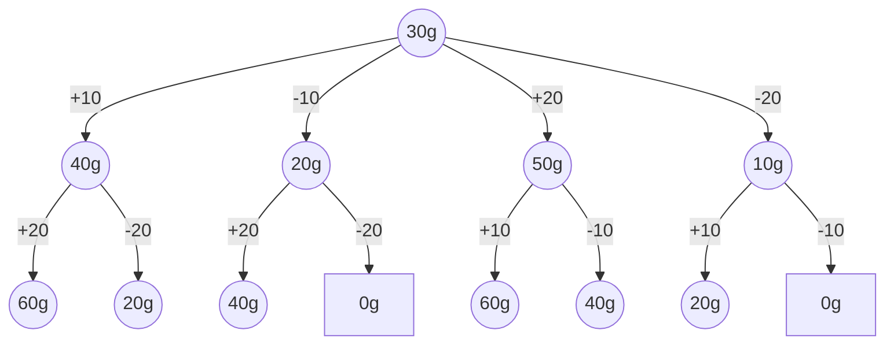

# Marktwaage

## Lösungsidee

Bei dieser Aufgabe ist es nötig, nahezu alle möglichen Kombinationen an Gewichten zu berechnen, die im Bereich 10 - 10000 liegen, da auch nicht genau passende berücksichtigt werden sollen. 

Zuerst gehe ich davon aus, dass das Ausgleichen von 0 in jedem Fall möglich ist, indem man kein Gewicht auf die Waage stellt. Wenn also von einem Zielgewicht ausgehend durch Addition und Subtraktion von vorhandenen Gewichten 0 erreicht wird, bevor alle Gewichte aufgebraucht sind, ist das Zielgewicht ausgleichbar.

Beispiel (Zielgewicht: 30g; Gewichte: 10g, 20g):



## Umsetzung

Dieses Konzept setze ich durch eine rekursive Funktion in [Typescript](https://www.typescriptlang.org/) mit der Laufzeit [Deno](https://deno.land/) um. Ich schreibe auf Englisch, damit ich Teile des Codes in anderen Projekten wiederverwenden kann, in denen Englisch meist Standard ist.

Das Einlesen und die Umwandlung der Textdateien und der Ausgabe von `calculateNearest()` übernehmen zwei Funktionen `convertInput()` und `convertOutput()`, die allerdings keine Logik beinhalten.

### Basisfälle (Z. 7 - 16)

Zuerst wird der oben angesprochene Fall eines Zielgewichts von 0 überprüft, bei dem sofort eine genau passende Gewichtskombination (`diff = 0`) zurückgegeben werden kann. Wenn keine Gewichte zum Ausgleichen vorhanden sind, sind keine weiteren Berechnungen möglich.

### Rekursion (Z. 23 - 59)

Jedes zum Ausgleichen vorhandene Gewicht wird zum aktuellen Zielgewicht addiert und subtrahiert, mit diesen neu entstandenen Zielgewichten wird die gesamte Funktion erneut aufgerufen.

Dazu wird zunächst eine aktualisierte Version der Liste von benutzbaren Gewichten erstellt, da das eben addierte (&rarr; auf die linke Seite der Waage gelegte) oder subtrahierte (&rarr; rechte Seite) Gewicht nicht mehr zum Ausgleichen vorhanden ist. Auch wird die Liste der benutzten Gewichte um das gerade eben Benutzte erweitert und an die nächste Funktion weitergegeben.

In den Variablen `added` und `subtracted` wird die bestmögliche Gewichtskombination zum Erreichen des Zielgewichts nach Addition bzw. Subtraktion gespeichert. Diese werden mit der aktuellen `bestCombination` hinsichtlich ihrer Differenz zum Zielgewicht als auch der Anzahl an benutzten Gewichten verglichen. Die Erste hat Priorität, bei beiden Kriterien wird ein möglichst kleiner Wert bevorzugt. `bestCombination` ist gewichtsübergreifend, (&rarr; nicht block-scoped im for-loop) und wird laufend mit der passendsten und kürzesten Gewichtskombination aktualisiert.

### Rückgabe (Z. 60 - 68)

Falls nach Austesten aller Gewichte keine passende Lösung gefunden wurde, wird die nähste zurückgegeben. Die Funktion gibt eine genau passende Lösung aber schon während des Testens zurück, um unnötige Berechnungen zu vermeiden. Eine Lösung ( &rarr; [Typ Gewichtskombination](#### Gewichtskombination)) besteht aus dem Unterschied zum Zielgewichts und den zuvor aggregierten Gewichten, die zum Erreichen der Lösung beigetragen haben.

### Laufzeitverbesserungen

Sicher ist Ihnen aufgefallen, dass ich einige Abschnitte bis jetzt nicht behandelt habe (z.B. Z. 18-19, 42, 51). Die Funktion würde auch ohne sie richtig arbeiten, allerdings sehr ineffizient (exponentielle Zeitkomplexität). Daher habe ich (neben frühzeitiger Rückgabe) zwei Maßnahmen zum Umgehen irrelevanter Berechnungen eingebaut.

1. Memoisation (Zwischenspeicherung) von Teillösungen
2. keine Addition und Subtraktion der gleichen Gewichtsklasse

#### Memoisation

Die Memoisation realisiere ich durch `memo`, ein JavaScript Objekt mit dem [Typ `weightMemo`](####Zwischenspeicher), das an alle Unteraufrufe weitergegeben wird. Damit ergibt sich ein dritter Basisfall, der eintritt, wenn die Kombination aus gesuchtem Gewicht und vorhandenen Gewichten bereits berechnet worden ist.

Um das `memo`-Objekt mit Lösungen zu füllen, wird eine Lösung vor Rückgabe mit einem eindeutigen Key, bestehend aus Zielgewicht und vorhandenen Gewichten, gespeichert.

#### Sinnvolle Addition und Subtraktion

Bei ersten Tests gab die Funktion oft richtige Lösungen aus, allerdings mit dem gleichen Gewicht auf beiden Seiten. Das wird verhindert, indem vor Addition / Subtraktion eines Gewichtes dessen Erscheinen in den benutzen Gewichten mit umgekehrtem Vorzeichen überprüft wird.

## Beispiele

## Quellcode

### calculateNearest()

```typescript
const calculateNearest = (
	target: number,
	usableWeights: Array<number>,
	memo: weightMemo = {},
	usedWeights: Array<number> = []
): weightCombination => {
	if (target === 0)
		return {
			diff: 0,
			usedWeights: usedWeights
		};
	if (usableWeights.length === 0)
		return {
			diff: target,
			usedWeights: usedWeights
		};

	const memoKey = `${target}:${usableWeights.toString()}`;
	if (memoKey in memo) return memo[`${target}:${usableWeights.toString()}`];

	let bestCombination: weightCombination = {
		diff: target,
		usedWeights: []
	};

	for (const weight of usableWeights) {
		// Make a true copy, not only a reference copy
		const shortenedWeights = [...usableWeights];
		shortenedWeights.splice(usableWeights.indexOf(weight), 1);

		let added: weightCombination = {
			diff: target,
			usedWeights: []
		};
		let subtracted: weightCombination = {
			diff: target,
			usedWeights: []
		};

		// Ensure weights of equal size only to be on one side

		if (!usedWeights.includes(weight)) {
			subtracted = calculateNearest(
				target - weight,
				shortenedWeights,
				memo,
				[...usedWeights, -weight]
			);
		}

		if (!usedWeights.includes(-weight)) {
			added = calculateNearest(target + weight, shortenedWeights, memo, [
				...usedWeights,
				weight
			]);
		}

		bestCombination = determineBest([bestCombination, added, subtracted]);

		// Early return if a matching combination is found
		if (bestCombination.diff === 0) {
			memo[memoKey] = bestCombination;
			return bestCombination;
		}
	}
	memo[memoKey] = bestCombination;
	return bestCombination;
};
```

### Typen

#### Gewichtskombination

```typescript
type weightCombination = {
	diff: number;
	usedWeights: Array<number>;
};
```

#### Zwischenspeicher

```typescript
type weightMemo = {
	[key: string]: weightCombination;
};
```

