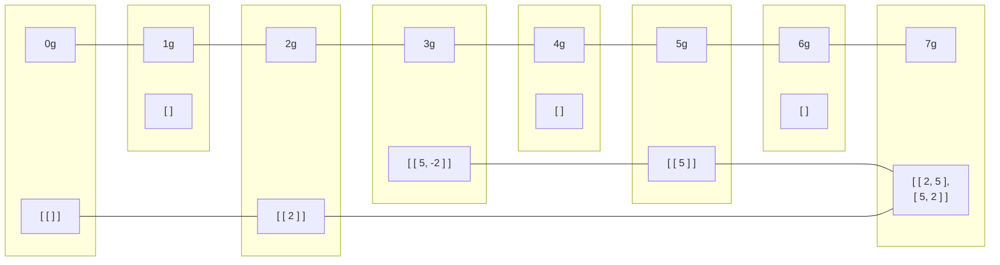

# Marktwaage

## Lösungsidee

Bei dieser Aufgabe ist es nötig, nahezu alle möglichen Kombinationen an Gewichten zu berechnen, die im Bereich 10 - 10 000 liegen (teilweise auch darüber hinaus), da auch nicht genau passende berücksichtigt werden sollen.

Zuerst gehe ich davon aus, dass das Ausgleichen von 0 in jedem Fall möglich ist, indem man kein Gewicht auf die Waage stellt. Wenn also von einem Zielgewicht ausgehend durch Addition und Subtraktion von vorhandenen Gewichten 0 erreicht wird, bevor alle Gewichte aufgebraucht sind, ist das Zielgewicht ausgleichbar.

Allerdings ist es nicht sinnvoll, für ein Gewicht zwei Ausgleichsmöglichkeiten zu berechnen oder *Übergangsgewichte* größer als 10 000 plus das größte Gewicht des Gewichtssatzes. *Übergangsgewichte* nenne ich als Zwischenschritt notwendigerweise berechnete Gewichte, die keine tatsächliche Lösung eines Zielgewichts sind.

Für jedes Ziel- und Übergangsgewicht existiert eine Liste an Gewichtskombinationen, mit denen es erreicht werden kann, falls das möglich ist. Diese Listen werden nach und nach mit Möglichkeiten gefüllt.

Beispiel (Gewichte: 2g, 5g; Zielgewichte 1g - 7g):




## Umsetzung

Dieses Konzept setze ich in [Typescript](https://www.typescriptlang.org/) mit der Laufzeit [Deno](https://deno.land/) um. Ich schreibe wegen einer besseren Lesbarkeit auf Englisch, da Typescript selbst englischbasiert ist.

Das Einlesen und die Umwandlung der Textdateien sowie die Vorbereitung für die Ausgabe im Terminal übernehmen die zwei Funktionen `convertInput()` und `convertOutput()`, allerdings enthalten sie keine Logik zur Bestimmung passender Gewichte.

In `main.ts` werden alle nötigen Funktionen für Zielgewicht (10, 20, ..., 10 000) aufgerufen,  die aber in `calculations.ts` stehen. Folgende Berechnungen gescehen in [`nearestCombination()`](###nearestCombination).

### Basisfälle

Zuerst wird der oben angesprochene Fall eines Zielgewichts von 0 überprüft (Z. 7 - 11), bei dem sofort eine genau passende Gewichtskombination (`diff = target = 0`) zurückgegeben werden kann. Wenn keine Gewichte zum Ausgleichen vorhanden sind, sind keine weiteren Berechnungen möglich, folglich ist der Abstand zum anfänglichen Zielgewicht das verbleibende Zielgewicht.

### Rekursion

Jedes zum Ausgleichen vorhandene Gewicht wird zum aktuellen Zielgewicht addiert und subtrahiert, mit diesen neu entstandenen Zielgewichten wird die gesamte Funktion erneut aufgerufen (Z. 21 - 54).

Dazu wird zunächst eine aktualisierte Version der Liste von benutzbaren Gewichten (`shortenedWeights`) erstellt (Z. 22 - 24), da das eben addierte (&rarr; linke Seite der Waage) oder subtrahierte (&rarr; rechte Seite) Gewicht nicht mehr zum Ausgleichen vorhanden ist. Auch wird die Liste der benutzten Gewichte um das gerade eben benutzte erweitert und an die nächste Funktion weitergegeben.

Die Variablen `added` und `subtracted` speichern die bestmögliche Gewichtskombination zum Erreichen des Zielgewichts nach Addition bzw. Subtraktion. Diese werden mit der aktuellen `bestCombination` hinsichtlich ihrer Differenz zum Zielgewicht als auch der Anzahl an benutzten Gewichten durch [`determineBest()`](###determineBest()) verglichen (Z. 45 - 54). Die Differenz hat Priorität, bei beiden Kriterien wird ein möglichst kleiner Wert bevorzugt. `bestCombination` ist gewichtsübergreifend, (&rarr; nicht im Rahmen des for-loops) und wird laufend mit der passendsten und kürzesten Gewichtskombination aktualisiert.

### Rückgabe

Falls durch Austesten aller Gewichte keine passende Lösung gefunden worden ist, wird die nähste zurückgegeben (Z. 63). Die Funktion gibt eine genau passende Lösung aber schon während des Testens zurück, um unnötige Berechnungen zu vermeiden (Z. 56 - 60). Eine Lösung ( &rarr; [Typ Gewichtskombination](###type%20weightCombination)) besteht aus dem Unterschied zum Zielgewichts und den zuvor aggregierten Gewichten, die zum Erreichen der Lösung beitragen.

`convertOutput()` wandelt diese in ein gut lesbares Format um, damit sie im Terminal ausgegeben werden kann.

### Laufzeitverbesserungen

Ich habe einige Abschnitte bis jetzt nicht behandelt  (z.B. Z. 13-14, 30), weil die Funktion ohne sie richtig arbeiten würde, allerdings sehr ineffizient (exponentielle Zeitkomplexität). Daher habe ich (neben frühzeitiger Rückgabe) drei Maßnahmen zum Umgehen irrelevanter Berechnungen eingebaut.

1. Memoisation (Zwischenspeicherung) von Teillösungen
2. keine gleichzeitige Addition und Subtraktion der gleichen Gewichtsgröße
3. keine Kalkulation, wenn $0 > target_{neu} > 10000 + weight_{max}$

#### Memoisation

Die Memoisation realisiere ich durch `memo`, ein JavaScript Objekt mit dem [Typ `weightMemo`](###type%20weightMemo), das an alle Unteraufrufe weitergegeben wird. Damit ergibt sich ein dritter Basisfall, der eintritt, wenn die Kombination aus gesuchtem Gewicht und vorhandenen Gewichten bereits berechnet worden ist.

Um das `memo`-Objekt mit Lösungen zu füllen, wird eine Lösung vor Rückgabe mit einem eindeutigen Key, bestehend aus Zielgewicht und vorhandenen Gewichten, gespeichert (Z. 13, 58, 62).

#### Einseitige Addition und Subtraktion

Bei ersten Tests gab die Funktion oft richtige Lösungen aus, allerdings mit dem gleichen Gewicht auf beiden Seiten. Das wird verhindert, indem vor Addition / Subtraktion eines Gewichtes dessen Erscheinen in den benutzen Gewichten mit umgekehrtem Vorzeichen überprüft wird.

#### Begrenzung des Zielgewichts

Als ich testweise das `memo`-Objekt ausgeben ließ, stellte ich fest, dass Lösungen für irrelevant hohe und auch negative Gewichte ausgerechnet und memoriert wurden. Die Bedinung (Z. 30, 37 - 38) liegt bei $0 <= target_{neu} <= 10000 + weight_{max}$, da alle relevanten Kombinationen des Gewichtssatzes nur mit Zwischenschritten in diesem Intervall verwirklicht werden können.

## Beispiele

## Quellcode

### nearestCombination()

```typescript
const nearestCombination = (
	target: number,
	usableWeights: Array<number>,
	memo: weightMemo = {},
	usedWeights: Array<number> = []
): weightCombination => {
	if (target === 0 || usableWeights.length === 0)
		return {
			diff: target,
			usedWeights: usedWeights
		};

	const memoKey = `${target}:${usableWeights.toString()}`;
	if (memoKey in memo) return memo[memoKey];

	let bestCombination: weightCombination = {
		diff: target,
		usedWeights: []
	};

	for (const weight of usableWeights) {
		// Make a true copy, not only a reference copy
		const shortenedWeights = [...usableWeights];
		shortenedWeights.splice(usableWeights.indexOf(weight), 1);

		// Ensure weights of equal size only to be on one side
		// 0 <= new target <= 10000 + biggest weight

		const subtracted =
			!usedWeights.includes(weight) && target - weight >= 0
				? nearestCombination(target - weight, shortenedWeights, memo, [
						...usedWeights,
						-weight
				  ])
				: undefined;
		const added =
			!usedWeights.includes(-weight) &&
			target + weight <= 10000 + usableWeights[usableWeights.length - 1]
				? nearestCombination(target + weight, shortenedWeights, memo, [
						...usedWeights,
						weight
				  ])
				: undefined;

		bestCombination = determineBest(
			bestCombination,
			...(added !== undefined
				? subtracted !== undefined
					? [added, subtracted]
					: [added]
				: subtracted !== undefined
				? [subtracted]
				: [])
		);

		// Early return if a matching combination is found
		if (bestCombination.diff === 0) {
			memo[memoKey] = bestCombination;
			return bestCombination;
		}
	}
	memo[memoKey] = bestCombination;
	return bestCombination;
};
```

### determineBest()

```typescript
const determineBest = (
	combinations: Array<weightCombination>
): weightCombination => {
	return combinations.sort((a, b) => {
		// Make negative values positive for comparison
		a.diff = a.diff < 0 ? a.diff * -1 : a.diff;
		b.diff = b.diff < 0 ? b.diff * -1 : b.diff;

		if (a.diff === b.diff)
			return a.usedWeights.length - b.usedWeights.length;
		return a.diff - b.diff;
	})[0];
};
```

### type weightCombination

```typescript
type weightCombination = {
	diff: number;
	usedWeights: Array<number>;
};
```

### type weightMemo

```typescript
type weightMemo = {
	[key: string]: weightCombination;
};
```

