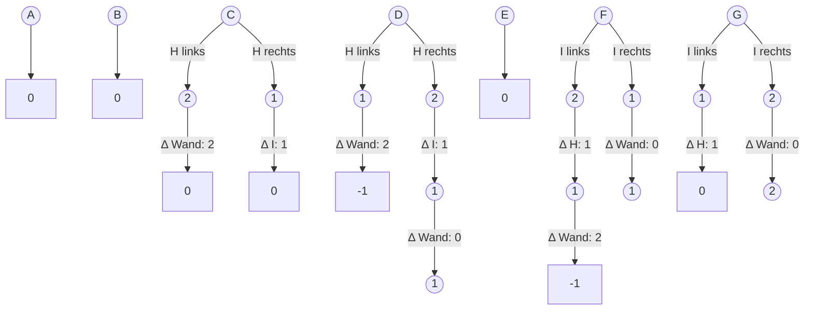

# Schiebeparkplatz

## Lösungsidee

Für das Ausparken eines vertikal stehenden Autos ist zunächst nur das direkt davorstehende horizontale Auto relevant. Kann man dieses nicht ausreichend verschieben, werden auch die zwei benachbarten relevant.

Da die Verschiebung von querstehenden (horizontalen) Autos für eine Lösung logischerweise nur in eine Richtung geschieht, lässt sich das Problem in zwei einfache Probleme aufteilen:

- Wie oft muss zum Ausparken nach links / rechts verschoben werden (bzw. ist es möglich)?
- In welche Richtung müssen weniger Autos verschoben werden?

Jeder Behinderung eines vertikalen Autos durch ein horizontales Auto ist für jede Richtung (links / rechts) eine Mindestzahl an Positionen zugeordnet, um die das horizontale Auto zum Ausparken verschoben werden muss (1 oder 2). Der Abstand zum nächsten Auto einer Richtung (links / rechts), subtrahiert von der Mindestzahl an Verschiebungen dieser Richtung, ist die Anzahl an Positionen, um die das nächste Auto verschoben werden muss. Das wird so lange fortgeführt, bis die Mindestzahl an Positionsverschiebungen <= 0 ist, denn dann kann ausgeparkt werden.

Beispiel (Situation auf dem Flyer):

## Umsetzung

## Quellcode

### Datentypen

### Funktionen

