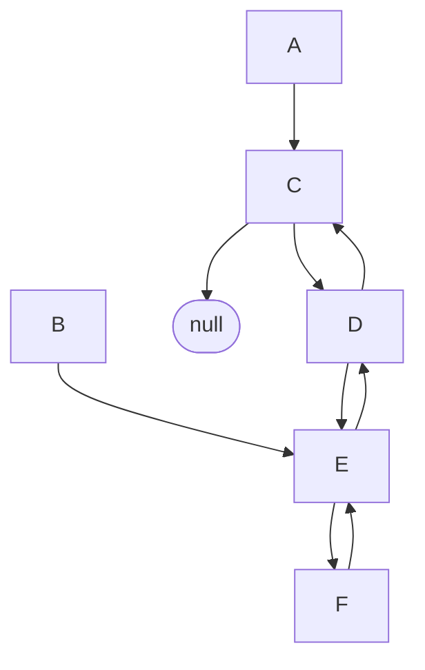
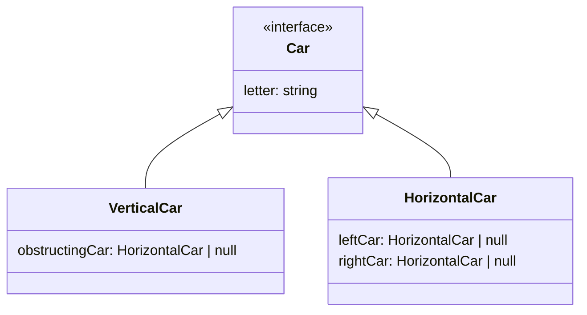

# Schiebeparkplatz

## Lösungsidee

Da jedes vertikal stehende Auto mit einer möglichst geringen Anzahl von Verschiebungen ausgeparkt werden soll, ist es sinnvoll zunächst nur das direkt hinderliche Auto zu betrachten, da es zwangsweise verschoben werden muss. Kann dieses nicht passend verschoben werden, müssen dessen direkte Nachbarn in Betracht gezogen werden, da einer von beiden verschoben werden muss. Klappt das Ausparken dann immer noch nicht, müssen wieder die direkten Nachbarn der zwei äußeren Autos mit berücksichtigt werden.

Auf jeder "Stufe" werden alle möglichen Positionen der Autos errechnet und getestet, ob das gewünschte Auto ausparken kann. Das ist wesentlich effizienter als einfach alle Stellmöglichkeiten der horizontal stehenden Autos zu errechnen und dann zu filtern, da dabei auch Möglichkeiten errechnet werden, die keine Relevanz haben.

## Umsetzung

Jedes Auto enthält eine **Referenz** zu den für seine Bewegungsmöglichkeiten **direkt relevanten** Autos. Von jedem vertikal parkenden Auto geht daher ein Refernzbaum aus (Insgesamt ist die entstehende Datenstruktur ein Graph). Während des oben beschriebenen Austestens wird immer tiefer in den Refernzbaum vorgedrungen, bis eine Ausparkmöglichkeit entsteht.

### Beispielparkplatz & Refernzbaum

```
(A)				(B)
( C )	( D )	( E ) 	( F )
```



### Klassen

Um diese Struktur umzusetzen, wird für jedes eingelesene Auto ein Objekt erstellt, das sowohl den Buchstaben als entsprechende Referenzen enthält. Alle Objekte zusammen werden als Attribute in einem klassenunabhängigen Objekt gespeichert, wobei der Key der Buchstabe ist und der Wert das zugehörige Autoobjekt. Die Referenzmöglichkeit über den passenden Buchstaben ist wesentlich praktischer und logischer als die über Zahlen in einem Array.



Bereits existierende Autoobjekte als Attributwerte zu benutzen ist nicht redundant, da JavaScript nur eine **Referenz** zu dem existierenden Objekt abspeichert.
