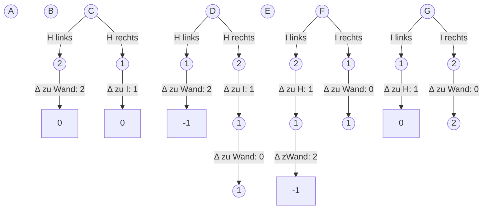

# Schiebeparkplatz

## Lösungsidee

Ich bezeichne die auszuparkenden Autos als *vertikal* und die blockierenden Autos als *horizontal*.

Für das Ausparken eines vertikal stehenden Autos ist zunächst nur das direkt davorstehende horizontale Auto relevant. Nur wenn Ausparken durch dessen Verschiebung nicht möglich ist, werden die zwei benachbarten relevant.

Da die Verschiebung von horizontalen Autos für eine Lösung nur in eine Richtung geschieht, lässt sich das Problem des Verschiebens in zwei einfache Probleme aufteilen:

- Wie viele Autos müssen nach links verschoben werden?
- Wie viele Autos müssen nach rechts verschoben werden?

Die nötigen Positionsverschiebungen eines störenden horizontalen Autos zum Ausparken des vertikalen Autos lassen sich folgenderweise beschreiben:
$$
nach \space Links: Position_{Horizontal} - Position_{Vertikal} + 2 \\ 
nach \space Rechts: Position_{Vertikal} - Position_{Horizontal} + 1
$$
Diese Zahl ist entweder 1 oder 2. Der Abstand zum nächsten Auto einer Richtung (links / rechts), subtrahiert von der Zahl an nötigen Verschiebungen dieser Richtung, ist die Anzahl an Positionen, um die das nächste Auto verschoben werden muss. Das wird so lange wiederholt, bis die Mindestzahl an Positionsverschiebungen <= 0 ist, denn dann kann ausgeparkt werden.

Beispiel (Situation auf dem Aufgabenblatt):



## Umsetzung

Ich schreibe in [Typescript](https://www.typescriptlang.org/) und benutze die Laufzeit [Deno](https://deno.land/).

Ein Parkplatz wird durch `convertInput()` eingelesen, die Anweisungen zum Ausparken durch `convertOutput()` für die Ausgabe im Terminal arrangiert. Da die beiden aber keine Logik zur Bestimmung der Schiebeschritte enthalten, gehe ich nicht näher auf sie ein.

Die nötigen Funktionsaufrufe geschehen in `main.ts`, während die Funktionen selbst in `calculations.ts` geschrieben sind. Die im Folgenden beschriebenen Schritte beziehen sich auf ein vertikales Auto, sie werden natürlich für jedes durchgeführt.

### Bestimmung des blockierenden Autos

[locateObstructing()](###locateObstructing()) vergleicht die Position des vertikalen Autos (`carIndex`) mit den Positionen der horiziontalen Autos und gibt bei Überschneidungen das störende Auto zurück. Die folgenden Schritte geschehen nicht, falls die Rückgabe `undefined` ist, was signalisiert, dass kein Auto im Weg steht.

### Verschiebung in beide Richtungen

Die Funktion wird für jedes vertikale Auto zweimal aufgerufen: Schieberichtung links und rechts.

[`shiftHorizontal()`](###shiftHorizontal()) prüft rekursiv den Abstand zum nächsten Auto und gibt eine Liste an nötigen [Verschiebungsanweisungen](###type%20shiftStep) zurück. Die beiden Wände / Parkplatzenden werden als unverschiebbare horizontale Autos gehandhabt.

#### Basisfälle

Das Verschieben war erfolgreich, wenn keine nötigen Verschiebungen mehr übrig sind. In diesem Fall wird die Liste, in die von den aufrufenden Funktionen Verschiebungsschritte hinzugefügt werden, zurückgegeben (Z. 7). Falls versucht wird, eine `"wall"`, das Parkplatzende, zu verschieben, ist das Ausparken nicht möglich (Z. 8).

#### Rekursion 

Das nächste zu verschiebende Auto ist abhängig von der gegebenen Schieberichtung, es ist entweder das vorige oder nächste Listenelement in der Liste aller horizontalen Autos (Z. 10 - 11).

Für den nächsten Aufruf ist die Distanz zum nächsten Auto erforderlich, da dieses um die Distanz *weniger* verschoben werden muss (Z. 13 - 16). Der Subtrahend ist natürlich richtungsabhängig, außerdem muss die Länge von 2 eines Autos beachtet werden. `furtherShifts` speichert die Verschiebungsschritte aller weiteren Autos, die durch den rekursiven Funktionsaufruf zurückgegeben werden (Z. 18 - 23).

#### Rückgabe

`undefined` tritt auf, wenn das Ausparken durch Verschiebung horizontaler Autos in die gegebene Richtung nicht möglich ist, es wird einfach weitergegeben (Z. 25).

Wenn die Funktion eine Liste erhält, sind dort die weiteren [Verschiebungsanweisungen](###type%20shiftStep) gespeichert. Nach Hinzufügen der hier getätigten Verschiebung wird diese Liste weitergegeben (Z. 27 - 33).

### Vergleich der Verschiebungsmöglichkeiten

[`determineBest()`](###determineBest()) vergleicht die Verschiebung nach links und rechts nach folgenden Kriterien :

1. Möglichkeit des Ausparkens
2. Geringere Anzahl an verschobenen Autos
3. Geringere Anzahl an verschobenen Positionen

Die bessere wird nach Formatierung durch `convertOutput()` im Terminal ausgegeben.

## Beispiele

*parkplatz0* bis *parkplatz5* sind die [Beispiele der bwinf-Seite](https://bwinf.de/bundeswettbewerb/40/1/), während alle weiteren selbst ausgedacht sind.

### parkplatz0

```txt
A G
2
H 2
I 5
```

```txt
A: 
B: 
C: H 1 rechts
D: H 1 links
E: 
F: H 1 links, I 2 links
G: I 1 links
```

### parkplatz1

```txt
A N
4
O 1
P 3
Q 6
R 10
```

```txt
A: 
B: P 1 rechts, O 1 rechts
C: O 1 links
D: P 1 rechts
E: O 1 links, P 1 links
F: 
G: Q 1 rechts
H: Q 1 links
I: 
J: 
K: R 1 rechts
L: R 1 links
M: 
N: 
```

### parkplatz2

```txt
A N
5
O 2
P 5
Q 7
R 9
S 12
```

```txt
A: 
B: 
C: O 1 rechts
D: O 1 links
E: 
F: O 1 links, P 2 links
G: P 1 links
H: R 1 rechts, Q 1 rechts
I: P 1 links, Q 1 links
J: R 1 rechts
K: P 1 links, Q 1 links, R 1 links
L: 
M: P 1 links, Q 1 links, R 1 links, S 2 links
N: S 1 links
```

### parkplatz3

```txt
A N
5
O 1
P 4
Q 8
R 10
S 12
```

```txt
A: 
B: O 1 rechts
C: O 1 links
D: 
E: P 1 rechts
F: P 1 links
G: 
H: 
I: Q 2 links
J: Q 1 links
K: Q 2 links, R 2 links
L: Q 1 links, R 1 links
M: Q 2 links, R 2 links, S 2 links
N: Q 1 links, R 1 links, S 1 links
```

### parkplatz4

```txt
A P
5
Q 0
R 2
S 6
T 10
U 13
```

```txt
A: R 1 rechts, Q 1 rechts
B: R 2 rechts, Q 2 rechts
C: R 1 rechts
D: R 2 rechts
E: 
F: 
G: S 1 rechts
H: S 1 links
I: 
J: 
K: T 1 rechts
L: T 1 links
M: 
N: U 1 rechts
O: U 1 links
P: 
```

### parkplatz5

```txt
A O
4
P 2
Q 4
R 8
S 12
```

```txt
A: 
B: 
C: P 2 links
D: P 1 links
E: Q 1 rechts
F: Q 2 rechts
G: 
H: 
I: R 1 rechts
J: R 1 links
K: 
L: 
M: S 1 rechts
N: S 1 links
O: 
```

### parkplatz6

```txt
A E
2
F 0
G 3
```

```txt
A: F 1 rechts
B: Ausparken nicht möglich
C: 
D: Ausparken nicht möglich
E: G 1 links
```

Der Parkplatz unterscheidet sich vor allem darin, dass es zwei Autos nicht möglich ist, auszuparken. Das wird korrekt erkannt und ausgegeben.

### parkplatz7

```txt
A F
3
G 0
H 2
I 4
```

```txt
A: Ausparken nicht möglich
B: Ausparken nicht möglich
C: Ausparken nicht möglich
D: Ausparken nicht möglich
E: Ausparken nicht möglich
F: Ausparken nicht möglich
```

In diesem Beispiel kann kein Auto ausparken, weil die drei davorstehenden alle sechs Plätze einnehmen und damit unverschiebbar sind.

### parkplatz8

```txt
A H
0
```

```txt
A: 
B: 
C: 
D: 
E: 
F: 
G: 
H: 
```

Dieser Fall ist ebenfalls eine Art Extremfall, es sind gar keine blockierenden Autos vorhanden. Dass die Eingabedatei nur zwei Zeilen hat oder die Liste der horizontalen Autos leer ist, stört das Programm jedoch nicht.

## Quellcode

### locateObstructing()

```typescript
const locateObstructing = (
	carIndex: number,
	horizontalCars: Array<horizontalCar>
): horizontalCar | undefined => {
	for (let i = 0; horizontalCars[i].position - 1 < carIndex; i++) {
		if (
			horizontalCars[i].position === carIndex ||
			horizontalCars[i].position + 1 === carIndex
		)
			return horizontalCars[i];
	}
	return undefined;
};
```

### shiftHorizontal()

```typescript
const shiftHorizontal = (
	minShifts: number,
	direction: number, // -1: left, 1: right
	currentCar: horizontalCar,
	horizontalCars: Array<horizontalCar>
): Array<shiftStep> | undefined => {
	if (minShifts <= 0) return [];
	if (currentCar.name === "wall") return undefined;

	const nextCar =
		horizontalCars[horizontalCars.indexOf(currentCar) + direction];

	const distance =
		direction === -1
			? currentCar.position - (nextCar.position + 2)
			: nextCar.position - (currentCar.position + 2);

	const furtherShifts = shiftHorizontal(
		minShifts - distance,
		direction,
		nextCar,
		horizontalCars
	);

	if (furtherShifts === undefined) return undefined;

	const currentShift: shiftStep = {
		carLetter: currentCar.name,
		direction: direction,
		positions: minShifts
	};

	return [...furtherShifts, currentShift];
};
```

### determineBest()

```typescript
const determineBest = (
	shiftStepsLeft: Array<shiftStep> | undefined,
	shiftStepsRight: Array<shiftStep> | undefined
): Array<shiftStep> | undefined => {
	if (shiftStepsLeft === undefined) return shiftStepsRight;
	if (shiftStepsRight === undefined) return shiftStepsLeft;

	if (
		shiftStepsLeft.length === shiftStepsRight.length &&
		shiftStepsLeft.length !== 0
	)
		return shiftStepsLeft
			.map((step) => step.positions)
			.reduce((acc, current) => acc + current) <
			shiftStepsRight
				.map((step) => step.positions)
				.reduce((acc, current) => acc + current)
			? shiftStepsLeft
			: shiftStepsRight;

	return shiftStepsLeft.length < shiftStepsRight.length
		? shiftStepsLeft
		: shiftStepsRight;
};
```

### type horizontalCar

```typescript
type horizontalCar = {
	name: string;
	position: number;
};A
```

### type shiftStep

```typescript
type shiftStep = {
	carLetter: string;
	direction: number;
	positions: number;
};
```

