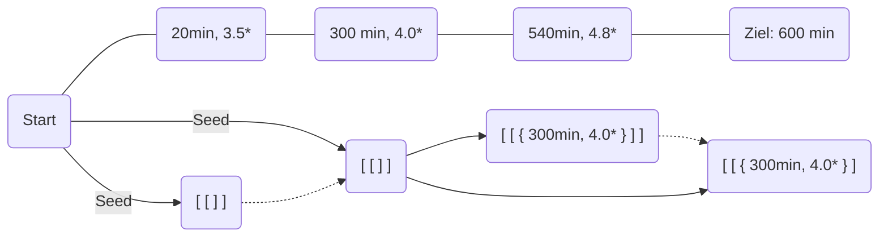

# Hotels

## Lösungsidee

Zuerst sollen alle Hotels mit einer besseren Alternative bei gleicher Minutenzahl aussortiert werden. Das hat zwei Vorteile: Ein Hotel kann allein durch die Minutenzahl eindeutig identifiziert werden und es wird von vornherein unnötiger Rechenaufwand vermieden. Ebenso sind Hotels nach dem Ziel nicht relevant.

In einer Liste der Länge aller Hotels wird für jedes Hotel eine Liste aller Möglichkeiten, es zu erreichen, abgespeichert. Zunächst werden alle vom Start erreichbaren Hotels mit einem bestimmten Wert initialisiert, um anzuzeigen, dass eine Möglichkeit vorhanden ist, das Hotel zu erreichen und keine Hotels dafür benötigt werden. Danach wird für jedes Hotel die Liste an Möglichkeiten, es zu erreichen, allen Hotels innerhalb der nächsten 360 Minuten hinzugefügt, nachdem jede Möglichkeit um das Hotel ergänzt worden ist. Das ist nötig, da in diesem Hotel übernachtet werden muss, um die darauffolgenden zu erreichen.

Zwei Einschränkungen gibt es: 

1. Wenn bei dem Zielhotel bereits eine Möglichkeit vorhanden ist, es mit einer höheren kleinsten Bewertung zu erreichen, während die gleiche / geringere Anzahl an Hotels benötigt wird, soll die betreffende Möglichkeit nicht hinzugefügt werden. Andernfalls soll sie alle mit gleich vielen / mehr Zwischenstopps ersetzen, die eine schlechtere / gleiche Bewertung haben. Das bedeutet, es werden pro Hotel maximal 5 Möglichkeiten gleichzeitig existieren.

2. Eine Möglichkeit ist nur zielführend, wenn pro verbleibendem Tag durchschnittlich weniger als 360 Minuten zu fahren sind. 

   &rarr; Andernfalls wird diese Möglichkeit nicht fortgeführt. 

Nachdem das für jedes Hotel geschehen ist, wird die beste Fahrtmöglichkeit durch Vergleich aller Möglichkeiten am Ziel ermittelt.

Beispiel:

*durchgezogen*: Hinzufügen einer Möglichkeit; *gepunktet*: Hinzufügen wäre möglich, allerdings ist bereits eine bessere Möglichkeit vorhanden

## Umsetzung

## Beispiele

## Quellcode

