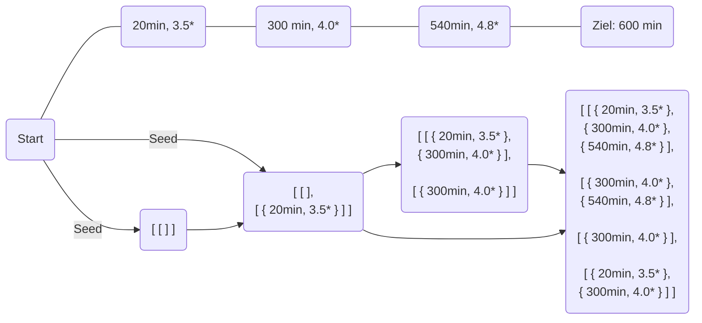

# Hotels

## Lösungsidee

Zuerst sollen alle Hotels mit einer besseren Alternative bei gleicher Minutenzahl aussortiert werden. Das hat zwei Vorteile: Ein Hotel kann allein durch die Minutenzahl eindeutig identifiziert werden und es wird von vornherein unnötiger Rechenaufwand vermieden.

In einer Liste der Länge aller Hotels wird für jedes Hotel eine Liste aller Möglichkeiten, es zu erreichen, abgespeichert. Zunächst werden alle vom Start erreichbaren Hotels mit einem Seedwert von `[[]]` initialisiert, was bedeutet, dass eine Möglichkeit vorhanden ist, das Hotel zu erreichen und keine Hotels dafür benötigt werden. Die Liste an Hotels, um das aktuelle zu erreichen, ergänzt um das aktuelle Hotel, wird dann der Liste an Möglichkeiten aller Hotels innerhalb der nächsten 360 Minuten hinzugefügt. Schließlich wird die beste Fahrtmöglichkeit durch Vergleich aller Möglichkeiten am Ziel ermittelt.

Beispiel:

Eine Möglichkeit ist jedoch nur zielführend, wenn pro verbleibendem Tag durchschnittlich weniger als 360 Minuten zu fahren sind. &rarr; Andernfalls wird diese Möglichkeit nicht fortgeführt. 

Ebenso sind alle Hotels, die eine schlechtere Bewertung als das maximal erreichbare außer Acht zu lassen, da sie zwangsläufig nicht die beste Möglichkeit sind.

## Umsetzung

## Beispiele

## Quellcode

