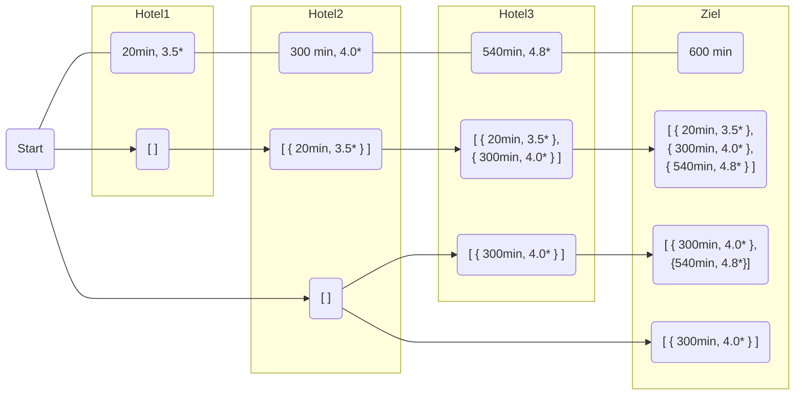

# Hotels

## Lösungsidee

In einer Liste der Länge aller Hotels wird für jedes Hotel eine Liste aller Möglichkeiten, es zu erreichen, abgespeichert. Die Liste an Hotels, um das aktuelle zu erreichen, ergänzt um das aktuelle Hotel, wird dafür der Liste an Möglichkeiten aller Hotels innerhalb der nächsten 360 Minuten hinzugefügt. Schließlich wird die beste Fahrtmöglichkeit durch Vergleich aller Möglichkeiten am Ziel ermittelt.

Beispiel:

Eine Möglichkeit ist jedoch nur zielführend, wenn pro verbleibendem Tag durchschnittlich weniger als 360 Minuten zu fahren sind. &rarr; Andernfalls wird diese Möglichkeit nicht fortgeführt.

## Umsetzung

## Beispiele

## Quellcode

