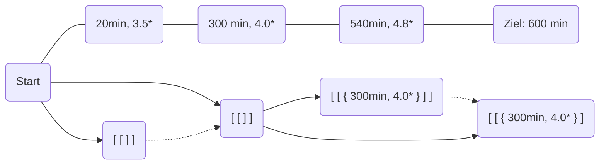

<h1 style="text-align: center"> Aufgabe 2: Vollgeladen </h1>
<p style="text-align: center">Team-ID: 00968 </p>
<p style="text-align: center">Teamname & Bearbeiter: Finn Rudolph </p>
<p style="text-align: center">19.11.2021 </p>

<h2>Inhaltsverzeichnis</h2>

[TOC]


## Lösungsidee

Zuerst sollen alle Hotels mit einer besseren Alternative bei gleicher Minutenzahl und die hinter dem Ziel aussortiert werden.

In einer Liste wird für jedes Hotel eine Liste aller Möglichkeiten, es zu erreichen, abgespeichert. Es ergibt sich eine dreidimensionale Liste, weil jede Möglichkeit wiederum eine Liste von Hotels ist. Zunächst werden alle vom Start erreichbaren Hotels mit einer leeren zweidimensionalen Liste initialisiert, um anzuzeigen, dass eine Möglichkeit vorhanden ist, das Hotel zu erreichen und keine Hotels dafür benötigt werden. Danach wird für jedes Hotel die Liste an Möglichkeiten, es zu erreichen, allen Hotels innerhalb der nächsten 360 Minuten hinzugefügt. Zuvor wird jede Möglichkeit aber um das aktuelle Hotel ergänzt, weil in diesem Hotel übernachtet werden muss, um die darauffolgenden zu erreichen.

Es gibt allerdings zwei Einschränkungen, unter denen eine Route (&rarr; Liste an Hotels) weiteren Hotels hinzugefügt wird: 

1. Wenn bei dem Zielhotel bereits eine Möglichkeit vorhanden ist, es mit einer höheren kleinsten Bewertung zu erreichen, während die gleiche / geringere Anzahl an Hotels benötigt wird, soll die betreffende Möglichkeit nicht hinzugefügt werden. Andernfalls soll sie alle mit gleich vielen / mehr Zwischenstopps ersetzen, die eine schlechtere / gleiche Bewertung haben. Das bedeutet, es werden pro Hotel maximal 5 Möglichkeiten gleichzeitig existieren.

2. Eine Reiseroute ist nur zielführend, wenn pro verbleibendem Tag durchschnittlich weniger als 360 Minuten zu fahren sind.


Nachdem das für je3des Hotel geschehen ist, wird die beste Fahrtmöglichkeit durch Vergleich aller Möglichkeiten am Ziel ermittelt.

Beispiel:




**durchgezogen**: Hinzufügen einer neuen Route

**gepunktet**: Hinzufügen wäre möglich, allerdings ist bereits eine bessere Route vorhanden

## Umsetzung

Ich schreibe in [Typescript](https://www.typescriptlang.org/) und benutze die Laufzeit [Deno](https://deno.land/).

`convertInput()` liest eine Textdatei ein und erstellt daraus die Liste aller Hotels. Die Umwandlung der besten Route in ein gut lesbares Format, das im Terminal ausgegeben werden kann, geschieht durch `convertOutput()`. Sie tragen aber nicht zur Bestimmung der besten Route bei, daher werde ich sie nicht behandeln.

**Dateienstruktur**: `main.ts` enthält die Aufrufe der in `calculations.ts` geschriebenen Funktionen, die ich im Folgenden beschreibe.

### Herausfiltern irrelevanter Hotels

Zuerst wird die Liste an Informationen zu jedem Hotel (&rarr; Typ [`hotelInformation`](###type hotelInformation) ) durch [`filterHotels()`](###filterHotels()) geschickt. Die Funktion gibt die gleiche Liste an Hotels zurück, jedoch ohne folgende:

- Hotels hinter dem Ziel (Z. 6)

- Hotels, für die es bei gleicher Minutenzahl ein besseres gibt (Z. 8 - 23)

  Jeweils vor und hinter dem Hotel wird solange iteriert, bis eine andere Minutenzahl auftritt. Wenn irgendwann ein besseres Hotel erscheint, wird `false` zurückgegeben. &rarr; Das Hotel wird nicht in die neue Liste mit aufgenommen.

Das zweite Kriterium wäre für die Funktion des Programms nicht notwendig, jedoch trägt es zu einer Laufzeitverbesserung bei, da es weniger rechenaufwendig ist, die Hotels vorneweg herauszunehmen, als später die daraus entstehenden nicht optimalen Routen auszusortieren.

### Bestimmung der besten Route

Die gefilterte Liste an Hotels wird der Funktion [`bestRoute()`](###bestRoute()) weitergegeben. Dieser wird ein Element für das Ziel hinzugefügt, um einen Ort zu haben, an dem Anfahrtmöglichkeiten für das Ziel gespeichert werden können (Z. 5).

#### Initialisierung der Tabelle

Die in der Lösungsidee angesprochene dreidimensionale Liste setze ich leicht abgewandelt um, weil es praktisch ist, bei jeder Anfahrtmöglichkeit die limitierende Bewertung sofort griffbereit zu haben. Daher ist die Liste selbst nur zweidimensional, allerdings von Typ [`route`](###type route), der die Liste an Hotels enthält.

Jeder Index der Liste wird mit einer leeren Liste initialisiert (Z. 7 - 10). Allen Hotels, die vom Start erreichbar sind, wird eine Route ohne Zwischenstopps und bestmöglicher niedrigster Bewertung hinzugefügt, da es keine Hotels gibt, die die Bewertung limitieren (Z. 12 - 16).

Es gibt also nun zwei Listen:

- `hotels` enthält die Bewertung und Minutenzahl aller Hotels, sie wird nicht verändert.
- `hotelsTable` wird schrittweise mit den Anfahrtmöglichkeiten jedes Hotels gefüllt werden, sie ist bereits mit Startwerten versehen worden.

#### Iteration

Für 

- jedes Hotel &rarr; `hotels[i]` (Z. 18)
- jedes von diesem erreichbare Hotel &rarr; `hotels[i + delta]` (Z. 19 - 24)
- jede mögliche Route zu `hotels[i]` &rarr; `hotels[i][routeI]` (Z. 25)

geschieht folgendes:

Die zu den Anfahrtsmöglichkeiten des Zielhotels hinzuzufügende Route `newRoute` wird erstellt, wobei das aktuelle Hotels den Zwischenstopps angefügt und die niedrigste Bewertung der Route gegebenenfalls aktualisiert wird (Z. 26 - 35).

#### Aktualisierung der Routen des Zielhotels

Ob eine Ersetzung der Routen überhaubt in Betracht gezogen wird, hängt davon ab, ob das Ziel mit insgesamt maximal vier Hotels (&rarr; maximal fünf Reisetage) noch erreichbar ist (Z. 37 - 41).

Ist das der Fall, wird die Funktion [`substituteRoutes()`](###substituteRoutes()) aufgerufen, die dafür zuständig ist, falls schlechtere Routen beim Zielhotel vorhanden sind, diese herauszufiltern und *alle* durch die vorgeschlagene `newRoute` zu ersetzen. Zuerst wird geprüft, ob bereits eine bessere Route vorhanden ist, was nach den Kriterien *höhere niedrigste Bewertung* und *weniger Zwischenstopps* geschieht (Z. 6 - 12). Wenn eine bessere Alternative auftritt, wird nichts verändert, andernfalls wird die neue Route sicherlich hinzugefügt (Z. 20), weil sie entweder gleichwertig oder besser als die bisher beste ist. Davor werden aber alle schlechteren Routen (gleiche Kriterien wie oben) aus der Liste herausgenommen (Z. 13 - 18), damit mit ihnen keine weiteren Routen gebildet werden, die in jedem Fall eine bessere Alternative haben. Das reduziert den Rechenaufwand und Arbeitsspeicherbedarf.

Das Zielhotel erhält schleißlich die aktualisierte Liste an Routen in [`bestRoute()`](###bestRoute()) (Z. 42 - 45).

#### Rückgabe

Die Funktion [`determineBest()`](###determineBest()) wird auf die Liste an Routen zum Ziel (letztes Element in `hotelsTable`) angewendet, das Ergebnis ist die Rückgabe von [`bestRoute()`](###bestRoute()) (Z. 49). Sie gibt die Route mit der besten niedrigsten Bewertung zurück, indem sie die Routen zum Ziel zuerst absteigend nach `lowestRating` sortiert und davon das erste Element nimmt. 

&rarr; Ausgabe im Terminal nach Strukturierung durch `convertOutput()`

## Beispiele

*hotels1* bis *hotels5* sind die [Beispiele der bwinf-Seite](https://bwinf.de/bundeswettbewerb/40/1/), während alle weiteren selbst ausgedacht sind.

Wegen der Größe habe ich die Eingabedateien von [*hotels3*](###hotels3), [*hotels4*](###hotels4) und [*hotels5*](###hotels5) nicht in die Dokumentation aufgenommen.

### hotels0

```txt
7
800
20 5.0
100 3.4
145 2.2
423 4.9
423 1.0
702 3.3
783 5.0
```

```txt
Minute 	|  Bewertung
		|
100		|  3.4
423		|  4.9
783		|  5
```

Dieses Beispiel kann ich manuell überprüfen, da es sehr kurz ist, was beispielsweise bei [hotels3](###hotels3) schwierig ist. Mit ihm kann ich feststellen, ob das Programm richtig arbeitet.

### hotels1

```txt
12
1680
12 4.3
326 4.8
347 2.7
359 2.6
553 3.6
590 0.8
687 4.4
1007 2.8
1008 2.6
1321 2.1
1360 2.8
1411 3.3
```

```txt
Minute 	|  Bewertung
		|
347		|  2.7
687		|  4.4
1007	|  2.8
1360	|  2.8
```

### hotels2

```txt
25
1737
340 1.6
341 2.2
341 2.3
342 2.1
360 1.9
361 4.4
362 3.1
442 5.0
567 4.9
700 3.0
710 2.9
718 1.4
987 4.6
1051 2.3
1053 4.8
1057 0.2
1199 5.0
1279 5.0
1367 4.5
1377 1.8
1377 1.6
1377 2.0
1378 2.1
1378 2.2
1380 5.0
```

```txt
Minute 	|  Bewertung
		|
341		|  2.3
700		|  3
1053	|  4.8
1380	|  5
```

### hotels3

&rarr; [hotels3.txt](https://bwinf.de/fileadmin/user_upload/hotels3.txt)

```txt
Minute 	|  Bewertung
		|
359		|  4.6
717		|  0.3
1075	|  0.8
1433	|  1.7
```

### hotels4

&rarr; [hotels4.txt](https://bwinf.de/fileadmin/user_upload/hotels4.txt)

```txt
Minute 	|  Bewertung
		|
340		|  4.6
676		|  4.6
979		|  4.7
1316	|  4.9
```

### hotels5

&rarr; [hotels5.txt](https://bwinf.de/fileadmin/user_upload/hotels5.txt)

```txt
Minute 	|  Bewertung
		|
317		|  5
636		|  5
987		|  5
1286	|  5
```

### hotels6

```txt
23
1800
35 1.3
78 4.6
104 2.4
170 2.4
171 4.1
182 2.1
202 5.0
360 4.4
500 3.2
540 2.6
720 1.2
772 4.7
808 3.0
808 4.0
808 2.2
1010 1.1
1056 1.6
1080 3.9
1305 2.9
1440 4.8
1600 4.0
1662 2.7
1665 3.7
```

```txt
Minute 	|  Bewertung
		|
360		|  4.4
720		|  1.2
1080	|  3.9
1440	|  4.8
```

Hier handelt es sich um einen Extremfall, weil das Ziel $5 \cdot 360min = 1800min$ (maximal weit) entfernt und damit nur über genau eine Hotelkombination erreichbar ist. Diese wird korrekt erkannt, da alle Zwischenstopps bei einem Vielfachen von $360$ liegen.

### hotels7

```txt
2
1000
302 2.3
441 4.2
```

```txt
Erreichen des Ziels unmöglich
```

Bei dieser Hotelauswahl ist eine zu große Lücke zwischen dem zweiten Hotel und dem Ziel vorhanden, sodass es nicht möglich ist, das Ziel mit maximal sechs Stunden Fahrtzeit pro Tag zu erreichen.

## Quellcode

### filterHotels()

```typescript
const filterHotels = (
	travelTime: number,
	hotels: Array<hotelInformation>
): Array<hotelInformation> =>
	hotels.filter((hotel, index) => {
		if (hotel.timestamp > travelTime) return false;

		for (
			let delta = 0;
			hotels[index + delta] !== undefined &&
			hotels[index + delta].timestamp === hotel.timestamp;
			delta++
		) {
			if (hotel.rating < hotels[index + delta].rating) return false;
		}
		for (
			let delta = 0;
			hotels[index - delta] !== undefined &&
			hotels[index - delta].timestamp === hotel.timestamp;
			delta++
		) {
			if (hotel.rating < hotels[index - delta].rating) return false;
		}
		return true;
	});
```

### bestRoute()

```typescript
const bestRoute = (
	travelTime: number,
	hotels: Array<hotelInformation>
): route => {
	hotels = [...hotels, { timestamp: travelTime, rating: 5 }];

	const hotelsTable: Array<Array<route>> = Array(hotels.length)
		// map() as independent Array instances are needed
		.fill(undefined)
		.map(() => []);

	// Seed all from start reachable hotels
	for (let i = 0; hotels[i].timestamp <= 360; i++) {
		const seedRoute: route = { lowestRating: 5, intermediateStops: [] };
		hotelsTable[i] = [seedRoute];
	}

	for (let i = 0; i < hotels.length; i++) {
		for (
			let delta = 1;
			hotels[i + delta] !== undefined &&
			hotels[i + delta].timestamp <= hotels[i].timestamp + 360;
			delta++
		) {
			for (let routeI = 0; routeI < hotelsTable[i].length; routeI++) {
				const newRoute: route = {
					lowestRating:
						hotels[i].rating < hotelsTable[i][routeI].lowestRating
							? hotels[i].rating
							: hotelsTable[i][routeI].lowestRating,
					intermediateStops: [
						...hotelsTable[i][routeI].intermediateStops,
						hotels[i]
					]
				};

				if (
					(travelTime - hotels[i + delta].timestamp) /
						(4 - hotelsTable[i][routeI].intermediateStops.length) <=
					360
				)
					hotelsTable[i + delta] = substituteRoutes(
						newRoute,
						hotelsTable[i + delta]
					);
			}
		}
	}
	return determineBest(hotelsTable[hotelsTable.length - 1]);
};
```

### substituteRoutes()

```typescript
const substituteRoutes = (
	route: route,
	hotelRoutes: Array<route>
): Array<route> => {
	for (let i = 0; i < hotelRoutes.length; i++) {
		if (
			route.lowestRating < hotelRoutes[i].lowestRating &&
			route.intermediateStops.length <=
				hotelRoutes[i].intermediateStops.length
		)
			return hotelRoutes;
	}
	const filteredRoutes = hotelRoutes.filter(
		(targetRoute) =>
			targetRoute.intermediateStops.length <
				route.intermediateStops.length ||
			targetRoute.lowestRating > route.lowestRating
	);

	return [...filteredRoutes, route];
};
```

### determineBest()

```typescript
const determineBest = (routes: Array<route>): route =>
	routes.sort((a, b) => b.lowestRating - a.lowestRating)[0];
```

### type hotelInformation

```typescript
type hotelInformation = {
	timestamp: number;
	rating: number;
};
```

### type route

```typescript
type route = {
	lowestRating: number;
	intermediateStops: Array<hotelInformation>;
};
```

